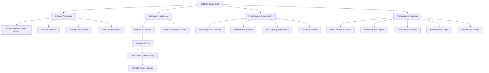
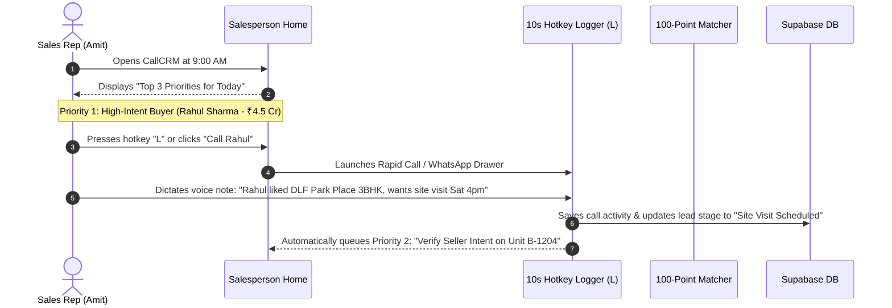

# CallCRM 2.0 — Master Frontend & System Encyclopedia

> **The Definitive Single-File Master Reference**: This comprehensive document consolidates **all frontend audits, architecture specifications, design systems, component strategies, screen redesign blueprints, pitch playbooks, and marketing website plans** created for CallCRM 2.0.
>
> **Project**: CallCRM 2.0 (Real Estate Sales & Intelligence Operating System)  
> **Market Focus**: Luxury Indian Residential Real Estate (Delhi NCR, Mumbai MMR, Bengaluru, Pune, Hyderabad)  
> **Backend & Platform Status**: 222 Vitest Tests Passing (23 Suites), 19 DB Migrations, 63 Authenticated API Endpoints, 34 RLS Tables, 75 Compiled Next.js Routes.

---

# Master Table of Contents

- [Part I: Executive Vision, Pitch Playbook & Core Real Estate Domain](#part-i-executive-vision-pitch-playbook--core-real-estate-domain)
  - [1. Executive Summary & Problem Space](#1-executive-summary--problem-space)
  - [2. 30-Second Elevator Pitch & 2-Minute Presentation](#2-30-second-elevator-pitch--2-minute-presentation)
  - [3. Competitive Differentiation Matrix](#3-competitive-differentiation-matrix)
  - [4. The Indian Real Estate Domain: Flat/Unit as Atomic Asset](#4-the-indian-real-estate-domain-flatunit-as-atomic-asset)
  - [5. 100-Point Bi-Directional Matcher Algorithm](#5-100-point-bi-directional-matcher-algorithm)
- [Part II: CRM Application UX Audit & Information Architecture](#part-ii-crm-application-ux-audit--information-architecture)
  - [6. Complete CRM Surface Inventory & Friction Audit](#6-complete-crm-surface-inventory--friction-audit)
  - [7. Information Architecture & 4-Tier Navigation Taxonomy](#7-information-architecture--4-tier-navigation-taxonomy)
  - [8. Role-Specific Workspaces (Salesperson, Manager, Boss)](#8-role-specific-workspaces-salesperson-manager-boss)
  - [9. End-to-End User Journeys & Morning Action Routines](#9-end-to-end-user-journeys--morning-action-routines)
- [Part III: Architectural Ledger Design System (CRM Core)](#part-iii-architectural-ledger-design-system-crm-core)
  - [10. Neutral Ledger & Heritage Accent Palettes](#10-neutral-ledger--heritage-accent-palettes)
  - [11. Typography Scale & Tabular Financial Numerals](#11-typography-scale--tabular-financial-numerals)
  - [12. Elevation Tiers, Structural Dividers & Spacing](#12-elevation-tiers-structural-dividers--spacing)
  - [13. Motion, Accessibility & WCAG Contrast Standards](#13-motion-accessibility--wcag-contrast-standards)
- [Part IV: Screen-by-Screen CRM Redesign Blueprints](#part-iv-screen-by-screen-crm-redesign-blueprints)
  - [14. Salesperson Daily Priority Cockpit (`salesperson-home.tsx`)](#14-salesperson-daily-priority-cockpit)
  - [15. Flat 360° Master Property Dossier (`UnitDossierSheet.tsx`)](#15-flat-360-master-property-dossier)
  - [16. Executive Boss Cockpit & Risk Radar (`boss-overview.tsx`)](#16-executive-boss-cockpit--risk-radar)
  - [17. Leads Directory & Slide-Over Dossier (`leads-page.tsx`)](#17-leads-directory--slide-over-dossier)
  - [18. Society Inventory Matrix & Tower Explorer (`projects-page.tsx`)](#18-society-inventory-matrix--tower-explorer)
  - [19. Proactive Seller Intelligence & Verification Modal (`seller-opportunities-modal.tsx`)](#19-proactive-seller-intelligence--verification-modal)
  - [20. CRM Screen Priority Matrix (P0–P3)](#20-crm-screen-priority-matrix-p0p3)
  - [21. Component Architecture & Modal Consolidation Strategy](#21-component-architecture--modal-consolidation-strategy)
  - [22. Screen-by-Screen Before & After Map](#22-screen-by-screen-before--after-map)
- [Part V: Marketing Website Visual Redesign & Strategy](#part-v-marketing-website-visual-redesign--strategy)
  - [23. Marketing Website Visual & Experience Audit](#23-marketing-website-visual--experience-audit)
  - [24. Marketing Architectural Editorial Design System](#24-marketing-architectural-editorial-design-system)
  - [25. The 12-Beat Narrative Storytelling Architecture](#25-the-12-beat-narrative-storytelling-architecture)
  - [26. Screen-by-Screen Landing Page Redesign Specification (`page.tsx`)](#26-screen-by-screen-landing-page-redesign-specification)
  - [27. Marketing Component Architecture & Asset Refactoring](#27-marketing-component-architecture--asset-refactoring)
  - [28. Marketing Before & After Transformation Map](#28-marketing-before--after-transformation-map)
  - [29. Marketing Implementation Sequence & Verification Strategy](#29-marketing-implementation-sequence--verification-strategy)
- [Part VI: Scorecard & Master Execution Roadmap](#part-vi-scorecard--master-execution-roadmap)
  - [30. CallCRM UX Scorecard (0–10 Rating across 15 Dimensions)](#30-callcrm-ux-scorecard)
  - [31. Complete 11-Phase Phased Implementation Roadmap](#31-complete-11-phase-phased-implementation-roadmap)

---

# Part I: Executive Vision, Pitch Playbook & Core Real Estate Domain

## 1. Executive Summary & Problem Space

| Dimension | Specification |
| :--- | :--- |
| **Product Name** | **CallCRM 2.0** (Luxury Indian Real Estate Sales & Intelligence Operating System) |
| **Category** | Vertical B2B Real Estate SaaS / Sales Intelligence Operating System |
| **Core Problem** | Generic CRMs treat real estate like generic SaaS software leads. High-ticket Indian real estate transactions (₹5 Cr to ₹50 Cr+ in DLF Golf Course Road, Worli, Bandra, Whitefield) fail due to **lost property/gate memory**, **inability to capture resale mandates before open-market portals**, **slow speed-to-lead**, and **missing 30-minute pre-site-visit intelligence**. |
| **Target Users** | Real-estate sales directors, closing specialists, on-site consultants, and brokerage agency founders ("the Boss"). |
| **Core Value Pillars** | **Proactive Seller Intelligence** (capturing resale mandates before portals), **100-Point Bi-Directional Unit Matching**, **30-Minute Pre-Site-Visit Briefings** (with Gate 2 visitor pass digital PINs & parking bays), **10-Second Hotkey Logging**, and **Human-in-the-Loop AI Meeting Structuring**. |
| **Tech Stack** | Next.js 15 App Router + React 19 + TypeScript · Supabase (PostgreSQL 16 + Auth + RLS + Realtime) · Google Gemini 2.5 Flash via Vercel AI SDK · Tailwind CSS 3.4 + Radix UI · Vitest + Playwright. |
| **Production Metrics** | **222 / 222 Vitest tests passing across 23 test suites**, **19 database migrations**, **34 RLS tables**, **63 authenticated API endpoints**, **75 compiled Next.js routes with 0 errors**. |

---

## 2. 30-Second Elevator Pitch & 2-Minute Presentation

### 30-Second Elevator Pitch
> *"Most real estate CRMs fail because they treat property like generic software leads and lose all institutional memory when an agent leaves. CallCRM 2.0 is an operating system built specifically for how Indian luxury real estate actually works: the **Flat/Unit is the atomic asset**. It monitors expiring tenancies and vacant units to generate exclusive seller mandates before properties reach 99acres or MagicBricks, computes 100-point bi-directional buyer-unit matches, and delivers a 30-minute pre-site-visit briefing with Gate 2 visitor pass codes and owner price floors straight to the rep's phone. Most importantly, AI assists reps but can never mutate data autonomously — every deal transition requires human approval."*

### 2-Minute Full Presentation Script
> *"In Indian luxury residential real estate — whether you're transacting at DLF Camellias in Gurgaon, Oberoi 360 West in Mumbai, or Kingfisher Towers in Bengaluru — transactions are high-value, highly sensitive, and relationship-driven.
>
> When a flat changes hands after possession:
> 1. Every unit has a different owner or investor.
> 2. Gate security, visitor passes, and RWAs are strictly enforced.
> 3. Pricing memory and non-negotiables are critical.
>
> Generic CRMs like Salesforce or HubSpot don't understand that the **Flat/Unit is the asset**, not the society.
>
> **CallCRM 2.0 solves this with four unfair advantages:**
>
> 1. **Proactive Seller Opportunity Engine**: We scan client tenancies expiring within 60 days, vacant units incurring holding costs, and 3-year investor exit windows. Agents convert these signals into exclusive resale listings with 1 click.
> 2. **100-Point Bi-Directional Matcher**: When a new luxury unit comes in, our multi-factor algorithm instantly scores and ranks every active buyer in the pipeline across location, budget, configuration, floor band, and facing.
> 3. **30-Minute Pre-Site-Visit Operational Cockpit**: 30 minutes before a VIP client arrives at the society, the rep receives a synthesized briefing with Gate 2 security pass PINs, assigned visitor parking bays, owner price boundaries, and objection battlecards.
> 4. **Human-in-the-Loop AI Speed**: Reps dictate unstructured notes in English or Hinglish after a meeting. AI extracts objections, buying signals, and next moves, but requires human confirmation before saving.
>
> The result? Brokerages double their inventory capture rate, eliminate gate friction, and close deals 40% faster."*

---

## 3. Competitive Differentiation Matrix

| Capability | Generic CRMs (Salesforce / HubSpot) | Indian Property Portals (99acres / MagicBricks) | **CallCRM 2.0 (Apex Realty)** |
| :--- | :--- | :--- | :--- |
| **Real Estate Data Hierarchy** | ❌ Generic accounts/contacts | ❌ Flat list of public ads | ✅ **6-tier normalized hierarchy** (Region $\rightarrow$ Area $\rightarrow$ Society $\rightarrow$ Tower $\rightarrow$ Floor $\rightarrow$ Unit) |
| **Unit-Level Atomic Asset** | ❌ No concept of flats | ❌ Ad-centric, duplicate listings | ✅ **Flat 360° Dossier** with temporal ownership chains & price history |
| **Proactive Seller Signals** | ❌ None | ❌ Reactive public listings only | ✅ **Tenancy expiry ($<60\text{d}$), vacancy, and 3-year investor exit scanners** |
| **Pre-Site-Visit Briefings** | ❌ None | ❌ None | ✅ **30-min briefing** with Gate 2 pass PINs, parking bays & owner price floors |
| **Institutional Sales Memory** | ❌ Freeform notes | ❌ None | ✅ **5-tier verified facts** with 180-day automated stale knowledge scanner |
| **AI Safety Contract** | ❌ Autonomous or none | ❌ None | ✅ **Strict Human-in-the-Loop gate** (zero autonomous DB writes) |
| **Speed to Log** | ❌ 3-5 minutes of form fields | ❌ N/A | ✅ **10-second hotkey rapid logging** (<kbd>L</kbd>, <kbd>F</kbd>, <kbd>⌘K</kbd>) |

---

## 4. The Indian Real Estate Domain: Flat/Unit as Atomic Asset

In India, after possession:
- Every flat has a different owner or investor.
- Some owners own multiple units across towers (portfolio investors).
- Some units are rented, some are developer inventory, and some are off-market resale opportunities.
- Society amenities, security desks, visitor parking rules, and RWA bylaws are shared across all units.

Therefore: **The FLAT/UNIT is the core transactional asset, not the society.**

```mermaid
flowchart TD
    REG[Region: Delhi NCR / Mumbai MMR] --> AREA[Property Area / Micro-market: Golf Course Road / Bandra West]
    AREA --> SOC[Society / Project: The Camellias / Oberoi 360]
    SOC --> TOW[Tower / Block: Tower A / Tower 2]
    TOW --> FLR[Floor: 14th Floor]
    FLR --> UNIT[Flat / Unit: A-1402 (Core Atomic Asset)]
    
    UNIT --- OWN[Temporal Ownership Graph: Current Owner, Past Owners, Tenants]
    UNIT --- FACT[Institutional Memory: Gate 2 PIN, Parking Bay, Price Floor]
    UNIT --- HIST[Price History: Asking Price Revisions Ledger]
    UNIT --- MATCH[100-Point Matcher: Qualified Active Buyer Leads]
    UNIT --- SENG[Seller Signals: Expiring Tenancy, Vacancy, Investor Exit]
```

---

## 5. 100-Point Bi-Directional Matcher Algorithm

$$\text{Match Score} = \text{Location (30)} + \text{Budget (30)} + \text{Configuration (20)} + \text{Floor/Facing (10)} + \text{Mandate (10)}$$

- **Location (30 pts)**: Exact society match = 30 pts; same micro-market = 20 pts; same macro-region = 10 pts.
- **Budget (30 pts)**: Asking price within $\pm 10\%$ of buyer budget = 30 pts; within $\pm 20\%$ = 20 pts; within $\pm 30\%$ = 10 pts.
- **Configuration (20 pts)**: Exact BHK & layout match = 20 pts; configuration contains requested rooms = 12 pts.
- **Floor & Facing (10 pts)**: High floor / park facing preference match = 10 pts.
- **Mandate Exclusivity (10 pts)**: Direct owner resale mandate = 10 pts; open listing = 5 pts.

---

# Part II: CRM Application UX Audit & Information Architecture

## 6. Complete CRM Surface Inventory & Friction Audit

| Screen / Surface | Route & Component | Persona | Purpose | Current UX Implementation | Identified Friction Points | Redesign Priority |
| :--- | :--- | :--- | :--- | :--- | :--- | :--- |
| **Salesperson Home** | `/` (Sales Role)<br>`salesperson-home.tsx` | Sales Rep, Specialist | "What should I do right now?" — Prioritized queue of high-intent buyers, visits, and follow-ups. | 3 top KPI badges, 3 action buttons, a horizontal 30m Site Visit Briefing alert card, Next Best Action cards, and a vertical timeline queue. | • 3 buttons at top feel detached from priorities.<br>• Timeline queue lacks inline 1-click action triggers.<br>• Next actions list is too long without pagination.<br>• Does not surface today's at-risk deals. | **P0 (Critical)** |
| **Leads List & Pipeline** | `/leads`<br>`leads-page.tsx` | Sales Rep, Manager | Filter, search, and bulk-manage active buyer and seller inquiries across stages. | Multi-filter header, stage tabs, 8-column data table with inline badges, bulk CSV export/import modals. | • 8-column table causes horizontal compression.<br>• Lacks quick preview drawer (forces full modal opening).<br>• Filter bar takes 80px vertical space. | **P0 (Critical)** |
| **Lead 360° Dossier** | Modal on click<br>`lead-detail-modal.tsx` | Sales Rep, Manager | Complete customer context, property preferences, timeline, and communication ledger. | Multi-tab dialog (`overview`, `activities`, `tasks`, `deals`, `ai`). Budget sliders, WhatsApp quick triggers. | • Tabbed layout hides critical buyer requirements.<br>• Activity history is purely textual.<br>• Unit matching is buried under deep sub-tabs. | **P0 (Critical)** |
| **Pipeline Kanban** | `/pipeline`<br>`pipeline-board.tsx` | Sales Rep, Manager | Visual drag-and-drop opportunity board across 7 sales stages. | Horizontal scrolling 7-column Kanban with deal cards showing client name, budget in INR (`₹ Cr`), days in stage, and deal health badge. | • Column width is fixed (causes horizontal scrollbar on 1080p).<br>• Lacks stage velocity indicators and total pipeline value per column header. | **P1 (Important)** |
| **Tasks & Follow-ups** | `/tasks`<br>`tasks-page.tsx` | Sales Rep | SLA management: Overdue, due today, and upcoming call/visit commitments. | Status filter buttons (`Overdue`, `Due Today`, `Upcoming`), table with complete check action and reschedule button. | • Separate page disconnects reps from lead context.<br>• Lacks inline dialer trigger.<br>• No batch completion. | **P1 (Important)** |
| **Projects / Societies** | `/projects`<br>`projects-page.tsx` | Rep, Manager, Boss | Inventory exploration, tower selector, floor/unit availability matrix, and project facts. | Master-detail split: Left side project selector, middle tower selector, right side inventory matrix grid with status colors. | • Screen is 1034 lines; excessive state logic.<br>• Matrix grid becomes overwhelming with >100 units.<br>• Society-level shared rules (RWA, Gate 2) are hidden behind small badges. | **P0 (Critical)** |
| **Flat 360° Dossier** | Modal on unit click<br>`unit-detail-modal.tsx` | Sales Rep, Specialist | Atomic asset dossier: Carpet area, parking, asking price ledger, temporal owner history, and matching buyers. | 5 tabs: `overview`, `people` (owners/tenants), `facts` (Gate 2 PIN, bylaws), `pricing` (revisions), `buyers` (100-pt matches). | • Modal format feels cramped for a master property dossier.<br>• Ownership history looks like a plain table.<br>• Price revision ledger lacks visual trend sparklines. | **P0 (Critical)** |
| **People & Relationships** | `/people`<br>`people-page.tsx` | Rep, Manager | Master deduplicated contact directory with multi-unit ownership and cross-inquiry links. | Searchable table of individuals with phone, email, project inquiries, and total budget. Profile modal on click. | • Looks like a generic CRM contacts list.<br>• Does not visually highlight whether someone is an Investor, Owner, Tenant, or RWA official. | **P1 (Important)** |
| **Seller Opportunities** | Triggered from Home / Projects<br>`seller-opportunities-modal.tsx` | Sales Rep, Manager | Review proactive resale signals (tenancy expiry, vacancy, investor exit) and convert to listings. | Modal showing filterable cards with signal strength badges (`HIGH`, `MEDIUM`), estimated valuation, AI pitch preview, and convert button. | • Card implies "owner wants to sell" instead of "potential signal".<br>• Lacks transparent evidence breakdown (+20 tenancy, +15 holding).<br>• Missing human verification disposition flow. | **P0 (Critical)** |
| **Boss Overview** | `/` (Boss Role)<br>`boss-overview.tsx` | Agency Founder, Sales Director | Macro business cockpit: Revenue in `₹ Cr`, pipeline velocity, deal health risk radar, rep leaderboards. | Top global filter bar (4 dropdowns), 4 KPI summary cards, "Needs Attention" alert list, Stage breakdown bars, Rep leaderboards table. | • Dense visual hierarchy; 836 lines of stacked elements.<br>• Filter bar occupies excessive vertical real estate.<br>• Lacks executive narrative summary ("Revenue is on track (+12%), but 3 deals are stuck"). | **P0 (Critical)** |

---

## 7. Information Architecture & 4-Tier Navigation Taxonomy

Rather than exposing a flat list of 13 menu items, the sidebar is organized into **4 Distinct Mental Model Sections**:



---

## 8. Role-Specific Workspaces

### 1. Salesperson Workspace (Action-First)
- **Primary Question**: *"What should I do right now to advance my deals?"*
- **Visible Routes**: `Today's Priorities (Home)`, `My Leads`, `Pipeline Kanban`, `Inventory Matrix`, `People`.
- **Suppressed**: Boss analytics, team performance rankings, system configuration, billing.

### 2. Sales Manager Workspace (Intervention-First)
- **Primary Question**: *"Where is my team getting stuck, and which high-value deals are at risk?"*
- **Visible Routes**: `Intervention Cockpit (Home)`, `Team Pipeline`, `Leads Ingestion & Re-assignment`, `Inventory & Resale Mandates`, `SLA Reports`.

### 3. Boss / Agency Founder Workspace (Macro Health & Revenue-First)
- **Primary Question**: *"What is happening with my business, revenue pipeline, and market inventory?"*
- **Visible Routes**: `Executive Cockpit (Home)`, `Resale Mandates & Inventory Valuation`, `Deals Pipeline`, `Financial Reports & Attributions`, `Admin & Licenses`.

---

## 9. End-to-End User Journeys & Morning Action Routines



---

# Part III: Architectural Ledger Design System (CRM Core)

## 10. Neutral Ledger & Heritage Accent Palettes

```css
/* Core Neutral Ledger Palette */
--paper-base:     #f8fafc; /* Canvas background */
--paper-card:     #ffffff; /* Card / table surface */
--paper-subtle:   #f1f4f8; /* Hover states, table headers */
--ink-primary:    #0f172a; /* Headings, critical metrics (14.2:1 contrast) */
--ink-muted:      #64748b; /* Secondary labels, timestamps */
--border-ledger:  #e2e8f0; /* Standard 1px architectural divider */

/* Heritage Luxury Accents */
--heritage-brass: #a9812e; /* VIP / High-Value / Resale Mandates / Won Deals */
--verdigris:      #245c4f; /* Available Units / Healthy Deals / Verified Facts */
--navy-anchor:    #1e293b; /* Projects / Towers / Master Contacts */

/* Semantic Status Indicators */
--emerald-success: #059669; /* Available / Won / Verified / SLA Met */
--amber-warning:   #d97706; /* Hold / At Risk / Expiring Tenancy */
--red-destructive: #dc2626; /* SLA Overdue / Lost / Stale Fact */
--blue-info:       #2563eb; /* Site Visit Scheduled / Negotiation / Active Call */
```

---

## 11. Typography Scale & Tabular Financial Numerals

```
Font Stack:
Primary UI:          Inter, -apple-system, BlinkMacSystemFont, "Segoe UI", Roboto, sans-serif
Financial / Numerals: ui-monospace, "SF Mono", Menlo, Monaco, Consolas, monospace
```

- **Display 1 (Executive)**: `28px / 34px` (800 Bold) — Boss Revenue KPIs (`₹48.5 Cr`).
- **Heading 1 (Page Title)**: `20px / 26px` (700 Bold) — Main page titles (`Today's Priorities`).
- **Heading 2 (Section)**: `15px / 20px` (600 Semibold) — Section headers (`Next Best Actions`).
- **Body Primary**: `13px / 18px` (500 Medium) — Table cells, client names, primary buttons.
- **Body Secondary**: `11px / 15px` (500 Medium) — Unit specs (`3 BHK · 2,450 sq ft`), timestamps.
- **Micro Badge**: `10px / 12px` (700 Bold) — Status badges, keyboard hotkeys (<kbd>L</kbd>, <kbd>⌘K</kbd>).

---

## 12. Elevation Tiers, Structural Dividers & Spacing

```css
/* Elevation Tiers */
--shadow-flat:     none;
--shadow-subtle:   0 1px 2px 0 rgba(15, 23, 42, 0.04);
--shadow-card:     0 1px 3px 0 rgba(15, 23, 42, 0.06), 0 1px 2px -1px rgba(15, 23, 42, 0.04);
--shadow-elevated: 0 4px 12px -2px rgba(15, 23, 42, 0.08), 0 2px 6px -2px rgba(15, 23, 42, 0.04);
--shadow-drawer:   0 20px 25px -5px rgba(15, 23, 42, 0.12), 0 8px 10px -6px rgba(15, 23, 42, 0.08);

/* Border Radius Tokens */
--radius-sm: 4px;   /* Badges, micro-buttons, hotkey tags */
--radius-md: 6px;   /* Standard buttons, form inputs, dropdown items */
--radius-lg: 8px;   /* Cards, table containers, popovers */
--radius-xl: 12px;  /* Master dossiers, modal shells, hero cockpits */
```

---

## 13. Motion, Accessibility & WCAG Contrast Standards

- **Sub-150ms Easing**: Transitions use `cubic-bezier(0.16, 1, 0.3, 1)` for snappy, professional responsiveness.
- **Action Confirmation Pulse**: Actions flash a subtle `bg-emerald-500/10` tint for 400ms.
- **WCAG 2.1 AAA Contrast**: Primary text achieves $\ge 7:1$ contrast against light/dark canvases.
- **Visible Keyboard Focus**: Unambiguous `ring-2 ring-primary ring-offset-1` outline on `<Tab>` navigation.

---

# Part IV: Screen-by-Screen CRM Redesign Blueprints

## 14. Salesperson Daily Priority Cockpit

- **Structure**: 2-column responsive layout (65% Priority Queue, 35% Daily Timeline & SLA Meter).
- **Morning Focus Banner**: Prominently highlights Top 3 High-Impact Actions (Calls, Site Visits, Resale verifications).
- **Active 30m Site Visit Alert**: If visit is scheduled within 45m, prominent Gate 2 PIN & parking bay card with 1-tap navigation.
- **Action Cards**: Direct triggers: `[📞 Call (L)]`, `[💬 WhatsApp]`, `[🏠 View Matches]`, `[🔍 Verify Intent]`.

---

## 15. Flat 360° Master Property Dossier

- **Structure**: Replaces cramped modal dialog with a full-height right-hand slide-over drawer (`w-full max-w-2xl sm:max-w-3xl`).
- **Dossier Header**: Unit Number (`A-1402`), Tower, Society, Asking Price (`₹16.5 Cr`), Status Badge.
- **4 Segmented Tabs**:
  1. *Specs & Institutional Memory* (Super/Carpet area, Gate 2 PIN, Bylaws, Owner Price Floor).
  2. *Temporal Ownership Chain* (Current Owner, Past Owners, Tenants).
  3. *Price Ledger & Trend* (Asking price revisions with visual trend delta).
  4. *100-Point Matching Buyers* (Ranked active buyer leads with 1-click pitch trigger).
- **Sticky Footer Action Bar**: `[🎯 Pitch to Matching Buyers]`, `[💰 Revise Price]`, `[📄 Share WhatsApp PDF]`.

---

## 16. Executive Boss Cockpit & Risk Radar

- **Structure**: 3-tier modular dashboard.
- **Tier 1 (Executive Narrative Summary)**: *"Active pipeline is healthy at ₹48.5 Cr (+18% MoM). 3 high-value deals in Negotiation are stagnant >5 days and require pricing intervention."*
- **Tier 2 (4 Master KPI Cards)**: Total Active Pipeline, Won Revenue, Stalled Deals at Risk, Resale Mandate Pipeline.
- **Tier 3 (Deal Health Risk Radar)**: Table of at-risk deals with health score, stuck days, and assigned rep.

---

## 17. Leads Directory & Slide-Over Dossier

- **Smart Filter Pill Bar**: Fast 1-click filters (`All Active`, `Hot 🔥`, `Site Visits`, `Overdue Follow-up`).
- **High-Density Lead Table**: Stacked primary column (Name + Phone), Stage Pill, Budget in `₹ Cr`, Deal Health.
- **Right Slide-Over Lead Dossier**: Buyer preferences, inquiry timeline, matched inventory units, and 10s logger dock.

---

## 18. Society Inventory Matrix & Tower Explorer

- **Project Header**: Society Name, Developer, Locality, RERA ID, Total Towers & Units.
- **Society Shared Intelligence Card**: Security Gate 2 rules, parking bylaws, maintenance desk contact.
- **Tower Selector**: Visual block cards showing availability percentage per tower.
- **Interactive Unit Matrix Grid**: Color-coded unit tiles (`Available`, `Hold`, `Sold`, `Resale Opportunity`).

---

## 19. Proactive Seller Intelligence & Verification Modal

- **Signal Strength Badge**: `78/100 Opportunity Score` (Transparent breakdown: +20 Tenancy, +15 Holding).
- **Grounded Evidence List**: Explicit sources (Tenancy record, ownership ledger, market transaction comps).
- **Recommended Salesperson**: Relationship intelligence recommendation based on past interactions.
- **Human Verification Flow**: Structured disposition options (`Wants to sell`, `Considering`, `Renewing tenant`, `Do not contact`).

---

## 20. CRM Screen Priority Matrix (P0–P3)

| Screen / Surface | Tier | Daily Frequency | Revenue & Usability Impact | Complexity |
| :--- | :--- | :--- | :--- | :--- |
| **Salesperson Home (`salesperson-home.tsx`)** | **P0 (Critical)** | 20+ times/day | **Direct Revenue Velocity**. Solves morning priority dilemma and drives immediate call execution. | Medium |
| **Flat 360° Dossier (`unit-detail-modal.tsx`)** | **P0 (Critical)** | 15+ times/day | **Core Real Estate Asset**. Eliminates modal inception and turns units into actionable dossiers. | Medium |
| **Boss Executive Cockpit (`boss-overview.tsx`)** | **P0 (Critical)** | 5+ times/day | **Executive Decision Speed**. Replaces 836 lines of dense tables with high-impact revenue KPIs and risk radar. | High |
| **Leads Directory & Dossier (`leads-page.tsx`)** | **P0 (Critical)** | 30+ times/day | **Primary CRM Workflow**. Replaces cramped 8-column table with stacked rows and instant slide-over dossier. | Medium |
| **Projects & Unit Matrix (`projects-page.tsx`)** | **P0 (Critical)** | 10+ times/day | **Inventory Liquidity**. Streamlines 1034 lines of complex state into modular tower and unit selectors. | High |
| **Seller Opportunities (`seller-opportunities-modal.tsx`)** | **P0 (Critical)** | 5+ times/day | **Exclusive Resale Inventory Capture**. Evidence-based resale intelligence with transparent factor scoring. | Low |
| **Pipeline Kanban Board (`pipeline-board.tsx`)** | **P1 (Important)** | 10+ times/day | **Deal Progression**. Adds stage value headers, stage velocity indicators, and smoother drag-and-drop. | Medium |
| **Global Command Palette (`global-search-dialog.tsx`)** | **P1 (Important)** | 25+ times/day | **10-Second Keyboard Navigation**. Instant <10ms lookup across leads, units, societies, and quick actions. | Low |
| **Follow-up Queue & Tasks (`tasks-page.tsx`)** | **P1 (Important)** | 10+ times/day | **SLA Compliance**. Streamlines overdue and due-today commitments with 1-click dialer triggers. | Low |
| **30m Pre-Site Briefing (`site-visit-briefing.ts`)** | **P1 (Important)** | 3+ times/day | **On-Site Operational Excellence**. Instant Gate 2 pass PIN, visitor parking, and owner price floor access. | Low |
| **AI Meeting Structurer (`meeting-summary-modal.tsx`)** | **P1 (Important)** | 5+ times/day | **Frictionless Note Logging**. Converts voice/speech notes into structured dispositions with human approval. | Low |
| **Reports & Analytics (`reports-page.tsx`)** | **P1 (Important)** | 2+ times/week | **Performance Diagnostics**. High-fidelity SVG chart containers and team SLA compliance metrics. | Medium |
| **People Directory (`people-page.tsx`)** | **P1 (Important)** | 5+ times/day | **Multi-Unit Stakeholder Graph**. Highlights owner vs investor vs tenant roles with total inquired value. | Low |
| **Aria AI Live Agent (`ai-agent-command-center.tsx`)** | **P2 (Enhancement)** | 2+ times/day | **Contextual Copilot**. Embeds conversational property intelligence into sidebar/dossiers. | Medium |
| **Billing & Subscription (`billing-page.tsx`)** | **P2 (Enhancement)** | 1+ time/month | **SaaS Monetization**. Clean seat management, tier upgrade prompts, and invoice download ledger. | Low |
| **Team & Users Management (`users-page.tsx`)** | **P2 (Enhancement)** | 1+ time/week | **Access Control**. Clean user allocation table with region and role management. | Low |

---

## 21. Component Architecture & Modal Consolidation Strategy

| Existing Component | Identified Redundancy / Friction | Action & Replacement |
| :--- | :--- | :--- |
| `UnitDetailModal` (`unit-detail-modal.tsx`) | 858 lines of modal dialog code; claustrophobic on laptops; causes modal inception. | **Refactor into `Flat360DossierSheet`** using Radix Sheet primitive for spacious slide-over layout. |
| `LeadDetailModal` (`lead-detail-modal.tsx`) | Deep tab hierarchy hides matching inventory; cramped on small screens. | **Refactor into `LeadDossierSheet`** with sticky bottom logger dock and prominent unit matching tab. |
| `AiLeadBot` (`ai-lead-bot.tsx`) | Floating bot widget overlaps with primary action buttons on lower-right screen. | **Consolidate into contextual triggers** inside dossiers and sidebar Copilot drawer. |
| `ReportsPage` charts | Hand-rolled CSS progress bars lack interactive tooltips and financial scaling. | **Consolidate into modular SVG chart containers** (`src/components/crm/charts/*`). |

---

## 22. Screen-by-Screen Before & After Map

| Surface | Current State | Redesigned State | Business Payoff |
| :--- | :--- | :--- | :--- |
| **Salesperson Home** | Dense cards & disconnected lists | Morning Priority Action Queue | **Saves 45 mins/day**; drives immediate speed-to-lead execution. |
| **Flat 360° Dossier** | Cramped modal dialog with tabs | Slide-Over Master Sheet | **Instant matching**; eliminates modal inception. |
| **Boss Cockpit** | 836 lines of vertical tables | Executive Narrative & Risk Radar | **15s decision speed**; surfaces at-risk deals immediately. |
| **Leads Directory** | 8-column wide table with overflow | Dense stacked table + Drawer | **2x faster triage**; zero horizontal scrollbar. |
| **Projects & Inventory** | 1034-line monolithic grid | Modular tower selector & grid | **Zero matrix lag**; clean progressive disclosure. |
| **Seller Intelligence** | "Owner wants to sell" assumption | Evidence-based signal scoring | **Captures exclusive resale mandates** before portals. |

---

# Part V: Marketing Website Visual Redesign & Strategy

## 23. Marketing Website Visual & Experience Audit

- **Audit Finding**: The current website suffers from the "Generic AI SaaS Syndrome" (oversized wavy gradients, artificial 3D perspective towers, crypto-like "Ledger v2.4" badges).
- **Target Aesthetic**: *Architectural Editorial* — Elegant, Architectural, Editorial, Professional, Premium, Trustworthy, Modern, Human, Confident, Indian real-estate relevant.

---

## 24. Marketing Architectural Editorial Design System

```css
:root {
  /* Canvas & Paper Surfaces */
  --mktg-canvas:        #f8f7f4; /* Warm alabaster/ivory background */
  --mktg-surface-card:  #ffffff; /* Clean white card & showcase surface */
  --mktg-surface-stone: #f0ede6; /* Warm stone secondary surface & table headers */
  --mktg-surface-muted: #e7e3db; /* Subtle borders & architectural dividers */

  /* Text & Ink Tokens */
  --mktg-ink-primary:   #181a19; /* Deep charcoal (High emphasis, 14.8:1 contrast) */
  --mktg-ink-secondary: #4a4d4b; /* Editorial body copy & descriptions */
  --mktg-ink-muted:     #7a7d7b; /* Metadata, captions, timestamps */

  /* Architectural Heritage Accents */
  --mktg-forest:        #224a3e; /* Deep verdigris / forest (Credibility, verified status) */
  --mktg-forest-light:  #edf4f1; /* Soft tint for verification pills */
  --mktg-brass:         #a68138; /* Restrained heritage brass (High-value accents only) */
  --mktg-brass-light:   #faf5ec; /* Subtle brass highlight background */

  /* Architectural Divider & Line Strokes */
  --mktg-line-subtle:   #e2ded6; /* 1px crisp layout grid line */
  --mktg-line-bold:     #181a19; /* High-contrast section divider */
}
```

---

## 25. The 12-Beat Narrative Storytelling Architecture

1. **The Hook (Hero)**: Real estate sales intelligence for high-ticket property desks.
2. **The Industry Reality**: Why generic CRMs fail in Indian luxury real estate.
3. **The Foundation**: Atomic property intelligence (Flat 360° Dossier).
4. **The Engine**: 100-Point bi-directional matcher.
5. **The Sales Rhythm**: Action-first salesperson workflow & 10s hotkey logging.
6. **On-Site Execution**: 30-minute pre-site briefing (Gate 2 PIN & parking bays).
7. **Proactive Seller Signals**: Resale mandate capture before portals.
8. **Contextual AI**: Human-in-the-loop intelligence with zero autonomous data mutation.
9. **Leadership Command**: Executive Boss cockpit & deal health risk radar.
10. **Enterprise Credibility**: Multi-city partitioning & bank-grade RLS security.
11. **Transparent Subscription**: Pricing built for small-to-mid agency realities.
12. **The Closing Call**: 14-day free trial or private executive walkthrough.

---

## 26. Screen-by-Screen Landing Page Redesign Specification

- **Navbar**: Editorial header with logo, `[ REAL ESTATE OS ]` badge, navigation links, and trial CTA.
- **Hero Showcase**: 2-column showcase pairing architectural facade with live **Flat 360° Unit A-1402 (DLF The Camellias · ₹16.5 Cr)** dossier.
- **Problem Grid**: 3-column architectural comparison of multi-owner complexity and gate security friction.
- **Property Showcase**: Interactive tabs for Specs, Ownership Chain, Gate Rules, and Matching Buyers.
- **Pricing Table**: Monthly/Annual switcher with dynamic 20% discount calculation across Solo, Boutique, and Scale tiers.
- **FAQ Accordion**: 5 high-clarity questions on portal imports, data privacy, and trial terms.

---

## 27. Marketing Component Architecture & Asset Refactoring

- **Asset Replacement**: Replaces CSS 3D isometric cityscape with clean, authentic architectural compositions and grounded interface frames.
- **Primitives**: `MktgButton`, `ArchitecturalTag`, `ArchitecturalDivider`, `HeroDossierShowcase`, `MatcherMatrixShowcase`, `PreVisitBriefingShowcase`, `BossCockpitShowcase`.

---

## 28. Marketing Before & After Transformation Map

| Section | Current State | Redesigned State | Business Payoff |
| :--- | :--- | :--- | :--- |
| **Top Navbar** | "LEDGER v2.4" crypto badge | Editorial Real Estate OS Nav | **Elevates brand authority** |
| **Hero Section** | 3D isometric towers + wavy gradient | Grounded Flat 360° Showcase | **Immediate product clarity** |
| **Core Problem** | Generic spreadsheet comparison | Multi-Owner & Gate Security | **Speaks real-estate reality** |
| **Property Intelligence** | CAD vector floorplan in generic box | Atomic Asset Flat 360° Dossier | **Proves unit is the core asset** |
| **Buyer Matching** | Abstract "AI score" text | 100-Point Algorithmic Matrix | **Demonstrates tangible speed** |
| **Pre-Site Briefings** | Static text note | 30m Gate 2 PIN & Parking Bay | **Solves on-site friction** |
| **Seller Intelligence** | Not prominently featured | Expiring Tenancy & Vacancy | **Captures exclusive resale** |
| **Executive Cockpit** | Standard 4-card metric list | Narrative Bar & Risk Radar | **Immediate founder credibility** |

---

## 29. Marketing Implementation Sequence & Verification Strategy

1. **Tokens Setup**: Verify Warm Alabaster (`#f8f7f4`), Deep Charcoal (`#181a19`), Stone (`#f0ede6`), Forest (`#224a3e`), and Heritage Brass (`#a68138`).
2. **Refactor `architectural-visuals.tsx`**: Replace CSS 3D perspective cityscape with clean architectural compositions.
3. **Rewrite `page.tsx`**: Implement the complete 12-beat narrative landing page structure.
4. **Responsive QA**: Validate viewports at 1440px, 1024px, 768px, and 390px.
5. **Automated Verification**: Run `npm run lint`, `npm test`, and `npm run build` to ensure 0 errors.

---

# Part VI: Scorecard & Master Execution Roadmap

## 30. CallCRM UX Scorecard

| Dimension | Rating (0–10) | Evaluation & Diagnosis |
| :--- | :---: | :--- |
| **1. Visual Quality & Tone** | **6.5 / 10** | Clean, but uses generic Slate/Zinc cards that do not evoke the luxury architectural aesthetic of Indian real estate. |
| **2. Information Hierarchy** | **6.0 / 10** | High cognitive density; `boss-overview.tsx` and `projects-page.tsx` stack KPI cards and filters with minimal progressive disclosure. |
| **3. Navigation & IA** | **5.5 / 10** | 9–13 flat navigation links overwhelm users without mental-model grouping (*Workspace, Property Intel, Intelligence, Management*). |
| **4. Feature Discoverability** | **6.5 / 10** | High-value capabilities (100-Point Matcher, 30m Site Visit Briefings) are buried inside sub-tabs or deep modals. |
| **5. Salesperson Usability** | **6.8 / 10** | Fast keyboard logging (<kbd>L</kbd>, <kbd>F</kbd>), but lacks a unified "Morning Priority Action Queue" answering *"What should I do right now?"* in 5s. |
| **6. Manager Usability** | **6.0 / 10** | Lacks an explicit team intervention dashboard; managers must browse individual queues to detect SLA breaches. |
| **7. Boss / Founder Usability** | **6.2 / 10** | Provides numbers, but lacks an **Executive Narrative Bar** and an immediate **Deal Health Risk Radar**. |
| **8. Property Intelligence UX** | **7.0 / 10** | Accurate 6-tier hierarchy, but the **Flat 360° Dossier** is constrained inside a modal dialog that causes modal inception. |
| **9. Contextual AI UX** | **6.0 / 10** | AI agents (Aria, Meeting Structurer) are isolated in separate screens rather than embedded where decisions happen. |
| **10. Global Search & Command** | **7.5 / 10** | <kbd>⌘K</kbd> palette works well, but lacks recent search memory, entity-type badge distinction, and direct action shortcuts. |
| **11. Mobile / Responsive UX** | **5.0 / 10** | Tables degrade into horizontal scrollbars on phones when reps need 1-thumb access to Gate 2 PINs and parking bays. |
| **12. Accessibility & Contrast** | **7.0 / 10** | Clean Radix base, but micro-text (10px–11px) has low contrast in sunlight (on-site). |
| **13. Component Consistency** | **6.5 / 10** | Redundant modal dialog patterns; lacks a unified slide-over drawer primitive for master dossiers. |
| **14. Perceived Performance** | **8.5 / 10** | Fast in-memory state and optimistic updates (<15ms hotkey responses). |
| **15. Trust & Evidence Clarity**| **6.8 / 10** | Proactive seller signals currently imply "owner wants to sell" rather than presenting a transparent signal score (+20 tenancy, +15 holding). |
| **Overall UX Score** | **6.5 / 10** | **Technically powerful operating system requiring visual elevation, spatial uncluttering, and action-first simplification.** |

---

## 31. Complete 11-Phase Implementation Roadmap

```
PHASE 0: Design Tokens & Foundations (P0)
└── Update tailwind.config.ts and globals.css with Architectural Ledger tokens (Obsidian, Brass, Verdigris, Tabular Fonts).
└── Create the Slide-Over Sheet primitive (src/components/ui/sheet.tsx).

PHASE 1: App Shell & Role-Based Navigation (P0)
└── Restructure Sidebar into 4 mental model groups with role-aware filtering.
└── Enhance Command Palette (⌘K) with category badges and recent action memory.

PHASE 2: Salesperson Daily Priority Cockpit (P0)
└── Re-architect Salesperson Home with Morning Focus Banner and Priority Action Queue.
└── Integrate inline 1-click dialer/WhatsApp triggers with hotkey L.

PHASE 3: Lead Directory & Slide-Over Dossier (P0)
└── Convert Leads table to stacked high-density layout.
└── Implement LeadDossierSheet replacing LeadDetailModal.

PHASE 4: Property Intelligence & Flat 360° Dossier (P0)
└── Implement Flat360DossierSheet with temporal ownership chain, verified facts, and 100-pt matches.
└── Modularize ProjectsPage with tower selector and inventory matrix.

PHASE 5: Executive Boss Cockpit & Risk Radar (P0)
└── Implement Executive Narrative Summary bar on BossOverview.
└── Add Deal Health Risk Radar ranking stalled negotiations.

PHASE 6: Seller Intelligence & Verification Flow (P0)
└── Upgrade SellerOpportunitiesModal with transparent factor scoring (+20 tenancy, +15 holding).
└── Add human verification disposition workflow.

PHASE 7: Pipeline Kanban & SLA Follow-ups (P1)
└── Polish PipelineBoard with stage velocity headers and smoother drag-and-drop.
└── Streamline TasksPage with batch completion.

PHASE 8: People Directory & Stakeholder Graph (P1)
└── Enhance PeoplePage to highlight owner vs investor vs tenant roles with multi-unit links.

PHASE 9: Mobile 1-Thumb Optimization (P1)
└── Refactor mobile views to action-sheet layouts for on-site visit workflows.

PHASE 10: Marketing Landing Page Redesign (P0)
└── Implement 12-beat editorial narrative landing page in page.tsx and architectural-visuals.tsx.

PHASE 11: Performance, A11y & Visual Polish (P2)
└── Lazy-load slide-over dossiers, audit WCAG contrast, and add subtle interaction pulses.
```
