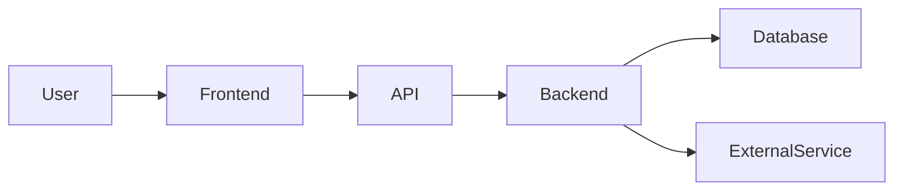

# Deep Project Audit & Presentation Preparation

You are a senior software architect, product analyst, security reviewer, QA engineer, and technical presentation coach.

Analyze the **entire project/codebase** available to you and produce exactly one file:

`PROJECT_AUDIT.md`

Assume I have **zero knowledge of this project**. I may not even know what the project is supposed to do.

Your job is to reverse-engineer the project from the available evidence and teach me everything I need to understand, explain, demonstrate, defend, and improve it.

## Critical Rules

* Inspect the actual files/code/configuration before making conclusions.
* Do not invent functionality that is not supported by evidence.
* Clearly distinguish:

  * **Implemented**
  * **Partially implemented**
  * **Mocked/demo behavior**
  * **Configured but unused**
  * **Referenced but missing**
  * **Broken/unclear**
  * **Inferred**
* When possible, reference the exact file, folder, function, class, API, database table, configuration, or component supporting each important conclusion.
* If something cannot be determined from the project, explicitly say **“Unknown from available evidence.”**
* Do not confuse intended functionality with actual functionality.
* Follow important functionality through the code instead of describing files in isolation.
* Prefer concrete evidence over assumptions.
* Explain technical concepts in simple language first, then provide technical detail.
* Do not merely summarize the README. Independently inspect the implementation.
* Look for inconsistencies between documentation and actual code.
* Identify dead code, duplicated logic, unused dependencies, incomplete features, hardcoded values, temporary solutions, and suspicious implementations.
* If the project contains secrets or credentials, do not reproduce the secret values. Identify their location and risk safely.

---

# 1. Executive Understanding

Start by answering these questions in extremely simple language:

### What is this project?

Explain it as if I am completely new to it.

Include:

* Project name
* One-sentence description
* Problem it solves
* Who uses it
* Who owns/operates it
* Main value it provides
* Main inputs
* Main outputs
* Main technologies
* Current implementation status

Then provide:

### 30-second explanation

Write something I could say if someone suddenly asks:

> “What is this project?”

### 2-minute explanation

Explain the project in a presentation-friendly way.

### Technical explanation

Explain the same project for a technical audience.

---

# 2. Project Discovery

Inspect the entire repository and build a map of the project.

Document:

* Root files
* Major directories
* Frontend
* Backend
* APIs
* Database
* Authentication
* Configuration
* Infrastructure
* Scripts
* Tests
* Documentation
* Deployment configuration
* CI/CD
* External services
* Third-party integrations

Create a table:

| Area | Location | Purpose | Important Components | Status |
| ---- | -------- | ------- | -------------------- | ------ |

Identify the files that are most important for understanding the system.

Create:

### “Top 20 files I should know”

For every file explain:

* Why it matters
* What it does
* What depends on it
* What depends on it

---

# 3. Technology Stack

Identify the actual technology stack.

Cover:

* Programming languages
* Frameworks
* Libraries
* Database
* ORM
* Authentication
* APIs
* Cloud/infrastructure
* Build tools
* Package managers
* Testing frameworks
* Monitoring/logging
* External APIs/services

For each technology explain:

1. Where it is used
2. Why it appears to be used
3. How important it is
4. Any concerns or outdated choices

Do not simply list dependencies from package files. Verify actual usage where possible.

---

# 4. Architecture

Reverse-engineer the complete architecture.

Explain:

* System boundaries
* Frontend architecture
* Backend architecture
* Service architecture
* Database architecture
* External services
* Authentication layer
* Storage
* Queues/background jobs if present
* Deployment/infrastructure

Create a Mermaid architecture diagram.

Example structure:



Replace this with the **actual architecture discovered from the project**.

Then explain the diagram in plain English.

---

# 5. End-to-End Data Flow

This is one of the most important sections.

Trace important data through the system.

For each major user action explain:

```text
User action
↓
UI component
↓
Frontend logic
↓
API request
↓
Backend route/controller
↓
Business logic/service
↓
Validation
↓
Database/external service
↓
Response
↓
Frontend state
↓
User sees result
```

Do this using actual project components.

For each important flow identify:

* Input
* Source
* Transformation
* Validation
* API
* Processing
* Storage
* External calls
* Output
* Error paths

Create Mermaid data-flow diagrams where useful.

---

# 6. User Experience

Reverse-engineer the actual user journey.

Explain:

### First-time user

What happens from opening the application until completing the main task?

### Returning user

What changes?

### Main user journeys

For every major feature explain:

1. What the user wants
2. What the user clicks/enters
3. What the application does
4. What data is generated
5. What happens in the backend
6. What the user finally sees

Identify:

* Screens
* Pages
* Forms
* Buttons
* Navigation
* Loading states
* Success states
* Error states
* Empty states
* Permissions
* Validation

Also identify UX gaps.

---

# 7. Owner / Admin / Operator Side

Analyze the project from the owner's perspective.

Explain:

* Who owns the system
* What the owner can see
* What the owner can control
* Admin features
* Dashboards
* Reports
* Configuration
* User management
* Data management
* Monitoring
* Approvals
* Operational workflows
* Permissions
* Administrative actions

Explain what happens behind the scenes when an owner performs each important action.

---

# 8. Feature Inventory

Create a complete feature inventory.

Use:

| Feature | User | Purpose | Frontend | Backend | Database | Status | Evidence |
| ------- | ---- | ------- | -------- | ------- | -------- | ------ | -------- |

Include:

* Core features
* Secondary features
* Admin features
* Authentication
* Notifications
* Reporting
* Search/filtering
* Upload/download
* Integrations
* Automation
* Analytics
* Any hidden/internal features

Do not only use README descriptions. Verify implementation.

---

# 9. Feature Deep Dive

For every major feature answer:

### What problem does it solve?

### Who uses it?

### What does the user do?

### What happens technically?

### What data is involved?

### What APIs are involved?

### What database operations occur?

### What happens if it fails?

### Why is the feature valuable?

### What could be improved?

---

# 10. Database & Data Model

Reverse-engineer the data model.

Identify:

* Tables/collections
* Models
* Fields
* Relationships
* Primary keys
* Foreign keys
* Indexes
* Constraints
* Migrations
* Seed data
* Important queries
* Data ownership

Create an ER diagram using Mermaid where possible.

Explain the most important entities in simple language.

Also identify:

* Duplicate data
* Missing constraints
* Potential data integrity problems
* Performance concerns
* Sensitive data

---

# 11. API Audit

Document all important APIs/endpoints.

Use:

| Method | Endpoint | Purpose | Input | Output | Authentication | Caller | Backend Logic | Status |
| ------ | -------- | ------- | ----- | ------ | -------------- | ------ | ------------- | ------ |

Trace each important API into the actual backend implementation.

Identify:

* Missing validation
* Poor error handling
* Authorization problems
* Inconsistent responses
* Unused endpoints
* Duplicate endpoints
* Potential security risks

---

# 12. Authentication & Authorization

Explain exactly how identity and permissions work.

Cover:

* Login
* Signup
* Sessions/tokens
* Password handling
* Roles
* Permissions
* Protected routes
* Backend authorization
* Frontend authorization
* Logout
* Expiration
* Refresh mechanisms

Check whether authorization is actually enforced server-side.

Identify security weaknesses.

---

# 13. Security Audit

Perform a practical security review.

Check for:

* Hardcoded credentials
* Exposed secrets
* Environment variables
* Authentication weaknesses
* Authorization weaknesses
* Input validation
* Injection risks
* XSS risks
* CSRF risks where applicable
* CORS
* File upload risks
* Sensitive data exposure
* Insecure API endpoints
* Logging of sensitive information
* Dependency risks
* Error-message leakage
* Missing rate limiting where relevant

Do not exploit anything.

Simply identify potential risks and explain their impact.

Classify risks:

* Critical
* High
* Medium
* Low

---

# 14. Workflow Analysis

Identify the important business and technical workflows.

For each workflow:

```text
Trigger
↓
Condition
↓
Action
↓
Processing
↓
Storage
↓
Notification/output
↓
Final state
```

Create Mermaid workflow diagrams.

Identify:

* Manual steps
* Automated steps
* Approval steps
* Failure points
* Retry behavior
* Dependencies
* Bottlenecks

---

# 15. Error Handling & Edge Cases

Analyze what happens when things go wrong.

Check:

* Invalid input
* Missing data
* Network failure
* API failure
* Database failure
* Authentication failure
* Permission failure
* Duplicate requests
* Timeout
* External service failure
* Empty states
* Unexpected data

Explain whether the system handles these properly.

---

# 16. Testing & Quality

Inspect:

* Unit tests
* Integration tests
* End-to-end tests
* Test coverage if available
* Test quality
* Fixtures/mocks
* Manual testing
* CI checks

Identify critical functionality that appears to have little or no testing.

---

# 17. Performance & Scalability

Analyze:

* Database queries
* API performance
* Frontend performance
* Large datasets
* Caching
* Pagination
* Background processing
* Concurrent users
* Memory/CPU concerns
* External API limits

Answer:

> “What happens if this project gets 10× more users/data?”

Then answer:

> “What would break first?”

---

# 18. Deployment & Operations

Explain how the project appears to be deployed.

Inspect:

* Docker
* Cloud configuration
* Environment variables
* Build process
* CI/CD
* Deployment scripts
* Database migrations
* Logging
* Monitoring
* Backups
* Rollbacks

If deployment information is missing, explicitly state that.

---

# 19. Documentation vs Reality

Compare:

* README
* Comments
* Documentation
* Configuration
* Actual code

Identify contradictions.

Create:

| Documentation Says | Code Actually Does | Difference | Impact |
| ------------------ | ------------------ | ---------- | ------ |

This section is especially important.

---

# 20. Implementation Status Audit

Create a clear status breakdown:

### Fully implemented

### Partially implemented

### Mocked

### Placeholder

### Unused

### Broken

### Missing

### Unclear

Provide evidence for each.

---

# 21. Architecture & Design Decisions

Identify important architectural decisions.

For each explain:

* Decision
* Evidence
* Reason it may have been chosen
* Advantages
* Disadvantages
* Alternatives
* Whether it should remain

Clearly distinguish between **observed design intent** and your own recommendation.

---

# 22. Business Value

Explain how the project helps users/business.

Identify:

* Time saved
* Manual work reduced
* Errors reduced
* Automation
* Better visibility
* Better decision making
* Revenue/value opportunities
* Operational benefits

Do not invent quantitative benefits.

If benefits cannot be measured from the codebase, state what should be measured.

---

# 23. Complete Risk Audit

Create a prioritized risk table:

| Risk | Category | Severity | Evidence | Impact | Recommendation |
| ---- | -------- | -------- | -------- | ------ | -------------- |

Categories:

* Security
* Reliability
* Performance
* Scalability
* UX
* Maintainability
* Data
* Architecture
* Business
* Operations

---

# 24. Improvement Roadmap

Create recommendations in priority order.

### P0 — Fix immediately

### P1 — High-value improvements

### P2 — Medium-term improvements

### P3 — Nice-to-have improvements

For each recommendation explain:

* Problem
* Proposed solution
* Why it matters
* Estimated complexity: Low/Medium/High
* Expected benefit
* Dependencies

---

# 25. Presentation Preparation

This section should prepare me to present the project even if I started with zero knowledge.

Create:

### Opening

Exactly how I should introduce the project.

### Problem

What problem does it solve?

### Solution

How does the project solve it?

### Users

Who uses it?

### Architecture

How should I explain the architecture verbally?

### Data flow

How should I explain the data flow verbally?

### Main features

Which features should I demonstrate?

### Demo flow

Give me the ideal order for a live demonstration.

### Technical highlights

What technical points should I mention?

### Business/value highlights

What value should I emphasize?

### Limitations

What should I honestly acknowledge?

### Future improvements

What roadmap should I present?

---

# 26. Presentation Q&A Preparation

Generate likely questions an audience may ask.

Include questions from:

### Non-technical audience

### Product/business audience

### Technical audience

### Developer/architect

### Security reviewer

### Project owner

For each question provide:

* Short answer
* Detailed answer
* Evidence/file to verify the answer

Include difficult questions such as:

* Why did you choose this architecture?
* Why this technology?
* How does the data flow?
* How is the system secured?
* What happens if the API/database fails?
* Can it scale?
* What is the biggest limitation?
* What would you improve first?
* What part is actually implemented?
* What makes this better than doing it manually?
* What happens with multiple users?
* How is user data protected?
* What would you change if you rebuilt it?

---

# 27. “Teach Me This Project”

Create a learning sequence from beginner to expert:

1. Understand the problem
2. Understand the users
3. Understand the UI
4. Understand the main workflow
5. Understand the data
6. Understand the API
7. Understand the backend
8. Understand the database
9. Understand the architecture
10. Understand deployment
11. Understand risks
12. Understand future improvements

For every step tell me which files I should read first.

---

# 28. Final Cheat Sheet

End the document with a compact cheat sheet containing:

## If I remember only 10 things

Exactly 10 important facts.

## Project in one sentence

One sentence.

## Project in 30 seconds

A presentation-ready explanation.

## Main users

List them.

## Main problem

One paragraph.

## Main solution

One paragraph.

## Main architecture

Short explanation.

## Main data flow

Short explanation.

## Main features

List the most important ones.

## Biggest strengths

List them.

## Biggest weaknesses

List them.

## Biggest risks

List them.

## Top 10 improvements

Prioritized.

## Questions I must be able to answer

List the most important questions.

## Files I must understand before presenting

Rank them from most important to least important.

---

# 29. Final Audit Verdict

Give the project an overall assessment.

Use:

* Architecture: /10
* Code quality: /10
* Security: /10
* UX: /10
* Scalability: /10
* Testing: /10
* Maintainability: /10
* Documentation: /10
* Business/value clarity: /10
* Presentation readiness: /10

Explain every score briefly.

Then provide:

### Overall verdict

What is good, what is weak, and what needs attention before presenting.

### Most important thing I should understand

### Most important thing I should fix

### Most important thing I should demonstrate

### Most likely question I will be asked

### Best answer

---

## Final Requirement

The final output must be a single Markdown document named:

`PROJECT_AUDIT.md`

It must be **evidence-driven, comprehensive, easy to understand, presentation-ready, and honest about uncertainty**.

Do not produce a generic template.

Actually inspect and analyze the project and fill the document with findings from the project itself.
