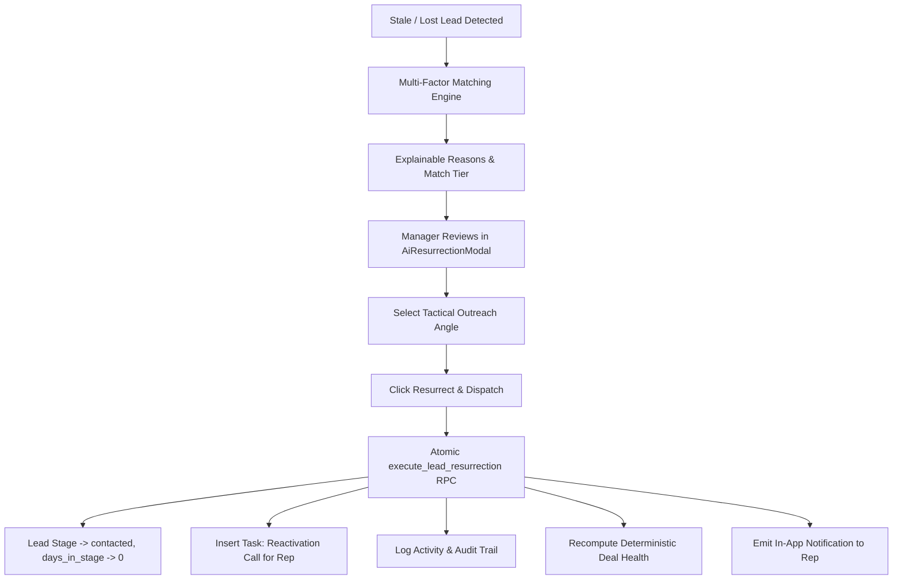

# CallCRM — Phase 10: Multi-Factor Resurrection Engine

## 1. Overview
The **Multi-Factor Resurrection Engine** replaces legacy $\pm20\%$ budget heuristics with a production-grade, explainable, tenant-isolated 100-point deterministic matching system. It identifies dormant, stale, and lost buyers and matches them against currently available, newly released inventory.

Matching decisions are 100% deterministic, explainable, and reproducible without relying on LLMs for numerical evaluations or financial calculations.

---

## 2. 100-Point Scoring Architecture

The engine scores available units for a buyer on a 100-point scale:

| Scoring Factor | Default Weight | Scoring Criteria & Rules |
| :--- | :---: | :--- |
| **Project Match** | **40 pts** | • **40 pts**: Exact preferred project match (`lead.project_id === unit.project_id` or matching project name)<br>• **25 pts**: Project in buyer's preferred regional territory (`lead.region_id === project.region_id`)<br>• **25 pts (Neutral baseline)**: When no project preference was specified<br>• **0 pts**: Unrelated project |
| **Budget Fit** | **30 pts** | • **30 pts**: Price variance $\le 5\%$ from target budget<br>• **25 pts**: Price variance $5\% - 10\%$ from target budget<br>• **18 pts**: Price variance $10\% - 15\%$ from target budget<br>• **10 pts**: Price variance $15\% - 20\%$ from target budget<br>• **15 pts (Neutral baseline)**: Missing / zero budget safely handled<br>• **0 pts**: Price variance $> 20\%$ |
| **Configuration Fit** | **20 pts** | • **20 pts**: Exact normalized layout match (e.g. `3bhk` = `3bhk`)<br>• **15 pts**: Compatible layout upgrade (e.g. `2bhk` buyer fitted into `3bhk` within budget)<br>• **12 pts (Neutral baseline)**: No configuration preference specified<br>• **0 pts**: Incompatible configuration (e.g. `4bhk` buyer vs `1bhk` unit) |
| **Floor Preference** | **5 pts** | • **5 pts**: Exact floor number or category match (`high` $\ge 12$, `mid` 5–11, `low` 1–4)<br>• **3 pts**: Adjacent floor category<br>• **5 pts (Neutral baseline)**: No floor preference specified<br>• **0 pts**: Incompatible floor level |
| **Facing Preference** | **5 pts** | • **5 pts**: Exact facing / view match (e.g. `East`, `Park`, `North-East`)<br>• **3 pts**: Compatible orientation (e.g. `North` vs `East`)<br>• **5 pts (Neutral baseline)**: No facing preference specified<br>• **0 pts**: Mismatch |
| **Recency Bonus** | **+5 pts** | • **+5 pts**: Units created/released within the last 14 days |

### Match Tiers
- **90–100**: Excellent Match
- **75–89**: Strong Match
- **60–74**: Possible Match
- **<60**: Weak Match (filtered out by default)

---

## 3. Hard Exclusion Rules & Safety
1. **Unit Operational Status**: Units with `status != 'available'` (`sold`, `booked`, `hold`, `site_visit`, `negotiation`, `cancelled`) are strictly excluded.
2. **Tenant Isolation**: Both leads and candidate inventory must belong to the caller's verified `org_id`. Cross-tenant candidate leakage is impossible.
3. **Opted-Out & Do Not Contact**: Leads with `lost_reason` in (`'opted_out'`, `'do_not_contact'`, `'unsubscribed'`) are automatically omitted from batch scans unless explicitly overridden.
4. **30-Day Cooldown**: Once resurrected (`last_resurrected_at`), a lead is excluded from automatic batch resurrection for 30 days to avoid rep spam and customer harassment.
5. **Human Approval Gate**: Matches and pitches are presented to sales managers / reps for review. Automated unapproved customer outreach is forbidden.

---

## 4. Re-Engagement Workflow


---

## 5. API Endpoints

### `POST /api/agent/resurrect`
Scans for resurrection opportunities across the organization or retrieves ranked candidates for a specific lead.
- **Access**: Manager+ role only.
- **Feature Gate**: Requires `resurrection` capability in organization plan.
- **Request Body**:
  ```json
  {
    "leadId": "uuid-optional",
    "daysThreshold": 14,
    "minScore": 60,
    "limit": 20,
    "force": false
  }
  ```

### `POST /api/agent/resurrect/execute`
Atomically executes the resurrection of one or more leads with human approval.
- **Access**: Manager+ role only.
- **Request Body**:
  ```json
  {
    "leadId": "uuid-optional",
    "leadIds": ["uuid-1", "uuid-2"],
    "unitId": "uuid-optional",
    "pitch": "Personalized re-engagement message..."
  }
  ```

---

## 6. Database Schema & RPCs
- **Migration**: `supabase/migrations/0016_phase10_resurrection_engine.sql`
- **Columns Added**: `leads.last_resurrected_at`, `leads.resurrection_count`.
- **Indexes**:
  - `idx_leads_resurrection_eval` on `public.leads(org_id, stage, days_in_stage, last_resurrected_at)`
  - `idx_project_units_resurrection_matching` on `public.project_units(org_id, status, project_id, price)`
- **Stored Procedures**:
  - `public.find_resurrection_candidates(p_org_id, p_lead_id, p_limit, p_min_score)`
  - `public.scan_resurrection_opportunities(p_org_id, p_days_threshold, p_limit, p_min_score, p_force)`
  - `public.execute_lead_resurrection(p_org_id, p_lead_id, p_user_id, p_unit_id, p_pitch)`
