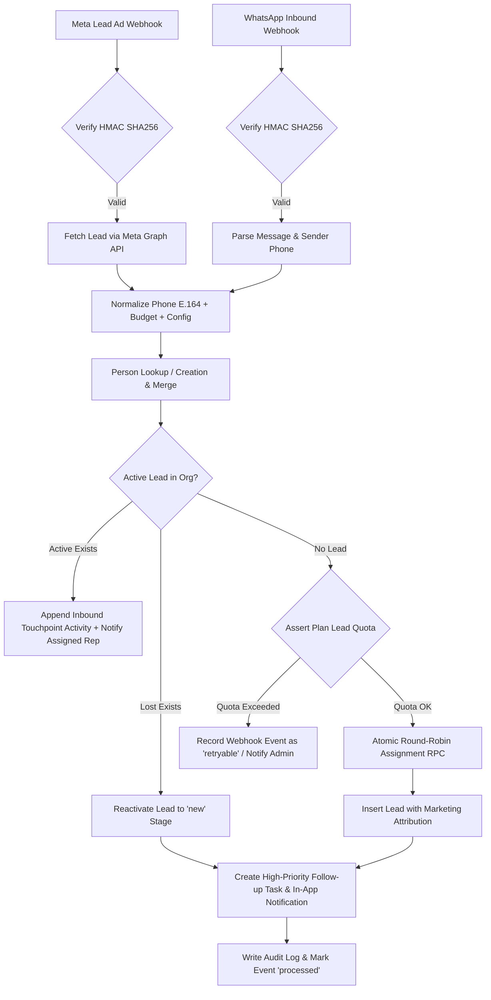

# CallCRM — Phase 7: Lead Ingestion Automation
## Meta Lead Ads & WhatsApp Pipeline Technical Documentation

---

### Overview
Phase 7 implements production-grade inbound lead ingestion pipelines for **Meta Lead Ads** and **WhatsApp (Cloud API / Twilio)**. Inbound webhooks are verified via cryptographic signatures, deduped against existing people/leads, checked against organization plan quotas, automatically assigned to salespeople using transactional round-robin locking, and enriched with initial follow-up tasks, real-time in-app notifications, and audit logging.

---

### Ingestion Flow & Architecture

---

### Key Components

#### 1. Database Migration `0013_phase7_lead_ingestion.sql`
- **`webhook_sources`**: Extended with `project_id` and `config` for automated campaign/project routing.
- **`webhook_events`**: Added status checks (`pending`, `processing`, `processed`, `failed`, `retryable`, `dead_letter`), `lead_id`, `person_id`, `retry_count`, and `last_error`.
- **`leads`**: Extended with marketing attribution columns (`campaign_id`, `campaign_name`, `adset_id`, `adset_name`, `ad_id`, `ad_name`, `form_id`, `form_name`, `external_lead_id`, `raw_inbound_payload`, `inbound_timestamp`).
- **`idx_leads_org_external_lead_id`**: Unique index enforcing idempotency on external lead IDs per organization.
- **`org_assignment_state`**: State table tracking round-robin monotonic counter per `(org_id, region_id)`.
- **`assign_next_salesperson(p_org_id, p_region_id)`**: Stored procedure utilizing transactional row locking (`FOR UPDATE` / atomic increment) with modulo distribution across active salespeople/closers and regional filters.

#### 2. Reusable Ingestion Engine (`Frontend/src/lib/server/lead-ingestion.ts`)
- **`normalizePhone(phone)`**: Converts 10-digit Indian numbers and varying formats into canonical E.164 (`+91XXXXXXXXXX`).
- **`normalizeConfiguration(raw)`**: Standardizes variations like `"3 BHK"`, `"3bhk"`, `"3 bed"` into canonical `"3bhk"`.
- **`normalizeBudget(raw)`**: Handles numeric strings, Cr/Lakh formats (`"1.5 Cr"` -> `15000000`, `"75 Lakhs"` -> `7500000`).
- **`ingestInboundLead(params)`**: Full end-to-end orchestration handling person dedup, lead lifecycle routing, quota checking, assignment, tasks, notifications, and audit logging.

#### 3. Meta Lead Ads Webhook (`Frontend/src/app/api/webhooks/meta-lead-ads/route.ts`)
- **Verification Handshake (`GET`)**: Validates `hub.mode = subscribe` and `hub.verify_token`.
- **Signature Verification (`POST`)**: Verifies `X-Hub-Signature-256` HMAC against `META_APP_SECRET` or source secret.
- **Lead Data Retrieval**: Fetches actual form answers and ad context from Meta Graph API (`https://graph.facebook.com/v20.0/{leadgen_id}`).
- **Replay Protection**: Logs webhook payload and skips duplicate `entry.id` or `leadgen_id`.

#### 4. WhatsApp Webhook (`Frontend/src/app/api/webhooks/whatsapp/route.ts`)
- **Verification Handshake (`GET`)**: Validates token handshake for WhatsApp Cloud API.
- **Signature Verification (`POST`)**: Validates `X-Hub-Signature-256` / `X-Twilio-Signature`.
- **Conversation Threading**: Attaches incoming customer inquiries directly to existing active leads as touchpoints, or spins up a new lead if no active deal is open.

#### 5. Webhook Retry & Dead-Letter Endpoint (`Frontend/src/app/api/webhooks/retry/route.ts`)
- **`GET /api/webhooks/retry`**: Lists failed, retryable, and dead-letter webhook events for managers/admins.
- **`POST /api/webhooks/retry`**: Allows retrying specific failed webhooks or replaying batch events. Automatically marks events reaching maximum retry limit (`5`) as `dead_letter`.

#### 6. Enterprise n8n & Outbox Event Bus (`supabase/migrations/0021_n8n_event_bus_and_integration_outbox.sql`)
- **Transactional Outbox**: Leads created via webhooks automatically write a domain event `lead.created` into `public.integration_outbox` with tenant isolation.
- **Circuit Breaker**: When external webhook dispatchers or n8n nodes fail repeatedly, the system trips a circuit breaker (`CLOSED` $\rightarrow$ `OPEN` $\rightarrow$ `HALF-OPEN`) to protect database throughput.
- **Idempotency Key Enforcement**: Inbound webhooks strictly validate `X-Idempotency-Key` headers against `public.idempotency_keys` with 24-hour expiration.

---

### Verification & Testing
- **Vitest Unit Tests**: `Frontend/src/__tests__/phase7-lead-ingestion.test.ts` (10 tests), `Frontend/src/__tests__/n8n-architecture.test.ts` (3 tests), and `Frontend/src/__tests__/webhook-security.test.ts` (8 tests).
- **Migration Validation Harness**: `scripts/validate-migrations.mjs` verifying schema extensions and round-robin stored procedure execution.
- **TypeScript Typecheck**: Passed cleanly with `npx tsc --noEmit`.
- **Next.js Production Build**: Compiled and generated 75 static/dynamic endpoints with zero errors.
