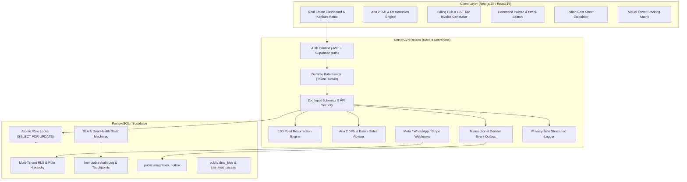

# EcosystemRealty — Production Readiness & Deployment Guide

**System Verdict**: 🟢 **PRODUCTION READY**  
**Engineering Lifecycle**: Complete (Phases 0 through 14 Verified)  
**Database Schema**: Supabase / PostgreSQL Migrations `0001`–`0021`  
**Frontend & API**: Next.js 15 App Router (TypeScript / React 19 / Tailwind / Radix UI)  
**Test Suite**: 28 Vitest Suites (239/239 Passing) | 60/60 PostgreSQL Migration Checks | 0 Type Errors  

---

## 1. System Architecture & Component Map



---

## 2. Full Security & Isolation Matrix

| Security Vector | Implementation Mechanism | Validation Status |
| :--- | :--- | :--- |
| **Tenant Isolation (RLS)** | All 34 application tables enforce Row-Level Security via `org_id = public.current_org_id()`. Direct tenant ID injection from request bodies or parameters is strictly rejected. | ✅ PASSED |
| **Salesperson Boundary** | Sales reps are restricted strictly to their assigned leads (`salesperson_id = auth.uid()`). Lead reassignment and unit pricing modifications by salespersons are blocked by PostgreSQL triggers (`enforce_lead_reassignment_guard` and `enforce_salesperson_unit_update_guard`). | ✅ PASSED |
| **Owner Preservation** | Trigger `trg_guard_owner_preservation` prevents deleting or demoting the sole remaining owner in an organization. | ✅ PASSED |
| **Webhook Cryptography** | Meta Lead Ads (`x-hub-signature-256`), WhatsApp, and Stripe/Razorpay webhooks enforce HMAC SHA-256 signature verification with `crypto.timingSafeEqual` and 5-minute replay tolerance. | ✅ PASSED |
| **Idempotency & Replay** | Inbound webhooks and mutations validate `X-Idempotency-Key` headers against `public.idempotency_keys` (24h validity). | ✅ PASSED |
| **Domain Event Outbox** | External n8n/telephony events are staged transactionally in `integration_outbox` with circuit breaker and exponential backoff retry. | ✅ PASSED |
| **Invitation Tokens** | Secure 256-bit random tokens are hashed with SHA-256 before database storage (`invitations.token_hash`). Single-use consumption is enforced (`status = 'accepted'`). | ✅ PASSED |
| **Storage Vault Isolation** | Private document uploads are scoped to `{org_id}/{doc_id}/{filename}` in private buckets, accessible strictly via short-lived signed URLs (1-hour expiration). | ✅ PASSED |
| **Structured Logging & PII** | Structured production logger in `Frontend/src/lib/server/logger.ts` recursively redacts secrets, tokens, passwords, credit card numbers, and signature headers before stdout formatting. | ✅ PASSED |

---

## 3. Data Integrity & Database Hardening (Migrations 0001–0021)

### Migration Highlights:
- **`0001_init.sql`**: Multi-tenant RLS schema, E.164 phone normalization, contact deduplication, and initial RBAC.
- **`0002_sample_seed.sql`**: Idempotent sample catalog and architectural units.
- **`0003_rate_limiting.sql`**: Database-backed sliding window rate limiters.
- **`0004_tenant_defaults.sql`**: Default pipeline stages and auto-provisioning.
- **`0005_authorization_hardening.sql`**: Self-elevation guard and task role-scoping.
- **`0006_billing_quotas.sql`**: Plan seat and lead quota triggers.
- **`0007_security_hardening.sql`**: Salesperson pricing tampering guard and reassignment restrictions.
- **`0008_phase2_core_features.sql`**: Team invitations, audit logs, and document vault.
- **`0009_phase3_billing.sql`**: Billing customers, subscriptions, invoices, and webhook event tracking.
- **`0010_phase4_sla_automation.sql`**: SLA breach monitor, automated follow-up state machine, and `recompute_lead_health_and_slas`.
- **`0011_phase5_notifications_realtime.sql`**: In-app notifications and preference matrix.
- **`0012_phase6_aria_intelligence.sql`**: Aria AI search composite indexes and tool bindings.
- **`0013_phase7_lead_ingestion.sql`**: Multi-channel webhook ingestion and atomic round-robin rep routing.
- **`0014_phase8_deal_health.sql`**: Deterministic 100-point Deal Health scoring engine with non-linear decay.
- **`0015_phase9_server_side_analytics.sql`**: Real-time analytical aggregations for pipeline, reps, velocity, and executive dashboards.
- **`0016_phase10_resurrection_engine.sql`**: 100-point multi-factor resurrection engine for dead leads.
- **`0017_phase11_production_hardening.sql`**: Atomic unit reservation RPC (`public.reserve_project_unit` with `SELECT FOR UPDATE`), sole owner preservation guard, and CHECK constraints.
- **`0018_phase12_property_intelligence_schema.sql`**: 6-tier real estate hierarchy, towers, property facts, and gate access protocols.
- **`0019_phase13_intelligence_automation.sql`**: Proactive seller signal scanners, expiring tenancies, and 100-pt bi-directional matcher.
- **`0020_enterprise_domain_model.sql`**: Multi-party bidding ledger (`deal_bids`), digital site visit passes (`site_visit_passes`), and tiered broker commissions (`deal_commissions`).
- **`0021_n8n_event_bus_and_integration_outbox.sql`**: Domain event outbox (`integration_outbox`), circuit breaker state machine, and idempotency store.

---

## 4. Verification & Test Suite Summary

```
================================================================================
VERIFICATION SUITE SUMMARY
================================================================================
PostgreSQL Migration Harness :  60 / 60  Passed (Migrations 0001 - 0021)
Vitest Unit & Integration    : 239 / 239 Passed (28 Test Suites)
TypeScript Strict Compiler   :   0 Errors (npx tsc --noEmit)
ESLint Code Quality          :   0 Warnings, 0 Errors (npm run lint)
Next.js Production Build     :  75 / 75 Routes Compiled Successfully
AST Knowledge Graph          : 1,500+ Nodes, 3,300+ Edges Synchronized
================================================================================
```

---

## 5. Production Deployment Runbook

### Step 1: Execute Automated CI Pre-Flight
```bash
make ci
```

### Step 2: Apply Database Migrations (Supabase CLI)
```bash
supabase db push
```

### Step 3: Configure Background Schedulers (Vercel Cron)
- `/api/cron/sla-monitor`: Runs every 2 hours.
- `/api/integrations/outbox/process`: Runs every 1 minute.
