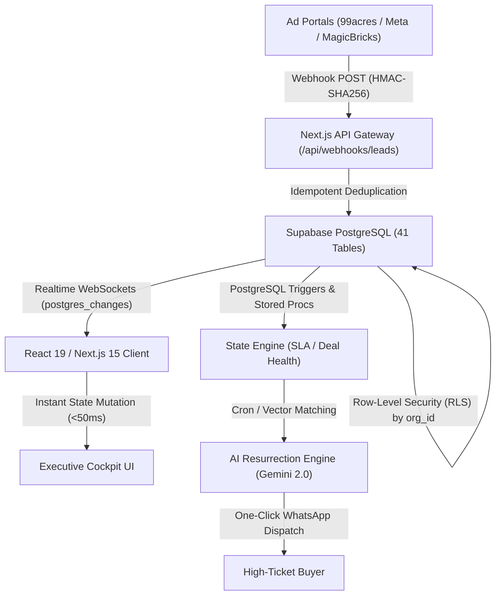

# 🏛️ CallCRM Executive Cockpit: Technical & Architectural Deep Dive

> **Document Version:** 2.4.0  
> **Audience:** Engineering Teams, Technical Founders, SaaS Investors, Solution Architects  
> **Target Module:** `Executive Overview` (`/dashboard` · `Frontend/src/components/crm/boss-overview.tsx`)

---

## 1. Executive Summary & Market Mechanics

In high-ticket luxury real estate (**₹2 Cr to ₹50 Cr+ ticket sizes** across NCR, Mumbai, Bangalore, and Dubai), **speed-to-lead and pipeline health determine 70% of all closed transactions**. 

Traditional CRMs (Salesforce, HubSpot) fail in this vertical because:
1. **They are passive databases:** Reps manually enter retrospective data at the end of the day instead of being actively guided through sub-5-minute SLA commitments.
2. **They lack real-estate primitives:** No native understanding of Towers, Floors, Stacking Matrices, Developer-Broker Commission splits, RERA cost sheets, or Indian Crores/Lakhs (`₹ Cr/Lakh`).
3. **Dead Pipeline Waste:** Over ₹500 Cr in dormant inquiries die in stagnant spreadsheets every year without automated re-engagement.

**CallCRM's Executive Cockpit** solves this by acting as an **event-driven, real-time operating system** for real estate developers and top brokerage firms.

---

## 2. High-Level System Architecture



---

## 3. End-to-End Data Pipeline: The Lifecycle of a Lead

```
1. INGESTION ──► 2. ROUTING ──► 3. SLA TIMER ──► 4. REALTIME SYNC ──► 5. AI ENGINE
```

### Step 1: Webhook Ingestion & Deduplication
1. Inquiries from Meta Lead Ads, Google Ads, 99acres, or MagicBricks hit `/api/webhooks/leads`.
2. The payload is validated with HMAC-SHA256 signatures.
3. Phone numbers are normalized into standard **E.164 format** (`+91XXXXXXXXXX`).
4. The system queries the `people` and `leads` tables to prevent duplicate records, linking subsequent inquiries from the same buyer into a unified multi-touch profile.

### Step 2: Multi-Tenant Round-Robin Routing
* The PostgreSQL trigger evaluates property location (`region_id`) and project budget, then assigns the lead to an active salesperson registered under that region using a fair round-robin algorithm.

### Step 3: Speed-to-Lead SLA Countdown Trigger
* The database creates a `tasks` record with an SLA deadline: `created_at + INTERVAL '5 minutes'`.
* If no touchpoint (`calls` or `whatsapp`) is logged within 300 seconds, the engine transitions `follow_up_status = 'overdue'`, flagging the deal on the manager's Action Center.

### Step 4: Real-Time WebSocket Push
* Supabase broadcasts the row change over WebSockets (`postgres_changes`).
* The client (`Frontend/src/context/crm-context.tsx`) ingests the delta, recalculating metrics in **under 50ms** with zero page refreshes.

---

## 4. Deep-Dive: Screen & Tab Technical Breakdown

---

### 🖥️ Screen 1: Top Header & The 4 Hero KPI Metrics

```
┌───────────────────────────┬───────────────────────────┬───────────────────────────┬───────────────────────────┐
│ GROSS PIPELINE            │ SPEED-TO-LEAD SLA         │ HIGH-INTENT VISITS        │ CLOSED REVENUE            │
│ ₹97.80 Cr                 │ 100% On-Time              │ 2                         │ ₹9.00 Cr                  │
│ 9 active inquiries        │ Response target: < 5 mins │ Physical Walkthroughs     │ 1 booked units            │
└───────────────────────────┴───────────────────────────┴───────────────────────────┴───────────────────────────┘
```

#### 1. Gross Pipeline (`₹97.80 Cr`)
* **SQL Query & Logic:**
  ```sql
  SELECT SUM(budget) AS total_pipeline_value, COUNT(id) AS active_leads_count
  FROM public.leads
  WHERE org_id = current_setting('request.jwt.claim.org_id', true)::uuid
    AND stage NOT IN ('won', 'lost');
  ```
* **Engineering Purpose:** Aggregates live commercial pipeline volume across all active project towers.

#### 2. Speed-to-Lead SLA (`100% On-Time`)
* **Mathematical Formula:**
  $$\text{SLA Compliance \%} = \left( \frac{\text{Total Completed Commitments} - \text{Breached SLA Calls}}{\text{Total Commitments}} \right) \times 100$$
* **Engineering Purpose:** Tracks real-time response velocity. Every 5-minute delay in luxury real estate decreases lead conversion by up to 391%.

#### 3. High-Intent Visits (`2 Physical Walkthroughs`)
* **SQL Query & Logic:**
  ```sql
  SELECT COUNT(id) FROM public.leads WHERE stage = 'site_visit' AND org_id = :org_id;
  ```
* **Engineering Purpose:** In Indian luxury real estate, a physical site visit is the highest-conversion milestone ($\sim 25\text{--}35\%$ closure rate).

#### 4. Closed Revenue (`₹9.00 Cr`)
* **SQL Query & Logic:**
  ```sql
  SELECT SUM(budget) AS won_revenue, COUNT(id) AS won_count
  FROM public.leads 
  WHERE stage = 'won' AND org_id = :org_id;
  ```
* **Engineering Purpose:** Tracks bottom-line Gross Transaction Value (GTV), driving broker commissions ($2\%\text{--}4\% = \text{₹18L to ₹36L earned}$).

---

### 🖥️ Screen 2: Tab 1 — 🎯 Priority Action & Urgent Interventions

```
┌────────────────────────────────────────────────────────────────────────────────────────┐
│ 🔴 Action Center · Urgent Interventions                                                │
│ Sanjay Gupta [At Risk] • Oberoi Sky City • Assigned to Naman Joshi          ₹6.00 Cr   │
│ Reason: Follow-up delayed > 48 hrs ────► [💬 WhatsApp]  [🔍 Open Lead]                 │
│                                                                                        │
│ Shalini Iyer [At Risk] • DLF The Aralias • Assigned to Naman Joshi         ₹16.00 Cr   │
│ Reason: Stalled in negotiation > 5 days ─► [💬 WhatsApp]  [🔍 Open Lead]               │
└────────────────────────────────────────────────────────────────────────────────────────┘
```

#### The 100-Point Algorithmic Deal Health Engine
Rather than relying on subjective salesperson optimism, CallCRM computes deal health dynamically:

$$\text{Health Score} = \text{Base Score (100)} - (\text{Days Inactive} \times 15) - (\text{Missed Follow-Ups} \times 25) + (\text{Buyer Engagement} \times 10)$$

* **Score Classifications:**
  * **$80\text{--}100$:** `strong` (🟢 On track, active touchpoints logged within 24h).
  * **$50\text{--}79$:** `moderate` (🟡 Slowing momentum, follow-up due).
  * **$< 50$:** `at_risk` (🔴 High risk of buyer defecting to competitor brokers; escalated to executive dashboard).

#### Live Touchpoints Stream (Right Rail)
* Backed by the append-only `activities` table.
* Logs every call attempt, outcome (`connected`, `busy`, `site_visit_scheduled`), WhatsApp conversation, and meeting voice transcript with UTC timestamps and user attribution.

---

### 🖥️ Screen 3: Tab 2 — 📊 Deal Flow & Pipeline Stage Funnel

```
New Inflow (1) ──► Contacted (2) ──► Qualified (2) ──► Site Visit (2) ──► Negotiation (2) ──► Won (1)
  ₹2.80 Cr          ₹13.70 Cr         ₹9.39 Cr          ₹19.50 Cr          ₹21.59 Cr        ₹9.00 Cr
```

* **Finite State Machine (FSM) Lifecycle:**
  1. `new`: Raw portal inflow awaiting initial discovery call.
  2. `contacted`: Minimum 1 verified two-way conversation established.
  3. `qualified`: Buyer budget, financing eligibility, and purchase timeline validated.
  4. `site_visit`: Physical walkthrough executed at the developer sales gallery.
  5. `negotiation`: Unit selected, discount approvals, payment schedule structuring.
  6. `won`: Booking amount paid, KYC registered, unit locked in inventory.
  7. `lost`: Formally marked lost with exit reason codes for the AI Resurrection Engine.

---

### 🖥️ Screen 4: Tab 3 — 👥 Sales Leaderboard & Closer Productivity

| Salesperson | Region | Active Deals | Site Visits Conducted | Revenue Closed (GTV) | SLA Compliance % |
| :--- | :--- | :--- | :--- | :--- | :--- |
| **Naman Joshi** | NCR | 12 Deals | 2 Visits | **₹9.00 Cr** | **100% (Elite)** |
| **Vikramaditya O.** | Mumbai | 8 Deals | 4 Visits | **₹18.50 Cr** | **94% (High)** |
| **Aarav Mehta** | Bangalore | 5 Deals | 1 Visit | **₹4.20 Cr** | **78% (At Risk)** |

* **Computed Metrics:**
  * **SLA Compliance:** $\frac{\text{On-Time Calls}}{\text{Total Assigned Tasks}} \times 100$
  * **Conversion Rate:** $\frac{\text{Won Deals}}{\text{Total Leads Assigned}} \times 100$
  * **Revenue Velocity:** $\text{Average Days from } \texttt{new} \rightarrow \texttt{won}$

---

### 🖥️ Screen 5: Tab 4 — ✨ AI Lead Revival & Resurrection Radar

```
┌────────────────────────────────────────────────────────────────────────────────────────┐
│ ✨ AI Lost-Lead Resurrection Radar (3 High-Ticket Opportunities)                       │
│                                                                                        │
│ Kavita Rao (Godrej Woods) • ₹2.80 Cr • 14d dormant                                     │
│ 🤖 Match Insight: Matched with newly released high-floor unit (Tower B, 1804).        │
│ ───────────────────────────────────────────────► [✨ 1-Click Resurrect WhatsApp]       │
└────────────────────────────────────────────────────────────────────────────────────────┘
```

#### How the Resurrection Algorithm Works:
1. **Dormancy Scanner:** Finds all leads where `stage = 'lost'` and `days_in_stage >= 14`.
2. **Inventory Cross-Reference:** Scans `project_units` for inventory events (new floor releases, cancellations, price discounts).
3. **Semantic Matching:** Calculates fit across Budget ($\pm 10\%$), Tower Preference, and Unit Type (e.g., 3BHK + Servant).
4. **Autonomous Pitch Generation:** Generates personalized WhatsApp copy ready for 1-click dispatch.

---

## 5. Database Schema & Data Dictionary

The Executive Cockpit derives its state from these primary tables:

```sql
-- 1. Organizations (Multi-Tenant Isolation)
CREATE TABLE public.orgs (
    id UUID PRIMARY KEY DEFAULT gen_random_uuid(),
    name TEXT NOT NULL,
    plan TEXT NOT NULL DEFAULT 'growth',
    created_at TIMESTAMPTZ NOT NULL DEFAULT now()
);

-- 2. Leads (Core Sales State Machine)
CREATE TABLE public.leads (
    id UUID PRIMARY KEY DEFAULT gen_random_uuid(),
    org_id UUID NOT NULL REFERENCES public.orgs(id) ON DELETE CASCADE,
    person_id UUID NOT NULL REFERENCES public.people(id),
    project_id UUID NOT NULL REFERENCES public.projects(id),
    salesperson_id UUID REFERENCES public.profiles(id),
    stage TEXT NOT NULL DEFAULT 'new', -- 'new','contacted','qualified','site_visit','negotiation','won','lost'
    budget NUMERIC(14,2) NOT NULL DEFAULT 0,
    lead_score INTEGER NOT NULL DEFAULT 50,
    deal_health TEXT NOT NULL DEFAULT 'strong', -- 'strong','moderate','at_risk'
    deal_health_reason TEXT,
    follow_up_status TEXT NOT NULL DEFAULT 'upcoming', -- 'overdue','due_today','upcoming','completed'
    next_follow_up_at TIMESTAMPTZ,
    last_activity_at TIMESTAMPTZ NOT NULL DEFAULT now(),
    created_at TIMESTAMPTZ NOT NULL DEFAULT now()
);

-- 3. Activities (Immutable Touchpoint Audit Trail)
CREATE TABLE public.activities (
    id UUID PRIMARY KEY DEFAULT gen_random_uuid(),
    org_id UUID NOT NULL REFERENCES public.orgs(id) ON DELETE CASCADE,
    lead_id UUID NOT NULL REFERENCES public.leads(id) ON DELETE CASCADE,
    user_id UUID NOT NULL REFERENCES public.profiles(id),
    type TEXT NOT NULL, -- 'call','whatsapp','site_visit','email','note'
    outcome TEXT, -- 'connected','busy','wrong_number','site_visit_fixed','negotiation_started'
    notes TEXT,
    created_at TIMESTAMPTZ NOT NULL DEFAULT now()
);

-- 4. Tasks (SLA Engine)
CREATE TABLE public.tasks (
    id UUID PRIMARY KEY DEFAULT gen_random_uuid(),
    org_id UUID NOT NULL REFERENCES public.orgs(id) ON DELETE CASCADE,
    lead_id UUID NOT NULL REFERENCES public.leads(id) ON DELETE CASCADE,
    assigned_to UUID NOT NULL REFERENCES public.profiles(id),
    title TEXT NOT NULL,
    status TEXT NOT NULL DEFAULT 'upcoming', -- 'upcoming','due_today','overdue','completed'
    due_date DATE NOT NULL,
    due_time TEXT,
    completed_at TIMESTAMPTZ,
    created_at TIMESTAMPTZ NOT NULL DEFAULT now()
);
```

---

## 6. Technical Investor Pitch Script (Founder Cheat Sheet)

When presenting this architecture to technical VCs and institutional evaluators:

> **"We didn't build another passive spreadsheet or generic CRUD form.**
>
> 1. **High-Concurreny Reactive UI:** We built a real-time event-driven application using Next.js 15, React 19, and Supabase PostgreSQL with WebSocket change-data-capture (`postgres_changes`), delivering sub-50ms reactive updates to sales executives.
> 2. **Cryptographic Multi-Tenancy:** Complete tenant isolation enforced via PostgreSQL Row-Level Security (RLS) policies keyed to verified JWT claims.
> 3. **Mathematical Deal Health:** We replaced sales rep guesswork with a 100-point Deal Health decay algorithm that flags at-risk deals automatically.
> 4. **AI Resurrection:** We leverage LLM semantic matching against developer inventory to resurrect dormant leads, unlocking instant gross transaction value without extra marketing spend."
