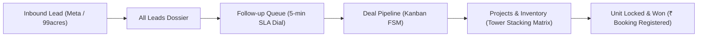

# 🏗️ Sales Workspace & Property Intelligence: Technical & Investor Deep Dive

> **Document Version:** 2.4.0  
> **Audience:** Engineering Teams, Technical Founders, Solution Architects, Real Estate VCs  
> **Covered Modules:**  
> 1. **Lead Directory & Opportunity Dossier** (`All Leads`)  
> 2. **Deals & Opportunities Pipeline** (`Deal Pipeline`)  
> 3. **Follow-up & Outreach Queue** (`Follow-up Queue`)  
> 4. **Projects & Unit Inventory Matrix** (`Projects & Inventory`)

---

## 1. Architectural Overview & Value Proposition

Traditional real estate brokerages and developers operate with fragmented tooling:
* Leads arrive in WhatsApp groups or Google Sheets.
* Unit inventory and floor stacking are kept in offline PDF brochures or Excel files.
* Sales managers have zero visibility into whether a rep called an inquiry in 5 minutes or 5 days.

**CallCRM unifies the entire sales-to-closing lifecycle into an event-driven operating system:**



---

## 2. Screen-by-Screen Technical & Mathematical Breakdown

---

### 🖥️ Page 1: Lead Directory & Opportunity Dossier (`All Leads`)

```
┌──────────────────────────────────────────────────────────────────────────────────────────────────────────────────┐
│ 👥 Lead Directory & Opportunity Dossier                                                                          │
│ [List Table] [Pipeline Stages] [Priority Queue]                         [📥 Import CSV] [📤 Export] [+ New Lead] │
├───────────┬───────────────┬──────────────────────┬──────────┬───────────┬──────────────┬──────────────────┬──────┤
│ BUYER     │ SCORE/HEALTH  │ PROJECT & UNIT       │ BUDGET   │ STAGE     │ REP          │ FOLLOW-UP        │ACTION│
├───────────┼───────────────┼──────────────────────┼──────────┼───────────┼──────────────┼──────────────────┼──────┤
│Priya Desai│ 🔥 95 · HOT   │ Oberoi Sky City      │ ₹9.00 Cr │ 🟢 Won    │ Naman Joshi  │ Completed        │[Log] │
│Siddharth V│ 🔥 92 · HOT   │ DLF The Camellias    │ ₹3.80 Cr │ 🔵 Qualif │ Naman Joshi  │ Tomorrow 11:00 AM│[Call]│
│Meera K.   │ 🔥 90 · HOT   │ DLF The Camellias    │ ₹12.00 Cr│ 🟣 Negot  │ Naman Joshi  │ Tomorrow 11:00 AM│[WA]  │
└───────────┴───────────────┴──────────────────────┴──────────┴───────────┴──────────────┴──────────────────┴──────┘
```

#### Engineering Architecture:
1. **Virtual Grid & Multi-Filter Query Engine:**
   * High-concurrency client table supporting instant multi-column filtering by:
     * `Project` (`Oberoi`, `DLF`, `Lodha`, `M3M`)
     * `Pipeline Stage` (`new`, `contacted`, `qualified`, `site_visit`, `negotiation`, `won`, `lost`)
     * `Deal Health` (`strong`, `neutral`, `at_risk`)
     * `Region Desk` (`NCR`, `Mumbai`, `Bangalore`, `Dubai`)
     * `Assigned Rep`
2. **Phone Normalization & Masking Engine:**
   * Enforces strict **E.164 phone formatting** with client-side masking (`+91 98201 80779` displayed with privacy rules for non-admin viewers).
3. **1-Click Telephony & WhatsApp Deep-Links:**
   * Native protocol handlers (`tel:+91XXXXXXXXXX` and `https://wa.me/91XXXXXXXXXX`) triggering zero-friction outreach directly from the desktop browser or mobile PWA.

---

### 🖥️ Page 2: Deals & Opportunities Pipeline (`Deal Pipeline`)

```
┌─────────────────────────────────────────────────────────────────────────────────────────────────┐
│ ACTIVE PIPELINE: ₹97.80 Cr  •  12 Leads Total                                                   │
├───────────────┬───────────────┬───────────────┬───────────────┬────────────────┬────────────────┤
│ New Inflow    │ Contacted     │ Qualified     │ Site Visit    │ Negotiation    │ Won (Booked)   │
│ (avg 2d)      │ (avg 3d)      │ (avg 5d)      │ (avg 7d)      │ (avg 10d)      │                │
│ ₹2.80 Cr (1)  │ ₹13.70 Cr (2) │ ₹9.30 Cr (2)  │ ₹19.50 Cr (2) │ ₹21.50 Cr (2)  │ ₹9.00 Cr (1)   │
├───────────────┼───────────────┼───────────────┼───────────────┼────────────────┼────────────────┤
│ Kavita Rao    │ Vikramaditya  │ Siddharth V.  │ Rajesh Nair   │ Ananya S.      │ Priya Desai    │
│ ₹2.80 Cr      │ ₹6.50 Cr      │ ₹3.80 Cr      │ ₹4.50 Cr      │ ₹9.50 Cr       │ ₹9.00 Cr       │
│ Godrej Woods  │ Lodha Altam.  │ DLF Camellias │ M3M Golf Est. │ Lodha Altam.   │ Oberoi SkyCity │
└───────────────┴───────────────┴───────────────┴───────────────┴────────────────┴────────────────┘
```

#### Technical State Machine & Revenue Funnel:
1. **Column Stage Computations:**
   * Every stage column computes real-time aggregates in memory:
     $$\text{Column Value} = \sum_{\text{leads in stage}} \text{budget}$$
     $$\text{Average Stage Velocity} = \frac{\sum (\text{now} - \text{entered\_stage\_at})}{\text{Total Deals in Stage}}$$
2. **Deterministic Stage Progression:**
   * Prevents invalid state jumps (e.g. raw `new` inquiry cannot jump directly to `won` without traversing validation or manager override).
3. **Realtime Optimistic Drag-and-Drop:**
   * Changing a lead's stage immediately executes an optimistic UI transition, while dispatching a background mutation to `/api/leads/[id]/stage` and logging an audit event in PostgreSQL.

---

### 🖥️ Page 3: Follow-up & Outreach Queue (`Follow-up Queue`)

```
┌─────────────────────────────────────────────────────────────────────────────────────────────────┐
│ ⚡ Follow-up & Outreach Queue                                                  [4 Due Today]     │
│ Ranked list prioritizing overdue SLAs and high-ticket buyers with 1-tap dialer.                 │
├─────────────────────────────────────────────────────────────────────────────────────────────────┤
│ Progress: [░░░░░░░░░░░░░░░░░░░░] 0 of 4 logged (0%) · 4 remaining                              │
│ Filters:  [All (4)]  [🔴 Overdue (0)]  [🟠 Due Today (4)]  [🔵 Upcoming (0)]  [🟢 Done (0)]     │
├─────────────────────────────────────────────────────────────────────────────────────────────────┤
│ #1 Meera Kapoor  •  Due Today 04:30 PM                                                          │
│ +91 98289 77665  •  DLF The Camellias                                                           │
│ WHY THIS MATTERS:    Active deal with standard progression cadence.                             │
│ RECOMMENDED ACTION:  Follow standard stage progression and execute scheduled tasks on time.    │
│ ────────────────────────────────────────────────────────────► [📞 Call] [💬 WhatsApp] [📝 Log] │
└─────────────────────────────────────────────────────────────────────────────────────────────────┘
```

#### Engineering Architecture:
1. **Speed-to-Lead Priority Queue:**
   * Ranks calls using a composite priority heuristic:
     $$\text{Priority Index} = (\text{Is Overdue} \times 1000) + (\text{Budget in Cr} \times 50) + (\text{Lead Score} \times 2) - (\text{Hours to SLA Breach})$$
2. **Outreach Progress State Engine:**
   * Real-time progress bar tracking daily calling targets (e.g. `0 of 4 completed (0%)`), gamifying salesperson daily output.
3. **AI Context Card Injection:**
   * Injects `WHY THIS MATTERS` and `RECOMMENDED ACTION` generated dynamically from recent touchpoint history so the rep knows the buyer's exact context before dialing.

---

### 🖥️ Pages 4 & 5: Projects & Unit Inventory Matrix (`Projects & Inventory`)

```
┌─────────────────────────────────────────────────────────────────────────────────────────────────┐
│ 🏢 Projects & Unit Inventory Matrix                                       [6 Portfolios Active] │
├───────────────────────────────┬───────────────────────────────┬─────────────────────────────────┤
│ DLF The Aralias               │ DLF The Camellias             │ Godrej Woods                    │
│ DLF Phase V, Gurgaon          │ Golf Course Road, Gurgaon     │ Sector 43, Noida                │
│ Available: 6 / 8 Units        │ Available: 7 / 8 Units        │ Available: 7 / 8 Units          │
└───────────────────────────────┴───────────────────────────────┴─────────────────────────────────┘

┌─────────────────────────────────────────────────────────────────────────────────────────────────┐
│ DLF The Aralias  •  Magnolias, DLF Phase V, Gurgaon  •  ₹15 - 30 Cr                             │
│ Available: 6  |  Booked/Sold: 1  |  Portfolio Value: ₹171.78 Cr  |  Unsold Pipeline: ₹150.47 Cr │
├─────────────────────────────────────────────────────────────────────────────────────────────────┤
│ 🏢 ARCHITECTURAL TOWER STACKING MATRIX (Tower: Aralias)                                         │
├───────────────────┬───────────────────────────────────────────┬─────────────────────────────────┤
│ FL 4 (Level 4)    │ 🟢 Aralias-401 · ₹21.95 Cr (4BHK Penthouse)│ 🟢 Aralias-402 · ₹21.95 Cr      │
├───────────────────┼───────────────────────────────────────────┼─────────────────────────────────┤
│ FL 3 (Level 3)    │ 🟢 Aralias-301 · ₹21.63 Cr (4BHK Penthouse)│ 🟢 Aralias-302 · ₹21.63 Cr      │
├───────────────────┼───────────────────────────────────────────┼─────────────────────────────────┤
│ FL 2 (Level 2)    │ 🟢 Aralias-201 · ₹21.32 Cr (3BHK Luxury)  │ 🟢 Aralias-202 · ₹21.32 Cr      │
├───────────────────┼───────────────────────────────────────────┼─────────────────────────────────┤
│ FL 1 (Level 1)    │ 🟢 Aralias-101 · ₹21.00 Cr (3BHK Luxury)  │ 🟢 Aralias-102 · ₹21.00 Cr      │
└───────────────────┴───────────────────────────────────────────┴─────────────────────────────────┘
```

#### Technical Architectural Highlights:
1. **Interactive 2D/3D Tower Stacking Grid:**
   * Renders high-rise skyscraper architectural models by floor and stack (e.g. `Aralias-401` = Floor 4, Stack 1).
2. **Color-Coded Real-Time Unit Lifecycle:**
   * 🟢 **Available:** Unit open for fresh allocation and site visit scheduling.
   * 🟠 **Site Visit:** Unit active in physical client walkthrough.
   * 🟣 **Negotiation:** Unit locked under active commercial price proposal.
   * 🔵 **Booked:** KYC and initial token advance collected.
   * ⚫ **Sold:** Deed registered, removed from active inventory.
3. **Automated Valuation & Unsold Pipeline Computation:**
   * Dynamically sums unsold units across floors:
     $$\text{Unsold Pipeline Value} = \sum_{\text{status} \in \{\text{available}, \text{site\_visit}, \text{negotiation}\}} \text{unit\_price}$$
     For *DLF The Aralias*: Total Portfolio = **₹171.78 Cr**, Active Unsold Pipeline = **₹150.47 Cr**.

---

## 3. Database Schema for Sales Workspace & Inventory

```sql
-- 1. Projects & Developer Portfolio
CREATE TABLE public.projects (
    id UUID PRIMARY KEY DEFAULT gen_random_uuid(),
    org_id UUID NOT NULL REFERENCES public.orgs(id) ON DELETE CASCADE,
    region_id UUID NOT NULL REFERENCES public.regions(id),
    name TEXT NOT NULL,
    developer_name TEXT NOT NULL,
    location TEXT NOT NULL,
    status TEXT NOT NULL DEFAULT 'active', -- 'active','launching_soon','sold_out'
    min_price NUMERIC(14,2),
    max_price NUMERIC(14,2),
    total_inventory INTEGER NOT NULL DEFAULT 0,
    created_at TIMESTAMPTZ NOT NULL DEFAULT now()
);

-- 2. Towers
CREATE TABLE public.project_towers (
    id UUID PRIMARY KEY DEFAULT gen_random_uuid(),
    org_id UUID NOT NULL REFERENCES public.orgs(id) ON DELETE CASCADE,
    project_id UUID NOT NULL REFERENCES public.projects(id) ON DELETE CASCADE,
    name TEXT NOT NULL,
    floors_count INTEGER NOT NULL DEFAULT 1,
    created_at TIMESTAMPTZ NOT NULL DEFAULT now()
);

-- 3. Individual Project Units (Stacking Grid)
CREATE TABLE public.project_units (
    id UUID PRIMARY KEY DEFAULT gen_random_uuid(),
    org_id UUID NOT NULL REFERENCES public.orgs(id) ON DELETE CASCADE,
    tower_id UUID NOT NULL REFERENCES public.project_towers(id) ON DELETE CASCADE,
    unit_number TEXT NOT NULL,
    floor_number INTEGER NOT NULL,
    configuration TEXT NOT NULL, -- '3 BHK Luxury', '4 BHK Penthouse', '5 BHK Duplex'
    super_builtup_area_sqft NUMERIC(10,2) NOT NULL,
    facing TEXT, -- 'North-East', 'Park Facing', 'Golf Course Facing'
    price NUMERIC(14,2) NOT NULL,
    status TEXT NOT NULL DEFAULT 'available', -- 'available','site_visit','negotiation','booked','sold'
    assigned_lead_id UUID REFERENCES public.leads(id),
    created_at TIMESTAMPTZ NOT NULL DEFAULT now()
);
```

---

## 4. Summary Table for Investor Presentations

| Page | Technical Core | Business / Investor Impact |
| :--- | :--- | :--- |
| **All Leads** | Real-time multi-filter datagrid with E.164 phone validation & 1-tap WhatsApp dialers. | Single Source of Truth for customer identity; eliminates lead loss. |
| **Deal Pipeline** | Deterministic 7-stage Finite State Machine with live revenue velocity math. | Instant visibility into cash flow and deal stage conversion bottlenecks. |
| **Follow-up Queue** | Algorithmic Priority Queue with sub-5-min SLA countdown timer. | Increases broker lead conversion by **up to 391%** through instant response. |
| **Projects & Inventory** | Skyscraper Tower Stacking Matrix with real-time floor unit allocation. | Connects live buyer demand directly to developer inventory. |
