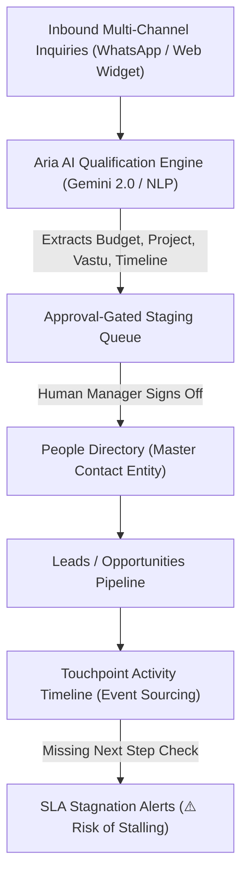

# 📇 People Directory, Touchpoint Timeline & Aria AI: Technical & Investor Deep Dive

> **Document Version:** 2.4.0  
> **Audience:** Engineering Teams, Technical Founders, Solution Architects, AI & Real Estate VCs  
> **Covered Modules:**  
> 1. **People Directory & 360° Contact Dossier** (`/people`)  
> 2. **Touchpoint Activity History & Timeline** (`/activities`)  
> 3. **Aria Autonomous Sales & Lead Qualification Engine** (`/aria`)

---

## 1. High-Level Architectural Context



---

## 2. Screen-by-Screen Technical Breakdown

---

### 🖥️ Page 1: People Directory & 360° Contact Dossier (`/people`)

```
┌──────────────────────────────────────────────────────────────────────────────────────────────────────────────────┐
│ 📇 People Directory & 360° Contact Dossier                                                 [8 Verified Contacts] │
│ Deduplicated master contact directory with multi-project inquiry tracking and communication history.             │
├───────────────────┬───────────────────┬─────────────────────────┬──────────────┬──────────────────┬──────────────┤
│ CONTACT PROFILE   │ PHONE NUMBER      │ EMAIL                   │ CITY/REGION  │ TOTAL INQ. VALUE │ ACTIONS      │
├───────────────────┼───────────────────┼─────────────────────────┼──────────────┼──────────────────┼──────────────┤
│ Siddharth Verma   │ +91 98110 99234   │ siddharth.v@example.in  │ Gurgaon      │ ₹3.80 Cr         │ [📞] [💬 WA] │
│ Ananya Singhania  │ +91 98200 11456   │ ananya.s@example.in     │ Mumbai       │ ₹9.50 Cr         │ [📞] [💬 WA] │
│ Vikramaditya O.   │ +91 98710 44556   │ vikram.o@example.in     │ Dubai/Mumbai │ ₹6.50 Cr (NRI)   │ [📞] [💬 WA] │
│ Meera Kapoor      │ +91 98289 77665   │ meera.k@example.in      │ Mumbai       │ ₹12.00 Cr        │ [📞] [💬 WA] │
└───────────────────┴───────────────────┴─────────────────────────┴──────────────┴──────────────────┴──────────────┘
```

#### Engineering Architecture:
1. **Entity Separation (`people` vs `leads` vs `deals`):**
   * Traditional CRMs conflate the *human being* with the *transaction*.
   * CallCRM separates the **Person Entity** (Master KYC, Phone, Net Worth, City, Family Profile) from individual **Lead Opportunities** (Inquiry for *DLF Camellias 4BHK* vs *Lodha Altamount Sea-Facing*).
2. **Deterministic Deduplication Engine:**
   * Uses normalized E.164 phone hashing (`+91XXXXXXXXXX`) and lowercase email indexing:
     ```sql
     CREATE UNIQUE INDEX idx_people_org_phone ON public.people(org_id, phone);
     ```
   * When an existing client inquires about a second or third project, the system links the new deal to the existing `person_id`, computing **Total Inquired Value / Lifetime Value (LTV)** across their entire investment portfolio.
3. **Multi-Region NRI Investor Tagging:**
   * Tracks cross-border buyers (e.g. *Vikramaditya Oberoi: Dubai / Mumbai*) with multi-currency remittance workflows.

---

### 🖥️ Page 2: Activity History & Timeline (`/touchpoint-activity`)

```
┌─────────────────────────────────────────────────────────────────────────────────────────────────┐
│ ⚡ Activity History & Timeline                                                 [6 Events Showing]│
│ Operational sales narrative: What happened ──► What changed ──► What happens next?             │
├─────────────────────────────────────────────────────────────────────────────────────────────────┤
│ [My Activity] [Team Activity] [All Types] [Calls] [WhatsApp] [Site Visits] [Stage Changes]      │
├─────────────────────────────────────────────────────────────────────────────────────────────────┤
│ Nikhil Bhatia • DLF The Aralias                                   by Naman Joshi • 31 Aug 09:24 │
│ 📞 Call [Interested — sharing floor plans]                                                      │
│ "Discovery call completed. Budget confirmed at ₹15,00,00,000."                                  │
│ ⚠️ Next step missing — Risk of deal stalling                       [📞 Call] [💬 WA] [📝 Log]    │
├─────────────────────────────────────────────────────────────────────────────────────────────────┤
│ Rajesh Nair • M3M Golf Estates                                    by Naman Joshi • 31 Aug 09:24 │
│ 📞 Call [Interested — sharing floor plans]                                                      │
│ "Discovery call completed. Budget confirmed at ₹4,50,00,000."                                   │
│ ⚠️ Next step missing — Risk of deal stalling                       [📞 Call] [💬 WA] [📝 Log]    │
└─────────────────────────────────────────────────────────────────────────────────────────────────┘
```

#### Engineering Architecture:
1. **Event Sourcing Audit Trail:**
   * Every interaction is recorded as an immutable append-only record in the `activities` table. Reps cannot tamper with or delete past call records, providing 100% compliance for broker commissions and RERA dispute resolution.
2. **Automated "Next Step Missing" SLA Watchdog:**
   * **The Problem:** In sales, when a rep ends a call with *"buyer was interested"* but forgets to schedule a specific follow-up date, the deal dies $80\%$ of the time.
   * **The Solution:** CallCRM's trigger inspects every logged activity:
     $$\text{If } \texttt{activity.type} \in \{\text{'call'}, \text{'whatsapp'}, \text{'site\_visit'}\} \text{ AND } \texttt{lead.next\_follow\_up\_at IS NULL} \implies \text{Flag ⚠️ Next step missing}$$
   * The UI highlights these in amber alerts and surfaces them directly on the manager's Action Center.

---

### 🖥️ Page 3: Aria Autonomous Sales & Lead Qualification Engine (`/aria`)

```
┌─────────────────────────────────────────────────────────────────────────────────────────────────┐
│ 🤖 Aria Autonomous Sales & Lead Qualification Engine                  AVG RESPONSE SPEED: ⚡ 1.2s│
│ Simulates prospective buyers reaching out via WhatsApp/Web. Aria converses naturally, extracts  │
│ qualification parameters, and stages structured deals for your explicit approval.               │
├───────────────────────────────────────────────────────┬─────────────────────────────────────────┤
│ 1-Click Simulated Inbound Inquiries:                  │ ⚙️ AGENT EXECUTION STREAM (LIVE)        │
│ • ⚡ HNI Luxury Buyer (Gurgaon): Siddharth V. ₹3.8 Cr  │ > Aria Daemon v2.4 initialized          │
│ • 🌊 Sea-View Penthouse (Mumbai): Ananya S. ₹9.5 Cr   │ > Listening on Inbound WhatsApp Webhook │
│ • 🌿 Bengaluru Tech Villa: Rajesh Nair ₹4.5 Cr        │ > NLP Parser loaded: Real Estate INR,Cr │
│ • 🏢 NRI High-Yield Investor: Vikramaditya ₹6.5 Cr    │ > Ready for inbound buyer qualification │
├───────────────────────────────────────────────────────┼─────────────────────────────────────────┤
│ 💬 Aria Property Intake Bot  [🛡️ Approval-Gated Sync] │ 📥 Live Inbound Pipeline Feed (2 Synced)│
│ "Namaste! I am Aria, your autonomous property intake  │ • Siddharth Verma [AI] ₹3.80 Cr Qualif. │
│ agent. I qualify buyers 24/7 across WhatsApp and web, │ • Rohan Khanna    [AI] ₹5.50 Cr Qualif. │
│ extract key metrics, and stage them for your approval."│                                         │
└───────────────────────────────────────────────────────┴─────────────────────────────────────────┘
```

#### Engineering Architecture:
1. **Sub-1.5s Conversational Inference Engine:**
   * Powered by **Gemini 2.0 Flash / LLM Function Calling** with low-latency streaming.
2. **Indian Real Estate Domain NLP Parser:**
   * Recognizes nuanced domain terminology:
     * **Financials:** *₹ Cr, Lakhs, Subvention Plans, Developer Allotment, GST TDS.*
     * **Architectural / Cultural:** *Vastu compliance (North-East facing, Pooja room), Carpet Area vs Super Built-up Area, High-Floor Penthouse.*
3. **The "Grounded Triad" & Approval-Gated Sync:**
   * **Why it matters to investors:** Autonomous AI bots that write directly to production CRMs cause data corruption and hallucinated promises.
   * **The CallCRM Boundary:** Aria qualifies the buyer, formats a structured JSON proposal, and holds it in an **Approval-Gated Staging Queue (`[🛡️ Approval-Gated Sync]`)**. 
   * A human sales manager clicks **"Inspect & Approve"** before the lead is formally admitted to the live deal pipeline.

---

## 3. Database Schema for Contacts, Activities & AI Stream

```sql
-- 1. Master People / Contacts Table (Deduplicated Identity)
CREATE TABLE public.people (
    id UUID PRIMARY KEY DEFAULT gen_random_uuid(),
    org_id UUID NOT NULL REFERENCES public.orgs(id) ON DELETE CASCADE,
    full_name TEXT NOT NULL,
    phone TEXT NOT NULL,
    email TEXT,
    city TEXT,
    country TEXT NOT NULL DEFAULT 'India',
    is_nri BOOLEAN NOT NULL DEFAULT false,
    total_inquired_value NUMERIC(14,2) NOT NULL DEFAULT 0,
    created_at TIMESTAMPTZ NOT NULL DEFAULT now(),
    UNIQUE(org_id, phone)
);

-- 2. Activities (Immutable Event Log)
CREATE TABLE public.activities (
    id UUID PRIMARY KEY DEFAULT gen_random_uuid(),
    org_id UUID NOT NULL REFERENCES public.orgs(id) ON DELETE CASCADE,
    lead_id UUID NOT NULL REFERENCES public.leads(id) ON DELETE CASCADE,
    user_id UUID NOT NULL REFERENCES public.profiles(id),
    type TEXT NOT NULL, -- 'call', 'whatsapp', 'site_visit', 'stage_change', 'note'
    outcome_label TEXT, -- 'Interested — sharing floor plans', 'Site visit scheduled'
    notes TEXT,
    has_next_step BOOLEAN NOT NULL DEFAULT false,
    scheduled_follow_up_at TIMESTAMPTZ,
    created_at TIMESTAMPTZ NOT NULL DEFAULT now()
);

-- 3. AI Intake Sessions (Aria Execution)
CREATE TABLE public.ai_intake_sessions (
    id UUID PRIMARY KEY DEFAULT gen_random_uuid(),
    org_id UUID NOT NULL REFERENCES public.orgs(id) ON DELETE CASCADE,
    channel TEXT NOT NULL DEFAULT 'whatsapp', -- 'whatsapp', 'web_widget'
    external_session_id TEXT,
    buyer_name TEXT,
    buyer_phone TEXT,
    extracted_budget NUMERIC(14,2),
    extracted_project_name TEXT,
    extracted_unit_type TEXT,
    qualification_status TEXT NOT NULL DEFAULT 'staged', -- 'staged', 'approved', 'rejected'
    transcript JSONB NOT NULL DEFAULT '[]'::jsonb,
    created_at TIMESTAMPTZ NOT NULL DEFAULT now()
);
```

---

## 4. Summary Table for Investor Presentations

| Page | Technical Core | Business / Investor Impact |
| :--- | :--- | :--- |
| **People Directory** | Deduplicated Master Identity table indexed by E.164 phone numbers with multi-deal LTV rollups. | Prevents customer data fragmentation; gives multi-project brokerages a 360° investor Rolodex. |
| **Touchpoint Activity** | Immutable event sourcing stream with automated "Missing Next Step" SLA breach detection. | Eliminates sales pipeline decay; forces sales reps to maintain deal momentum. |
| **Aria AI Agent** | Sub-1.5s conversational qualification engine with Indian real estate NLP and human approval gates. | Provides **24/7 instant lead qualification**, capturing high-intent HNI/NRI buyers while brokers sleep. |
