# EcosystemRealty — Complete Marketing Website Redesign Master Blueprint

> **Master Marketing Document**: This single document compiles all 7 marketing audit, design system, narrative architecture, section specifications, and implementation deliverables into one cohesive, authoritative reference for the public website of EcosystemRealty.
>
> **Brand Persona**: Luxury Real Estate Technology & Sales Operating System  
> **Target Audience**: Indian Real Estate Advisory Founders, Brokerage Managing Directors, Luxury Property Closers  
> **Aesthetic Direction**: *Architectural Editorial* (Warm Alabaster `#f8f7f4`, Deep Charcoal `#181a19`, Stone `#f0ede6`, Forest `#224a3e`, Heritage Brass `#a68138`)

---

# Table of Contents

1. [Part 1: Marketing Website Visual & Experience Audit (`MARKETING_SITE_AUDIT.md`)](#part-1-marketing-website-visual--experience-audit)
2. [Part 2: Marketing Design System Specification (`MARKETING_DESIGN_SYSTEM.md`)](#part-2-marketing-design-system-specification)
3. [Part 3: Marketing Information Architecture & Narrative Storytelling (`MARKETING_INFORMATION_ARCHITECTURE.md`)](#part-3-marketing-information-architecture--narrative-storytelling)
4. [Part 4: Screen-by-Screen Landing Page Redesign Specification (`LANDING_PAGE_REDESIGN.md`)](#part-4-screen-by-screen-landing-page-redesign-specification)
5. [Part 5: Marketing Component Strategy & Architecture (`MARKETING_COMPONENT_STRATEGY.md`)](#part-5-marketing-component-strategy--architecture)
6. [Part 6: Marketing Before & After Transformation Map (`BEFORE_AFTER_MARKETING_MAP.md`)](#part-6-marketing-before--after-transformation-map)
7. [Part 7: Marketing Implementation Plan & Verification Strategy (`MARKETING_IMPLEMENTATION_PLAN.md`)](#part-7-marketing-implementation-plan--verification-strategy)

---

# Part 1: Marketing Website Visual & Experience Audit

## 1. Executive Summary & Brand Positioning Diagnosis

The current marketing website has solid foundational content (pricing tiers, feature tabs, responsive structure), but visually and narratively suffers from the **"Generic AI SaaS Syndrome"**:
1. **Misaligned Brand Tone**: Heavy use of oversized serif headlines with wavy gradient underlines, flashing neon green/amber status pills, and isometric CSS glass skyscrapers. It feels like a template from Dribbble or an AI wrapper rather than an established enterprise software company trusted by high-ticket Indian property desks.
2. **"AI" Overemphasis**: The current copy repeatedly leans into tech buzzwords (*"Ledger v2.4"*, *"System Spec"*, *"Speed-to-Lead Queue"*) rather than speaking the grounded language of Indian real estate: **exclusive resale mandates, RWA gate protocols, temporal ownership chains, 100-point buyer-unit matching, and multi-crore deal protection**.
3. **Disconnected Product Showcases**: Product UI is presented as a floating card with colored window dots inside the hero, rather than pairing real architectural imagery with clean, grounded software interfaces.
4. **Visual Noise & Monotony**: Every single feature is packaged inside a generic "rounded card + icon + title + description" grid. There is little variation in rhythm, open editorial whitespace, or photographic storytelling.

---

## 2. Complete Section Inventory & Friction Audit

| Section | Location in `page.tsx` | Current Content & Visual Pattern | Key Friction Points & Brand Deficiencies | Redesign Direction |
| :--- | :--- | :--- | :--- | :--- |
| **Top Navigation** | Lines 83–157 | Sticky navbar with `LEDGER v2.4` badge, text links (`Features`, `Product Tour`, `Pricing`, `FAQ`, `Mobile App BETA`), Sign In link, and "Start 14-Day Free Trial" button. | • "LEDGER v2.4" feels like crypto/blockchain jargon.<br>• Right CTA lacks enterprise demo request.<br>• Mobile nav collapses abruptly. | Editorial navbar: `Product`, `Property Intelligence`, `Matching`, `Solutions`, `Pricing`, `Sign In`, `[Request Private Walkthrough]`. |
| **Hero Section** | Lines 160–337 | CSS 3D Isometric Cityscape + Giant serif headline with wavy gradient underline + Live stream card mockup with 3 columns. | • 3D isometric towers look decorative and artificial.<br>• Wavy gradient underline feels like a consumer AI app.<br>• Card mockup inside hero creates visual clutter before explaining the value proposition. | Calm, confident editorial hero: Clear value proposition ("Built for the way luxury real estate is actually sold"), architectural imagery paired with a grounded Flat 360° dossier preview. |
| **Value Highlights Bar** | Lines 339–360 | 4-column monospace metric cards (14-Day Free Access, <10s Rapid Log, Zero Stalling Deals, Strict Privacy). | • Monospace font looks like a developer terminal.<br>• Lacks concrete real-estate credibility (e.g. ₹ Cr protected, micro-market coverage). | Editorial credibility bar: Real estate enterprise trust signals (Gurgaon, Mumbai MMR, Bengaluru coverage; RERA-aligned; Bank-grade tenant isolation). |
| **Product Interface Tour** | Lines 361–638 | 4-tab switcher (Cockpit, Dossier, Pipeline, Matcher) with simulated lead cards and a CAD floor plan vector. | • High data density is good, but contained inside a generic white box.<br>• CAD floorplan looks detached from the actual unit asset. | Editorial interactive showcase: Show how a real property (e.g., *DLF Camellias 4BHK*) connects with verified owners, Gate 2 access rules, and active buyer demand. |
| **Core Capabilities** | Lines 640–715 | 6 equal-sized cards in a 3x2 grid with Lucide icons (Zap, PhoneCall, Compass, Kanban, MapPin, TrendingUp). | • Monotonous 3x2 grid.<br>• Icons inside gray squares look like a generic SaaS template.<br>• Does not tell a progressive sales story. | Narrative architectural features: Asymmetric 2-column editorial layouts with bold headings and contextual product UI snippets. |
| **How It Works** | Lines 717–770 | 4 step cards (01 Sign Up, 02 Import Leads, 03 Execute Outreach, 04 Close Deals). | • Basic linear 4-card stack.<br>• Focuses on administrative software steps rather than the real estate sales lifecycle. | Real estate transaction lifecycle: *Inbound Inquiry $\rightarrow$ Instant Unit Matching $\rightarrow$ 30m Site Visit Briefing $\rightarrow$ Human-Verified Deal Close*. |
| **Pricing Section** | Lines 772–1004 | Monthly/Yearly toggle with 3 tiers (Solo ₹1,999, Boutique ₹4,999, Scale ₹9,999) with check lists. | • Functional and transparent, but styling is standard SaaS cards.<br>• Most popular badge is visually loud. | Sophisticated pricing tables: Restrained borders, clear seat/project quotas, and an explicit "Enterprise Custom Desk" option for large brokerage houses. |
| **Pilot Testimonials** | Lines 1006–1062 | 3 quote cards with 5 gold stars from anonymous pilots (Managing Director, Sales Director, Principal Broker). | • Anonymous quotes lack high visual authority.<br>• Gold star icons look like consumer e-commerce reviews. | Editorial leadership quotes: Authentic advisory desk case notes with prominent typography and credible real estate context. |
| **Mobile Companion** | Lines 1064–1126 | Black card with smartphone frame and email signup form for beta APK. | • Good concept, but device frame looks isolated.<br>• Email form takes up significant visual weight. | On-site consultant experience: Emphasize the 30-minute pre-site-visit briefing (Gate 2 digital PINs & parking bays on mobile). |
| **Accordion FAQ** | Lines 1128–1188 | 5 expandable FAQ cards with plus/minus toggles. | • Clean and solid; needs minor typography and spacing refinement. | Refine typography to high-legibility sans-serif with clear architectural dividers. |
| **Final CTA & Footer** | Lines 1190–1262 | Standard centered CTA box + 4-column footer. | • Standard ending; lacks brand warmth. | Editorial conclusion: Clean statement on real estate sales intelligence + structured navigation footer. |

---

# Part 2: Marketing Design System Specification

## 1. Color Palette & Material Tokens

```css
:root {
  /* Canvas & Paper Surfaces */
  --mktg-canvas:        #f8f7f4; /* Warm alabaster/ivory background */
  --mktg-surface-card:  #ffffff; /* Clean white card & showcase surface */
  --mktg-surface-stone: #f0ede6; /* Warm stone secondary surface & table headers */
  --mktg-surface-muted: #e7e3db; /* Subtle borders & architectural dividers */

  /* Text & Ink Tokens */
  --mktg-ink-primary:   #181a19; /* Deep charcoal (High emphasis, 14.8:1 contrast) */
  --mktg-ink-secondary: #4a4d4b; /* Editorial body copy & descriptions */
  --mktg-ink-muted:     #7a7d7b; /* Metadata, captions, timestamps */

  /* Architectural Heritage Accents */
  --mktg-forest:        #224a3e; /* Deep verdigris / forest (Credibility, verified status) */
  --mktg-forest-light:  #edf4f1; /* Soft tint for verification pills */
  --mktg-brass:         #a68138; /* Restrained heritage brass (High-value accents only) */
  --mktg-brass-light:   #faf5ec; /* Subtle brass highlight background */

  /* Architectural Divider & Line Strokes */
  --mktg-line-subtle:   #e2ded6; /* 1px crisp layout grid line */
  --mktg-line-bold:     #181a19; /* High-contrast section divider */
}
```

---

## 2. Typography Scale

```
Primary Sans:     Inter, -apple-system, BlinkMacSystemFont, "Segoe UI", Roboto, sans-serif
Editorial Serif:  Newsreader, "Playfair Display", Georgia, serif
Monospace:        ui-monospace, "SF Mono", Menlo, Monaco, Consolas, monospace
```

- **Hero Title**: `42px` (sm: `56px`, lg: `64px` / 700 Bold) — *"Built for the way luxury real estate is actually sold."*
- **Section Title**: `28px` (sm: `36px` / 700 Bold) — *"Property Intelligence", "100-Point Matcher"*.
- **Editorial Statement**: `24px` (sm: `30px` / 500 Medium Italic Serif) — Philosophical quotes and core pillars.
- **Body Primary**: `14px / 22px` (400 Regular Sans) — Product explanations, feature descriptions.
- **Architectural Tag**: `11px / 14px` (700 Bold Monospace) — Category tags, unit specs (`[UNIT A-1402]`).

---

# Part 3: Marketing Information Architecture & Narrative Storytelling

```mermaid
flowchart TD
    BEAT1["1. THE HOOK: Hero Statement<br>Real Estate Sales Intelligence for High-Ticket Property Desks"]
    --> BEAT2["2. THE INDUSTRY REALITY: The Fragmentation Problem<br>Why Generic CRMs Fail in Luxury Indian Real Estate"]
    --> BEAT3["3. THE FOUNDATION: Atomic Property Intelligence<br>The Flat/Unit as the Core Transactional Asset"]
    --> BEAT4["4. THE ENGINE: 100-Point Bi-Directional Matcher<br>Instantly Connecting Active Buyer Demand with Live Inventory"]
    --> BEAT5["5. THE SALES RHYTHM: Action-First Salesperson Workflow<br>10s Touchpoints & Morning Priority Action Queues"]
    --> BEAT6["6. ON-SITE EXECUTION: 30-Minute Pre-Visit Briefing<br>Gate 2 Security PINs, Visitor Parking & Owner Price Floors"]
    --> BEAT7["7. PROACTIVE SELLER SIGNALS: Resale Mandate Capture<br>Tenancy Expiry & Investor Holding Horizon Scanners"]
    --> BEAT8["8. CONTEXTUAL AI: Human-in-the-Loop Intelligence<br>Zero Autonomous State Corruption · Speech/Text Meeting Structuring"]
    --> BEAT9["9. LEADERSHIP COMMAND: Executive Boss Cockpit<br>Pipeline Velocity, Deal Health Risk Radar & Revenue in ₹ Cr"]
    --> BEAT10["10. ENTERPRISE CREDIBILITY: Trust & Regional Walls<br>Bank-Grade Tenant Partitioning & Regional Desks"]
    --> BEAT11["11. TRANSPARENT SUBSCRIPTION: Pricing Built for Realities<br>Solo Closer, Boutique Agency & Scale Desks"]
    --> BEAT12["12. THE CLOSING CALL: Final Action & Guided Tour<br>14-Day Free Access or Private Executive Walkthrough"]
```



---

# Part 4: Screen-by-Screen Landing Page Redesign Specification

### 1. Architectural Navbar
- Sticky top header (`bg-[#f8f7f4]/90 backdrop-blur-md border-b border-[#e2ded6]`).
- Brand logo: `Ecosystem Realty` with `[ REAL ESTATE OS ]` badge.
- Navigation links: `Product`, `Property Intelligence`, `Matching`, `Solutions`, `Pricing`, `FAQ`.
- CTA: `Sign In` + `[Start 14-Day Free Trial]`.

### 2. Editorial Hero Section
- Eyebrow: `[ SYSTEM SPEC: RESIDENTIAL SALES INTELLIGENCE ]`.
- Headline: *"Built for the way luxury real estate is actually sold."*
- Subtitle: *"One connected sales intelligence operating system for your buyers, properties, owners, and deals — giving closers the context to act at the decisive moment."*
- CTAs: `[Start 14-Day Free Access]` + `[Explore Interactive Platform]`.
- Hero Showcase: Grounded 2-column showcase pairing architectural residential facade with live **Flat 360° Unit A-1402 (DLF The Camellias · ₹16.5 Cr)** dossier.

### 3. Trust & Credibility Bar
- 4-item architectural trust grid:
  - *Multi-City Hub Coverage (Gurgaon, Mumbai MMR, Bengaluru)*.
  - *Atomic Unit Asset Architecture (6-Tier Hierarchy)*.
  - *Sub-10s Speed-to-Lead Hotkey Execution*.
  - *Bank-Grade PostgreSQL Row-Level Security*.

### 4. The Core Problem (Why Generic CRMs Fail in Real Estate)
- 3-column architectural comparison grid:
  - *Multi-Owner Post-Possession Complexity*.
  - *On-Site Security Gate & Visitor Access Friction*.
  - *Lost Institutional Pricing Memory & Owner Non-Negotiables*.

### 5. Interactive Property Intelligence Showcase (Flat 360°)
- Interactive tabs:
  - `1. Flat 360° Dossier` (Super/Carpet area, temporal ownership chain, verified gate rules).
  - `2. 100-Point Matcher` (Multi-factor algorithmic fit score breakdown).
  - `3. 30m Site Visit Briefing` (Gate 2 PIN #8492, parking bay B2-14, owner price floor).
  - `4. Boss Risk Radar` (Executive revenue pipeline and deal health warnings).

### 6. Six Core Capabilities Grid
- 6 asymmetric capability cards:
  1. *Flat 360° Property Dossier*.
  2. *Bi-Directional 100-Point Matcher*.
  3. *10-Second Hotkey Activity Logger*.
  4. *30-Minute Pre-Site-Visit Briefings*.
  5. *Proactive Resale Seller Intelligence*.
  6. *Executive Boss Revenue & Risk Radar*.

### 7. Real Estate Sales Lifecycle (From Lead to Closed Deal)
- 4-step execution blueprint:
  - *01 Inbound Lead Ingestion & Qualification*.
  - *02 Instant 100-Point Inventory Matching*.
  - *03 30-Minute Pre-Site Briefing & Guided Tour*.
  - *04 Human-Verified Token Advance & Deal Close*.

### 8. Transparent Subscription Pricing
- Monthly / Annual toggle (with 20% annual discount calculation).
- 3 transparent tiers:
  - *Solo Closer* (₹1,599/mo annual · 1 Seat · 300 Leads).
  - *Boutique Team* (₹3,999/mo annual · 3 Closers + 1 Boss · 2,500 Leads · AI Matcher).
  - *Scale Desk* (₹7,999/mo annual · 10 Closers · 10,000 Leads · Regional Walls).
- Enterprise Custom Desk prompt for large multi-city brokerage houses.

---

# Part 5: Marketing Component Strategy & Architecture

### Reusable Marketing Primitives & Showcases
- **`MktgButton`**: Solid charcoal fill (`#181a19`), stone outline (`#d8d3c8`), brass accent (`#a68138`).
- **`ArchitecturalTag`**: Monospace uppercase tag with soft background tint (`#edf4f1`, `#faf5ec`).
- **`HeroDossierShowcase`**: Luxury residential facade paired with live **Flat 360° Unit A-1402 dossier**.
- **`MatcherMatrixShowcase`**: 3-column connector linking Buyer Requirements (`Siddharth V. · ₹17 Cr`) to `Unit A-1402` (96/100 match).
- **`PreVisitBriefingShowcase`**: 30-minute operational cockpit card with Gate 2 pass PIN and parking bay.
- **`BossCockpitShowcase`**: Executive revenue dashboard with narrative summary and deal health risk radar.

---

# Part 6: Marketing Before & After Transformation Map

```
---------------------------------------------------------------------------------------------------------
Section                Current State                         Redesigned State               Business Payoff
---------------------------------------------------------------------------------------------------------
Top Navbar             "LEDGER v2.4" crypto badge            Editorial Real Estate OS Nav   Elevates brand authority
Hero Section           3D isometric towers + wavy gradient   Grounded Flat 360° Showcase    Immediate product clarity
Core Problem           Generic spreadsheet comparison        Multi-Owner & Gate Security    Speaks real-estate reality
Property Intelligence  CAD vector floorplan in generic box   Atomic Asset Flat 360° Dossier Proves unit is the core asset
Buyer Matching         Abstract "AI score" text              100-Point Algorithmic Matrix   Demonstrates tangible speed
Sales Workflow         4 generic software steps              Inquiry -> Match -> Visit      Connects to daily sales rhythm
Pre-Site Briefings     Static text note                      30m Gate 2 PIN & Parking Bay   Solves on-site friction
Seller Intelligence    Not prominently featured              Expiring Tenancy & Vacancy     Captures exclusive resale
Executive Boss Cockpit Standard 4-card metric list           Narrative Bar & Risk Radar     Immediate founder credibility
Pricing Tiers          Standard SaaS cards                   Transparent Seat & Quota Grid  Frictionless trial activation
---------------------------------------------------------------------------------------------------------
```

---

# Part 7: Marketing Implementation Plan & Verification Strategy

### Implementation Steps
1. **Design Tokens & CSS Variables**: Verify Warm Alabaster (`#f8f7f4`), Deep Charcoal (`#181a19`), Stone (`#f0ede6`), Forest (`#224a3e`), and Heritage Brass (`#a68138`) in `tailwind.config.ts` and `globals.css`.
2. **Refactor `architectural-visuals.tsx`**: Replace CSS 3D perspective cityscape with clean architectural compositions, grounded unit dossiers, and on-site briefing frames.
3. **Rewrite `page.tsx`**: Implement the complete 12-beat narrative landing page structure.
4. **Interactive Showcase Wiring**: Ensure interactive tabs, annual pricing 20% discount calculation, mobile beta email persistence, and accordion FAQ function with zero runtime errors.
5. **Responsive QA**: Validate viewports at 1440px, 1024px, 768px, and 390px.
6. **Automated Verification**: Run `npm run lint`, `npm test`, and `npm run build` to guarantee 0 regressions.
