# EcosystemRealty — Marketing Information Architecture & Narrative Storytelling

> **Document Objective**: Map the editorial narrative arc, section sequence, navigation taxonomy, and psychological conversion progression for the public marketing website of EcosystemRealty.

---

## 1. The 12-Beat Narrative Storytelling Arc

The redesigned marketing website replaces disjointed SaaS feature blocks with a **compelling, sequential business story** tailored for Indian real estate leadership:

```mermaid
flowchart TD
    BEAT1["1. THE HOOK: Hero Statement<br>Real Estate Sales Intelligence for High-Ticket Property Desks"]
    --> BEAT2["2. THE INDUSTRY REALITY: The Fragmentation Problem<br>Why Generic CRMs Fail in Luxury Indian Real Estate"]
    --> BEAT3["3. THE FOUNDATION: Atomic Property Intelligence<br>The Flat/Unit as the Core Transactional Asset"]
    --> BEAT4["4. THE ENGINE: 100-Point Bi-Directional Matcher<br>Instantly Connecting Active Buyer Demand with Live Inventory"]
    --> BEAT5["5. THE SALES RHYTHM: Action-First Salesperson Workflow<br>10s Touchpoints & Morning Priority Action Queues"]
    --> BEAT6["6. ON-SITE EXECUTION: 30-Minute Pre-Visit Briefing<br>Gate 2 Security PINs, Visitor Parking & Owner Price Floors"]
    --> BEAT7["7. PROACTIVE SELLER SIGNALS: Resale Mandate Capture<br>Tenancy Expiry & Investor Holding Horizon Scanners"]
    --> BEAT8["8. CONTEXTUAL AI: Human-in-the-Loop Intelligence<br>Zero Autonomous State Corruption · Speech/Text Meeting Structuring"]
    --> BEAT9["9. LEADERSHIP COMMAND: Executive Boss Cockpit<br>Pipeline Velocity, Deal Health Risk Radar & Revenue in ₹ Cr"]
    --> BEAT10["10. ENTERPRISE CREDIBILITY: Trust & Regional Walls<br>Bank-Grade Tenant Partitioning & Regional Desks"]
    --> BEAT11["11. TRANSPARENT SUBSCRIPTION: Pricing Built for Realities<br>Solo Closer, Boutique Agency & Scale Desks"]
    --> BEAT12["12. THE CLOSING CALL: Final Action & Guided Tour<br>14-Day Free Access or Private Executive Walkthrough"]
```



---

## 2. Detailed Section Blueprint & Content Structure

### Beat 1: The Hero (Clarity, Confidence, Restraint)
- **Visual Motif**: Warm alabaster canvas, crisp architectural typography, pairing real-estate photography with a live Flat 360° dossier preview.
- **Headline**: *"Built for the way luxury real estate is actually sold."*
- **Supporting Narrative**: *"One connected sales intelligence operating system for your buyers, properties, owners, and deals — giving closers the context to act at the decisive moment."*
- **CTAs**: `[Start 14-Day Free Access]` (Primary Solid Ink) + `[Explore Interactive Platform]` (Secondary Stone Outline).
- **Trust Reassurance**: *14-day full access · No credit card required · 60-second setup · Multi-city support (Gurgaon, Mumbai MMR, Bengaluru).*

---

### Beat 2: The Core Problem (Why Generic CRMs Fail)
- **Narrative Premise**: Real estate is not SaaS. In Indian luxury real estate, transactions fail because:
  1. *Every flat has a different owner or investor after possession.*
  2. *Gate security protocols, visitor parking, and RWA bylaws create on-site friction.*
  3. *Institutional pricing memory and owner non-negotiables are lost when agents leave.*
  4. *Generic CRMs treat multi-crore properties like generic lead spreadsheets.*

---

### Beat 3: The Atomic Asset Model (Flat 360° Dossier)
- **Concept**: Society is shared infrastructure; the **Flat/Unit is the transactional asset**.
- **Interactive Showcase**: Visual breakdown of **Unit A-1402 (DLF The Camellias)**:
  - *Super & Carpet Area* (4,200 sq ft · 4 BHK + Staff).
  - *Temporal Ownership Chain* (Current Owner, Past Owners, Active Tenancy).
  - *Verified Property Facts* (Gate 2 visitor pass PIN, parking bay B2-14, owner price floor ₹16.0 Cr).
  - *Active Buyer Matches* (3 buyers with match score $\ge 90\%$).

---

### Beat 4: Bi-Directional 100-Point Matcher
- **Explanation**: Moving from keyword search to a **multi-factor matching algorithm**:
  $$\text{Match Score} = \text{Location (30)} + \text{Budget (30)} + \text{Configuration (20)} + \text{Floor/Facing (10)} + \text{Mandate (10)}$$
- **Visual Presentation**: Side-by-side card showing a Buyer Lead (`Siddharth Verma · ₹17 Cr`) instantly matched with `Unit A-1402` (Score: 96/100) with a 1-click `[Pitch Unit via WhatsApp]` trigger.

---

### Beat 5: The Salesperson Morning Rhythm
- **Concept**: From administrative data entry to a **Morning Action Cockpit**.
- **Visual Presentation**:
  - *Top 3 Daily Focus Items*: High-intent calls, upcoming visits, and at-risk deals.
  - *10-Second Hotkey Logging*: Press <kbd>L</kbd> to record a call, log outcome, and cascade next follow-up.

---

### Beat 6: 30-Minute Pre-Site-Visit Briefing
- **Concept**: Arrive at the society completely briefed.
- **Visual Presentation**: Mobile-responsive operational card featuring:
  - *Gate 2 Digital PIN*: `#8492` (Zero gate check-in delay).
  - *Assigned Visitor Parking*: `Bay B2-14`.
  - *Owner Price Floor*: `₹16.0 Cr net (Non-negotiable)`.
  - *Talking Points & Anticipated Objections*.

---

### Beat 7: Proactive Seller Intelligence
- **Concept**: Capturing resale mandates *before* they appear on public property portals.
- **Visual Presentation**:
  - *Tenancy Expiry Scanner* ($<60$ days).
  - *Vacant Unit Carrying Cost Scanner*.
  - *3-Year Investor Exit Window*.
  - *Human Verification Disposition*: Verify intent with 1 click before converting to active resale listings.

---

### Beat 8: Contextual AI (Strict Human-in-the-Loop)
- **Core Message**: *AI assists your team, but never mutates your data autonomously.*
- **Capabilities**:
  - Speech-to-text meeting structuring (English & Hinglish).
  - Instant buyer brief synthesis.
  - Stale property knowledge scanner (180-day verification).

---

### Beat 9: Executive Boss Cockpit
- **Target Audience**: Agency Founders and Sales VPs.
- **Visual Presentation**:
  - *Total Pipeline in INR* (`₹48.5 Cr`).
  - *Deal Health Risk Radar* (Highlighting deals stuck in negotiation >5 days).
  - *Pipeline Stage Velocity* (Average days per stage from Inbound $\rightarrow$ Won).

---

### Beat 10: Enterprise Trust, Security & Regional Desks
- **Trust Pillars**:
  - *Multi-City Hub Partitioning*: Strict data walls between Gurgaon, Mumbai, and Bengaluru desks.
  - *PostgreSQL Row-Level Security (RLS)*: Enterprise tenant isolation.
  - *RERA Alignment & Audit Trails*: Full change ledger on asking price revisions.

---

### Beat 11: Transparent Subscription Pricing
- **Pricing Strategy**: Monthly / Annual toggle (20% savings on annual).
  - **Solo Closer**: ₹1,999/mo (1 Seat, 300 Leads, 1 Project Catalog).
  - **Boutique Team**: ₹4,999/mo (3 Closers + 1 Manager, 2,500 Leads, 5 Projects, AI Matcher).
  - **Scale Desk**: ₹9,999/mo (10 Closers, 10,000 Leads, Unlimited Projects, Regional Partitioning).
  - **Enterprise Custom**: Custom pricing for large brokerage houses with dedicated migration support.

---

### Beat 12: Knowledge Base (FAQ) & Final CTA
- **5 High-Clarity FAQs**: Answering portal imports, role permissions, trial policies, and data security.
- **Closing Call**: Generous, calm CTA banner inviting founders to start a 14-day trial or book a private demonstration.

---

## 3. Global Navigation Taxonomy

```
[ Navbar: Logo / Ecosystem Realty ]
├── Product
│   ├── Flat 360° Property Dossier
│   ├── 100-Point Buyer Matcher
│   ├── 30m Site Visit Briefings
│   └── Proactive Seller Signals
├── Solutions
│   ├── Luxury Property Brokerages
│   ├── Developer Sales Desks
│   └── Boutique Advisory Firms
├── Intelligence
│   ├── Human-in-the-Loop AI
│   ├── Deal Health Risk Radar
│   └── Stale Knowledge Scanner
├── Pricing
└── [ Sign In ]  [ Start Free Trial ]
```
