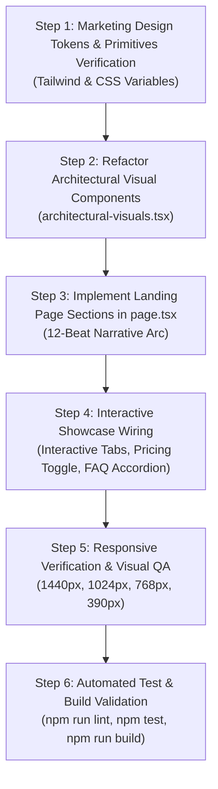

# CallCRM — Marketing Website Implementation Plan

> **Plan Objective**: Provide an exact, step-by-step technical implementation plan for redesigning the public marketing website (`Frontend/src/app/page.tsx` and `Frontend/src/components/marketing/*`) into an authoritative, editorial, high-ticket Real Estate Technology Operating System.

---

## 1. Scope & Implementation Boundaries

### What Will Be Changed:
- `Frontend/src/app/page.tsx`: Full redesign of the marketing landing page following the 12-beat narrative architecture.
- `Frontend/src/components/marketing/architectural-visuals.tsx`: Refactor from 3D isometric perspective towers into authentic architectural compositions, grounded unit dossiers, and on-site briefing frames.
- `Frontend/tailwind.config.ts` & `Frontend/src/app/globals.css`: Verify marketing design tokens (Warm Alabaster `#f8f7f4`, Deep Charcoal `#181a19`, Stone `#f0ede6`, Forest `#224a3e`, Heritage Brass `#a68138`).

### What Will NOT Be Changed:
- No changes to authentication or session gating (`auth-context.tsx`).
- No changes to database schemas, migrations, or Supabase RLS.
- No changes to CRM application business logic or API route handlers.
- No new external runtime dependencies.

---

## 2. Step-by-Step Implementation Sequence

---

## 3. Section-by-Section Implementation Blueprint for `page.tsx`

### 1. Architectural Navbar
- Sticky top header (`bg-[#f8f7f4]/90 backdrop-blur-md border-b border-[#e2ded6]`).
- Brand logo: `Apex CallCRM` with `[ REAL ESTATE OS ]` badge.
- Navigation links: `Product`, `Property Intelligence`, `Matching`, `Solutions`, `Pricing`, `FAQ`.
- CTA: `Sign In` + `[Start 14-Day Free Trial]`.

### 2. Editorial Hero Section
- Eyebrow: `[ SYSTEM SPEC: RESIDENTIAL SALES INTELLIGENCE ]`.
- Headline: *"Built for the way luxury real estate is actually sold."*
- Subtitle: *"One connected sales intelligence operating system for your buyers, properties, owners, and deals — giving closers the context to act at the decisive moment."*
- CTAs: `[Start 14-Day Free Access]` + `[Explore Interactive Platform]`.
- Hero Showcase: Grounded 2-column showcase pairing architectural residential facade with live **Flat 360° Unit A-1402 (DLF The Camellias · ₹16.5 Cr)** dossier.

### 3. Trust & Credibility Bar
- 4-item architectural trust grid:
  - *Multi-City Hub Coverage (Gurgaon, Mumbai MMR, Bengaluru)*.
  - *Atomic Unit Asset Architecture (6-Tier Hierarchy)*.
  - *Sub-10s Speed-to-Lead Hotkey Execution*.
  - *Bank-Grade PostgreSQL Row-Level Security*.

### 4. The Core Problem (Why Generic CRMs Fail in Real Estate)
- 3-column architectural comparison grid:
  - *Multi-Owner Post-Possession Complexity*.
  - *On-Site Security Gate & Visitor Access Friction*.
  - *Lost Institutional Pricing Memory & Owner Non-Negotiables*.

### 5. Interactive Property Intelligence Showcase (Flat 360°)
- Interactive tabs:
  - `1. Flat 360° Dossier` (Super/Carpet area, temporal ownership chain, verified gate rules).
  - `2. 100-Point Matcher` (Multi-factor algorithmic fit score breakdown).
  - `3. 30m Site Visit Briefing` (Gate 2 PIN #8492, parking bay B2-14, owner price floor).
  - `4. Boss Risk Radar` (Executive revenue pipeline and deal health warnings).

### 6. Six Core Capabilities Grid
- 6 asymmetric capability cards:
  1. *Flat 360° Property Dossier*.
  2. *Bi-Directional 100-Point Matcher*.
  3. *10-Second Hotkey Activity Logger*.
  4. *30-Minute Pre-Site-Visit Briefings*.
  5. *Proactive Resale Seller Intelligence*.
  6. *Executive Boss Revenue & Risk Radar*.

### 7. Real Estate Sales Lifecycle (From Lead to Closed Deal)
- 4-step execution blueprint:
  - *01 Inbound Lead Ingestion & Qualification*.
  - *02 Instant 100-Point Inventory Matching*.
  - *03 30-Minute Pre-Site Briefing & Guided Tour*.
  - *04 Human-Verified Token Advance & Deal Close*.

### 8. Transparent Subscription Pricing
- Monthly / Annual toggle (with 20% annual discount calculation).
- 3 transparent tiers:
  - *Solo Closer* (₹1,599/mo annual · 1 Seat · 300 Leads).
  - *Boutique Team* (₹3,999/mo annual · 3 Closers + 1 Boss · 2,500 Leads · AI Matcher).
  - *Scale Desk* (₹7,999/mo annual · 10 Closers · 10,000 Leads · Regional Walls).
- Enterprise Custom Desk prompt for large multi-city brokerage houses.

### 9. Pilot Desk Feedback (Authentic Advisory Notes)
- 3 editorial quote cards from luxury advisory desks in Gurgaon, South Mumbai, and Bengaluru.

### 10. Mobile On-Site Companion
- High-resolution smartphone frame highlighting the on-site visit cockpit (Gate 2 PIN, parking stall, and WhatsApp pitch dispatch).
- Verified early access form with local storage persistence.

### 11. Comprehensive FAQ
- 5 high-clarity accordion items covering portal CSV imports, role permissions, trial policies, and data security.

### 12. Final Call to Action & Architectural Footer
- Generous closing banner inviting founders to start a 14-day trial.
- Structured 4-column architectural footer.

---

## 4. Visual QA & Verification Strategy

After coding:
1. **Responsive Viewport Verification**:
   - `1440px Desktop` (Generous editorial spacing, crisp 2-column showcase).
   - `1024px Tablet` (Balanced reflow).
   - `768px Tablet` (Stacking cards).
   - `390px Mobile` (1-thumb touch targets, no horizontal scrollbars).
2. **Automated Verification**:
   - `npm run lint` $\rightarrow$ 0 warnings or errors.
   - `npm test` $\rightarrow$ 222/222 vitest tests passing.
   - `npm run build` $\rightarrow$ Next.js 15 standalone build compiles with 0 errors.
