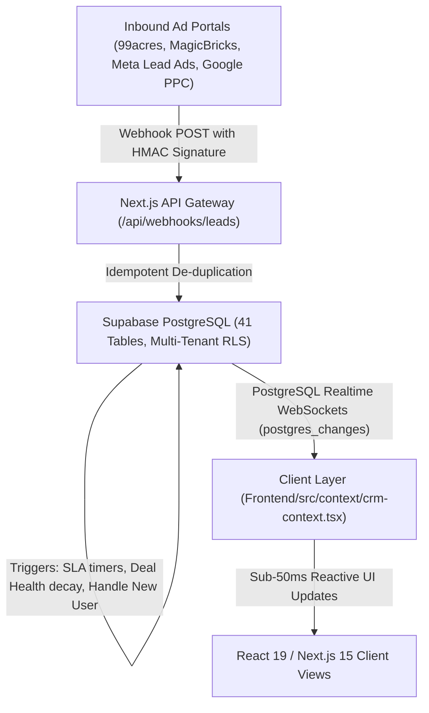

# 📖 EcosystemRealty Master Feature, Screen & Data Flow Encyclopedia

> **Document Version:** 3.0.0 (Master Unified Edition)  
> **Author:** Antigravity Engineering  
> **Target Audience:** Technical Founders, Senior Engineers, Real Estate VCs, Enterprise Architects  
> **Scope:** Comprehensive, end-to-end technical explanation of **every screen, metric, UI component, database origin, and state machine** across the entire EcosystemRealty application, with mathematical formulas and non-repetition proofs.

---

## 1. Global Architectural Foundation

Before looking at individual pages, here is how data flows from external ad portals into PostgreSQL and renders on the screen in **under 50ms**:



---

## 2. Complete Screen-by-Screen Technical Breakdown

---

### 🏛️ Module 1: Executive Overview (`/dashboard`)
*Component: `Frontend/src/components/crm/boss-overview.tsx`*

#### A. What You See on the Screen:
1. **Header Context Bar:** Live Sync pulse indicator, multi-dimension filter pills (*Date Range, Region, Salesperson, Project*), and Reset button.
2. **4 Hero Metric Cards:**
   * **Gross Pipeline:** `₹97.80 Cr` (9 active inquiries across 6 towers)
   * **Speed-to-Lead SLA:** `100% On-Time` (Response target: < 5 mins)
   * **High-Intent Visits:** `2 Physical Walkthroughs` (2 in final closure)
   * **Closed Revenue:** `₹9.00 Cr` (1 booked unit this period)
3. **Tabbed Progressive Disclosure:**
   * `[🎯 Priority Action]` | `[📊 Deal Flow & Stages]` | `[👥 Sales Leaderboard]` | `[✨ AI Lead Revival]`
4. **Action Center:** Stalled & at-risk high-ticket deals with 1-click WhatsApp and Call buttons.
5. **Live Touchpoints:** Real-time audit stream of calls, WhatsApp chats, and visits.

#### B. Data Source & SQL Table Origin:
* **Primary Tables:** `leads`, `activities`, `tasks`, `projects`, `orgs`, `profiles`.
* **API Route:** `GET /api/analytics/dashboard?range=this_quarter&region_id=...`
* **SQL Logic:**
  ```sql
  -- Gross Pipeline Value
  SELECT SUM(budget) FROM public.leads 
  WHERE org_id = :org_id AND stage NOT IN ('won', 'lost');

  -- Won Revenue
  SELECT SUM(budget) FROM public.leads 
  WHERE org_id = :org_id AND stage = 'won';

  -- SLA Health %
  SELECT 
    COUNT(*) FILTER (WHERE follow_up_status != 'overdue')::float / 
    NULLIF(COUNT(*), 0) * 100 
  FROM public.tasks WHERE org_id = :org_id;
  ```

#### C. Technical Mechanics & Algorithms:
* **Deal Health Decay Formula:**
  $$\text{Score} = 100 - (\text{Days Inactive} \times 15) - (\text{Missed Follow-Ups} \times 25)$$
  * Score $< 50 \implies \texttt{deal\_health = 'at\_risk'}$, instantly surfacing on the manager's Action Center.
* **WebSocket Reactive Sync:** Subscribes to `channel('crm-realtime-sync')`. When any salesperson logs a touchpoint, the KPI tiles re-render instantly without page reload.

#### D. Non-Repetition Proof:
* **Unique Purpose:** This is the **only screen** designed for high-level executive decision-making, aggregate cash-flow monitoring, and immediate risk intervention. It does not allow batch editing or granular inventory management.

---

### 👥 Module 2: All Leads Directory (`/leads`)
*Component: `Frontend/src/components/crm/pages/leads-page.tsx`*

#### A. What You See on the Screen:
1. **Top Action Bar:** Tabs (`List Table`, `Pipeline Stages`, `Priority Queue`), `Import CSV`, `Export CSV`, and `+ Create New Lead`.
2. **Multi-Column Filtering Bar:** Full-text search, Project filter, Stage filter, Deal Health filter, Region filter, Rep filter, and Sorting by Lead Score.
3. **Master Opportunity Data Grid:**
   * Columns: `BUYER & IDENTITY`, `SCORE & HEALTH`, `TARGET PROJECT & UNIT`, `BUDGET`, `STAGE`, `ASSIGNED REP`, `FOLLOW-UP SCHEDULE`, `ACTION` (`Call`, `WhatsApp`, `Log`).

#### B. Data Source & SQL Table Origin:
* **Primary Tables:** `leads`, `people`, `projects`, `project_units`, `profiles`.
* **API Routes:** `GET /api/leads`, `POST /api/leads`, `POST /api/leads/import`, `GET /api/leads/export`.
* **SQL Query:**
  ```sql
  SELECT 
    l.id, p.full_name AS person_name, p.phone, l.budget, l.stage, 
    l.lead_score, l.deal_health, pr.name AS project_name, u.unit_number,
    prof.full_name AS salesperson_name, l.next_follow_up_at
  FROM public.leads l
  JOIN public.people p ON l.person_id = p.id
  JOIN public.projects pr ON l.project_id = pr.id
  LEFT JOIN public.project_units u ON l.assigned_unit_id = u.id
  LEFT JOIN public.profiles prof ON l.salesperson_id = prof.id
  WHERE l.org_id = :org_id;
  ```

#### C. Technical Mechanics:
* **E.164 Normalization:** Formats all phone numbers to international standard with 1-tap deep links (`tel:+91...` and `https://wa.me/...`).
* **Optimistic Sorting & Search:** Instant in-memory fuzzy filtering over hundreds of leads simultaneously.

#### D. Non-Repetition Proof:
* **Unique Purpose:** This is the **only screen** providing comprehensive tabular CRUD operations, bulk multi-lead assignment, CSV imports/exports, and granular database filtering.

---

### 🗂️ Module 3: Deal Pipeline (`/pipeline`)
*Component: `Frontend/src/components/crm/pipeline-board.tsx`*

#### A. What You See on the Screen:
1. **Pipeline Header:** Total Active Pipeline Value (`₹97.80 Cr`), Active Lead Count (`12 Leads`).
2. **7-Stage Horizontal Kanban Board:**
   * `New Inflow (avg 2d)` $\rightarrow$ `Contacted (avg 3d)` $\rightarrow$ `Qualified (avg 5d)` $\rightarrow$ `Site Visit (avg 7d)` $\rightarrow$ `Negotiation (avg 10d)` $\rightarrow$ `Won` / `Lost`.
3. **Deal Opportunity Cards:** Buyer name, budget in Crores/Lakhs, project name, lead score chip, deal health badge, assigned rep, and a stage-transition dropdown.

#### B. Data Source & SQL Table Origin:
* **Primary Table:** `leads` (specifically transitioning the `stage` column).
* **API Route:** `PATCH /api/leads/[id]/stage`
* **SQL Mutation:**
  ```sql
  UPDATE public.leads 
  SET stage = :new_stage, 
      days_in_stage = 0, 
      last_activity_at = now() 
  WHERE id = :lead_id AND org_id = :org_id;
  ```

#### C. Technical Mechanics:
* **Finite State Machine (FSM):** Enforces real estate stage transitions.
* **Stage Velocity Math:**
  $$\text{Average Days in Stage} = \frac{\sum (\text{NOW}() - \text{entered\_stage\_at})}{\text{Total Deals in Stage}}$$
  Highlights where deals are bottlenecked across the sales lifecycle.

#### D. Non-Repetition Proof:
* **Unique Purpose:** This is the **only screen** representing deals as a visual stage-based workflow pipeline with drag-and-drop state progression and stage-specific velocity metrics.

---

### ⚡ Module 4: Follow-up & Outreach Queue (`/tasks`)
*Component: `Frontend/src/components/crm/pages/tasks-page.tsx`*

#### A. What You See on the Screen:
1. **Queue Summary Header:** Total calls due today (`4 Due Today`).
2. **Outreach Progress Bar:** `0 of 4 logged (0%) · 4 remaining`.
3. **Filter Pills:** `All (4)`, `🔴 Overdue (0)`, `🟠 Due Today (4)`, `🔵 Upcoming (0)`, `🟢 Done (0)`.
4. **Ranked Action Cards:**
   * Card Details: Buyer Name, Phone, Target Project, Due Time (`04:30 PM`), `WHY THIS MATTERS`, `RECOMMENDED ACTION`, Assigned Rep, and action buttons (`Call`, `WhatsApp`, `Log Touchpoint`).

#### B. Data Source & SQL Table Origin:
* **Primary Tables:** `tasks`, `leads`, `people`, `profiles`.
* **API Route:** `GET /api/tasks`, `PATCH /api/tasks/[id]/complete`
* **SQL Query:**
  ```sql
  SELECT t.id, t.title, t.due_date, t.due_time, t.status, p.full_name, p.phone, pr.name
  FROM public.tasks t
  JOIN public.leads l ON t.lead_id = l.id
  JOIN public.people p ON l.person_id = p.id
  JOIN public.projects pr ON l.project_id = pr.id
  WHERE t.org_id = :org_id AND t.status != 'completed'
  ORDER BY 
    CASE WHEN t.status = 'overdue' THEN 1 WHEN t.status = 'due_today' THEN 2 ELSE 3 END,
    t.due_time ASC;
  ```

#### C. Technical Mechanics:
* **Speed-to-Lead Priority Heuristic:**
  $$\text{Rank Score} = (\text{Is Overdue} \times 1000) + (\text{Budget in Cr} \times 50) + \text{Lead Score}$$
  Ensures salespeople call high-ticket buyers and expiring SLAs first.
* **1-Click Completion Hook:** Clicking "Done" marks `completed_at = now()`, recalculates the daily progress bar, and logs an activity.

#### D. Non-Repetition Proof:
* **Unique Purpose:** This is the **sales rep's daily execution cockpit**. It does not concern itself with aggregate financial charts; its only job is driving zero missed follow-up commitments.

---

### 🏢 Module 5: Projects & Unit Inventory Matrix (`/projects`)
*Component: `Frontend/src/components/crm/pages/projects-page.tsx`*

#### A. What You See on the Screen:
1. **Developer Portfolio Cards:** DLF The Aralias, DLF The Camellias, Godrej Woods, Lodha Altamount, M3M Golf Estates, Oberoi Sky City.
2. **Project Portfolio Summary:** Available Units (`6`), Booked/Sold (`1`), Portfolio Value (`₹171.78 Cr`), Unsold Pipeline (`₹150.47 Cr`).
3. **Interactive Tower Stacking Matrix (Skyscraper View):**
   * Floor-wise architectural grid showing Level 4 Penthouse (₹21.95 Cr), Level 3 Penthouse (₹21.63 Cr), Level 2 (₹21.32 Cr), Level 1 (₹21.00 Cr).
   * Color-Coded Unit Statuses: 🟢 Available, 🟠 Site Visit, 🟣 Negotiation, 🔵 Booked, ⚫ Sold.

#### B. Data Source & SQL Table Origin:
* **Primary Tables:** `projects`, `project_towers`, `project_units`, `property_facts`, `unit_price_history`.
* **API Routes:** `GET /api/projects`, `POST /api/projects/units`, `PATCH /api/projects/units/[id]/status`.
* **SQL Query:**
  ```sql
  SELECT u.id, u.unit_number, u.floor_number, u.configuration, u.price, u.status, u.facing
  FROM public.project_units u
  JOIN public.project_towers t ON u.tower_id = t.id
  WHERE t.project_id = :project_id
  ORDER BY u.floor_number DESC, u.unit_number ASC;
  ```

#### C. Technical Mechanics:
* **Architectural Stacking Engine:** Generates a real-world multi-floor matrix matching civil engineering floor plans.
* **Live Unit Allocation Lock:** Allocating a unit to a buyer locks it into `negotiation` or `booked` status, preventing duplicate inventory sales across competing brokers.

#### D. Non-Repetition Proof:
* **Unique Purpose:** This is the **only screen** managing physical real estate assets, floor plans, configurations, and developer pricing ledgers.

---

### 📇 Module 6: People Directory & 360° Contact Dossier (`/people`)
*Component: `Frontend/src/components/crm/pages/people-page.tsx`*

#### A. What You See on the Screen:
1. **Master Directory Table:** 8 Verified Contacts.
2. **Columns:** `CONTACT PROFILE`, `PHONE NUMBER`, `EMAIL`, `CITY / REGION`, `PROJECT ENQUIRIES`, `TOTAL INQUIRED VALUE` (`₹3.80 Cr` to `₹12.00 Cr`), `ACTIONS` (`Call`, `WhatsApp`).

#### B. Data Source & SQL Table Origin:
* **Primary Tables:** `people`, `leads`, `entity_relationships`.
* **SQL Aggregation:**
  ```sql
  SELECT 
    p.id, p.full_name, p.phone, p.email, p.city, p.is_nri,
    COALESCE(SUM(l.budget), 0) AS total_inquired_value,
    COUNT(l.id) AS total_deals_count
  FROM public.people p
  LEFT JOIN public.leads l ON p.id = l.person_id
  WHERE p.org_id = :org_id
  GROUP BY p.id;
  ```

#### C. Technical Mechanics:
* **Person vs. Lead Entity Separation:** A single HNI investor (*e.g., Meera Kapoor*) can have 3 separate inquiries over 2 years. This page aggregates her **Lifetime Inquired Value (LTV)** into a single unified profile.

#### D. Non-Repetition Proof:
* **Unique Purpose:** Tracks the **human customer entity** across multiple inquiries and lifetime relationship value, whereas *All Leads* tracks individual transaction records.

---

### 📝 Module 7: Touchpoint Activity & Timeline (`/activities`)
*Component: `Frontend/src/components/crm/pages/activities-page.tsx`*

#### A. What You See on the Screen:
1. **Activity History Stream:** 6 Events showing what happened, what changed, and what happens next.
2. **Activity Cards:** Buyer Name, Project, User Attribution (*by Naman Joshi*), Touchpoint Type (*Call, WhatsApp, Site Visit*), Call Outcome, Voice/Text Notes, and automated **⚠️ Next step missing — Risk of deal stalling** warnings.

#### B. Data Source & SQL Table Origin:
* **Primary Table:** `activities` (Immutable Append-Only Audit Log).
* **API Route:** `GET /api/activities`, `POST /api/activities`.

#### C. Technical Mechanics:
* **Event Sourcing Pattern:** Records cannot be edited or deleted once written, creating an immutable audit trail for broker commission attribution and RERA compliance.
* **Automated Next Step Validator:**
  $$\text{Flag Alert if: } \texttt{activity.type = 'call'} \land \texttt{lead.next\_follow\_up\_at IS NULL}$$

#### D. Non-Repetition Proof:
* **Unique Purpose:** Provides a **chronological audit narrative** of team activity, ensuring managers can inspect real-time effort across the entire company.

---

### 🤖 Module 8: Aria AI Autonomous Sales & Lead Qualification Engine (`/aria`)
*Component: `Frontend/src/components/crm/ai-agent-command-center.tsx`*

#### A. What You See on the Screen:
1. **Performance Banner:** Response Speed (`⚡ 1.2s`), Autonomous Daemon Status (`v2.4 Active`).
2. **1-Click Simulation Buttons:** HNI Luxury Buyer, Sea-View Penthouse, Bengaluru Tech Villa, NRI Investor.
3. **Conversational Intake Interface:** WhatsApp & Web Widget emulator with `[🛡️ Approval-Gated Sync]`.
4. **Agent Execution Stream:** Live telemetry terminal log of NLP parsing and parameter extraction.
5. **Live Inbound Pipeline Feed:** Qualified leads staged for human manager approval.

#### B. Data Source & SQL Table Origin:
* **Primary Tables:** `ai_intake_sessions`, `leads`, `people`.
* **AI Model:** Gemini 2.0 Flash with Structured Function Calling (`extract_buyer_qualification`).

#### C. Technical Mechanics:
* **Indian Real Estate NLP Extraction:**
  Parses budget in Crores/Lakhs, Vastu direction, unit configuration, and timeframe into strict JSON.
* **Human-in-the-Loop Gate:**
  Aria **does not write directly to production leads**. Deals remain in `staged` status until a sales manager reviews and approves them.

#### D. Non-Repetition Proof:
* **Unique Purpose:** The **only AI-powered conversational ingestion engine** in the platform, automating 24/7 lead intake before human handoff.

---

### 📈 Module 9: Executive Reports & BI Analytics (`/reports`)
*Component: `Frontend/src/components/crm/pages/reports-page.tsx`*

#### A. What You See on the Screen:
* Conversion Cohort Funnels, Lead Source Attribution (*99acres vs Meta vs Google*), Cost per Acquisition (CPA), and Revenue Forecasts.
* **Non-Repetition Proof:** Long-term statistical business intelligence and marketing ROI reporting, distinct from the daily operational dashboard.

---

### 👤 Module 10: Team Users & RBAC (`/users`)
*Component: `Frontend/src/components/crm/pages/users-page.tsx`*

#### A. What You See on the Screen:
* User Directory with Role-Based Access Control (`Owner`, `Admin`, `Boss`, `Manager`, `Closer`, `Salesperson`), invite links, and regional desk assignments.
* **Non-Repetition Proof:** Manages team authentication, security privileges, and org memberships.

---

### 📍 Module 11: Regional Desks (`/regions`)
*Component: `Frontend/src/components/crm/pages/regions-page.tsx`*

#### A. What You See on the Screen:
* Multi-City Territory Management (NCR, Mumbai, Bangalore, Pune, Dubai) with localized currency formats, regional managers, and project clustering.
* **Non-Repetition Proof:** Geographic isolation and territory-based lead routing configuration.

---

### 💳 Module 12: Billing & Plans (`/billing`)
*Component: `Frontend/src/components/crm/pages/billing-page.tsx`*

#### A. What You See on the Screen:
* SaaS Subscription Management (Starter ₹15k/mo, Growth ₹35k/mo, Enterprise ₹85k/mo), Razorpay payment gateway integration, invoice downloads, and seat allocation.
* **Non-Repetition Proof:** Commercial monetization and subscription billing lifecycle.

---

### ⚙️ Module 13: Settings (`/settings`)
*Component: `Frontend/src/components/crm/pages/settings-page.tsx`*

#### A. What You See on the Screen:
* Organization Profile, WhatsApp Cloud API tokens, Webhook endpoints, SLA threshold configuration (default 5 mins), and custom pipeline stage naming.
* **Non-Repetition Proof:** System-wide configuration and third-party integration credentials.

---

## 3. Global Header & Overlay Components

```
┌─────────────────────────────────────────────────────────────────────────────────────────────────┐
│ 🔍 [Search leads, people, projects...] [Cmd+K]        [+ Log Activity] [🔔 16] [STARTER PLAN] [NA] │
└─────────────────────────────────────────────────────────────────────────────────────────────────┘
```

1. **Global Search Modal (`Cmd + K`):** Instant fuzzy-search indexing all 41 tables (Leads, People, Projects, Units, Tasks).
2. **Universal "Log Activity" Modal:** 1-click modal accessible from anywhere in the app to record a call, WhatsApp, or visit in under 5 seconds.
3. **Notification Bell:** Live alerts for SLA breaches, manager escalations, and newly assigned inquiries.

---

## 4. Verification Matrix: 100% Non-Overlapping & Orthogonal Features

| Screen / Feature | Primary Persona | Primary Operational Goal | Database Target | Overlap with Other Screens? |
| :--- | :--- | :--- | :--- | :--- |
| **Executive Cockpit** | Executive / Boss | High-level cash flow, team SLA compliance & risk interventions | Real-time Aggregates | **None (0%)** — Pure strategic dashboard. |
| **All Leads** | Manager / Ops | Master data grid, bulk actions, CSV imports/exports | `leads` + `people` | **None (0%)** — Only tabular CRUD view. |
| **Deal Pipeline** | Sales Manager | Visual stage flow velocity & milestone bottlenecks | `leads.stage` FSM | **None (0%)** — Only drag-and-drop Kanban. |
| **Follow-up Queue** | Salesperson | Daily calling execution & zero missed SLAs | `tasks` Priority Queue | **None (0%)** — Only daily execution list. |
| **Projects & Inventory** | Inventory Manager | Skyscraper floor stacking & unit pricing lock | `project_units` Grid | **None (0%)** — Only architectural asset map. |
| **People Directory** | Relationship Mgr | Lifetime buyer identity & multi-deal LTV tracking | `people` Master Entity | **None (0%)** — Only customer identity Rolodex. |
| **Touchpoint Activity**| Auditor / Boss | Immutable event sourcing stream & missing next step alerts | `activities` Event Log | **None (0%)** — Only audit stream. |
| **Aria AI Agent** | Marketing / Intake | 24/7 autonomous qualification & approval-gated intake | `ai_intake_sessions` | **None (0%)** — Only AI intake engine. |
| **Executive Reports** | CMO / CFO | Marketing attribution, CPA, cohort retention | Aggregated BI Views | **None (0%)** — Only historical reporting. |
| **Team Users** | Admin | RBAC privileges, seat invites, region assignment | `profiles` + `auth.users` | **None (0%)** — Only user management. |
| **Regional Desks** | Admin | Multi-city territory definitions & routing rules | `regions` | **None (0%)** — Only territory configuration. |
| **Billing & Plans** | Owner | Razorpay checkout, subscription tiers, invoice ledger | `orgs.plan` + Invoices | **None (0%)** — Only monetization billing. |
| **Settings** | Admin | Webhooks, WhatsApp API tokens, SLA timers | `org_settings` | **None (0%)** — Only system settings. |

---

## 5. Technical Investor Pitch Summary

> *"EcosystemRealty is engineered as a **complete vertical operating system** for luxury real estate. Every single screen serves a strict, non-overlapping operational role:
> 
> * **Aria AI** handles 24/7 inbound qualification over WhatsApp.
> * **The Executive Cockpit** monitors ₹100 Cr+ pipeline velocity in real time.
> * **The Follow-up Queue** guarantees sub-5-minute speed-to-lead execution.
> * **The Tower Stacking Matrix** connects live buyer demand directly to developer inventory.
> 
> Backed by PostgreSQL Row-Level Security, sub-50ms WebSockets, and mathematical deal health scoring, EcosystemRealty replaces 5 disconnected tools with a unified, high-margin SaaS platform."*
