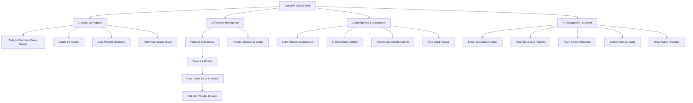
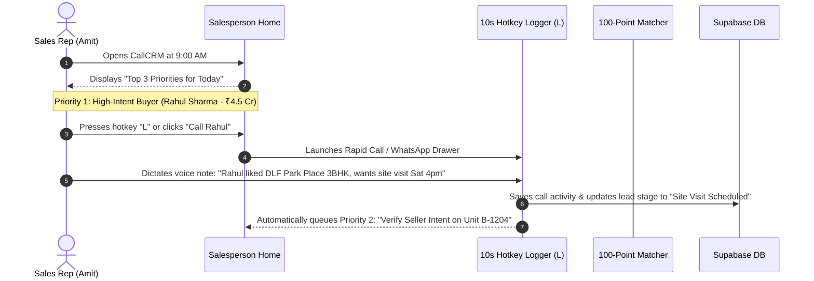
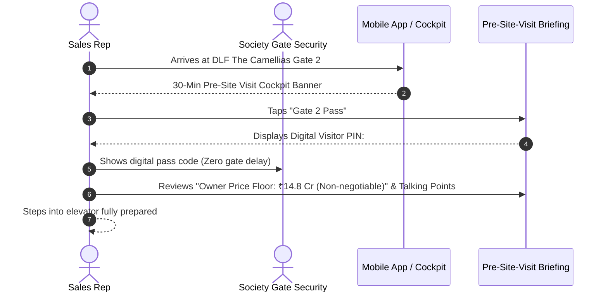
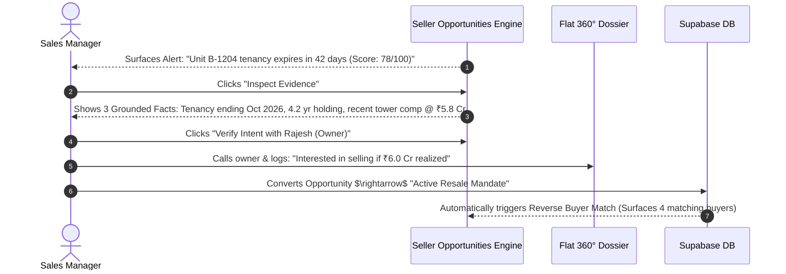
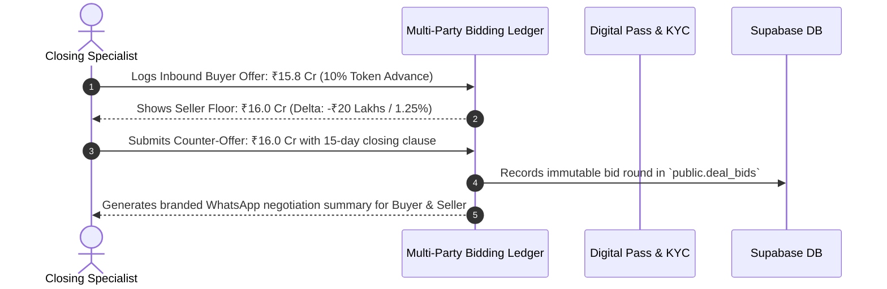
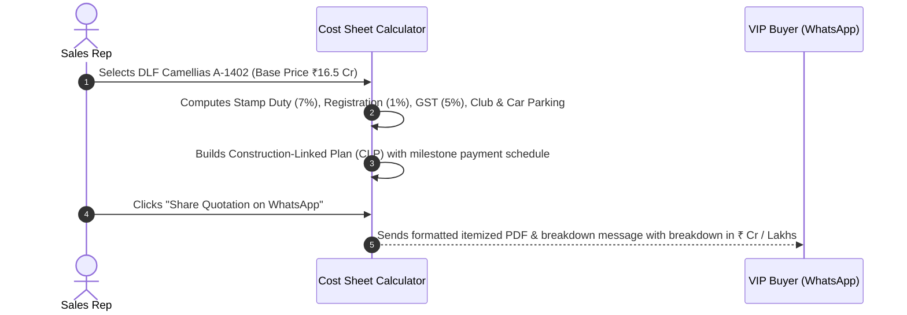

# CallCRM 2.0 — UX Information Architecture & Interaction Design

> **Document Objective**: Define the comprehensive Information Architecture (IA), role-specific mental models, navigation taxonomy, and user interaction journeys for CallCRM 2.0 to eliminate cognitive clutter, reduce modal fragmentation, and accelerate high-ticket sales workflows.

---

## 1. Core Information Architecture Principles

1. **Role-First Mental Models**: A salesperson, a sales manager, and an agency founder should never see the exact same layout. Navigation and dashboards must automatically adapt to their primary job-to-be-done.
2. **Atomic Asset Hierarchy**: The mental model strictly flows from **Geography $\rightarrow$ Complex $\rightarrow$ Building $\rightarrow$ Unit (Atomic Asset) $\rightarrow$ Stakeholder Graph**.
3. **5-Second Comprehension**: Every primary screen must answer its persona's single most important question within 5 seconds without requiring scrolling or filter manipulation.
4. **Contextual Action Over Administrative Nav**: Move actions to where the context lives. Avoid forcing users to navigate to an "Activities" or "Tasks" page when they can log, follow up, or match directly from a Lead or Unit dossier.
5. **Progressive Disclosure**: Show high-level executive cards or summary rows by default; reveal granular specifications, price ledgers, and institutional memory upon focused interaction (expandable rows, slide-over sheets, or dedicated split views).

---

## 2. Global Navigation Taxonomy & Structure

Rather than exposing a flat list of 13 menu items, the sidebar is organized into **4 Distinct Mental Model Sections**:



---

## 3. Role-Specific Workspaces

### A. Salesperson Workspace (Action-First)
- **Primary Question**: *"What should I do right now to advance my deals?"*
- **Default Landing**: `/` $\rightarrow$ **Today's Priorities (Salesperson Home)**.
- **Visible Navigation Items**:
  1. **Today** (`/`) — Prioritized action queue (High-intent calls, site visits, overdue commitments).
  2. **My Leads** (`/leads`) — Searchable buyer/seller lead directory with quick call/WhatsApp triggers.
  3. **Pipeline** (`/pipeline`) — Deal stage Kanban with stage stagnation warnings.
  4. **Inventory** (`/projects`) — Unit availability matrix, tower floor plans, and 100-point matching.
  5. **People** (`/people`) — Client profiles and multi-unit ownership context.
- **Suppressed / Hidden**: Boss analytics, team performance rankings, system configuration, billing.

---

### B. Sales Manager Workspace (Exception & Intervention-First)
- **Primary Question**: *"Where is my team getting stuck, and which high-value deals are at risk?"*
- **Default Landing**: `/` $\rightarrow$ **Manager Intervention Cockpit**.
- **Visible Navigation Items**:
  1. **Overview** (`/`) — Team SLA breaches, at-risk high-ticket deals, unassigned leads, and pending site visits.
  2. **Team Pipeline** (`/pipeline`) — Filterable by rep, stage velocity, and deal health score.
  3. **Leads** (`/leads`) — Ingestion logs, lead re-assignment, and stage override.
  4. **Inventory & Mandates** (`/projects`) — Available inventory, seller signals, and resale mandate pricing.
  5. **Performance** (`/reports`) — Rep conversion rates, call activity benchmarks, and SLA compliance.

---

### C. Boss / Agency Founder Workspace (Macro Health & Revenue-First)
- **Primary Question**: *"What is happening with my business, revenue pipeline, and market inventory?"*
- **Default Landing**: `/` $\rightarrow$ **Executive Overview**.
- **Visible Navigation Items**:
  1. **Executive Cockpit** (`/`) — Total active pipeline (`₹ Cr`), won revenue, deal health risk radar, and monthly growth trend.
  2. **Inventory & Resale Mandates** (`/projects`) — Capital locked in inventory, exclusive seller opportunities, and society pricing benchmarks.
  3. **Deals Pipeline** (`/pipeline`) — Macro negotiation status and closing probabilities.
  4. **Analytics & Financials** (`/reports`) — Micro-market velocity, team ROI, and lead source attribution (Meta vs WhatsApp vs Direct).
  5. **Administration** (`/users`, `/billing`, `/settings`) — Organization hierarchy, licenses, and security.

---

## 4. End-to-End User Journeys

### Journey 1: Morning Action Routine (Salesperson — 3 Minutes)


---

### Journey 2: On-Site Client Visit Cockpit (Salesperson on Mobile — 30 Seconds)


---

### Journey 3: Seller Resale Signal $\rightarrow$ Exclusive Mandate (Manager — 2 Minutes)


---

### Journey 4: Multi-Party Bidding & Counter-Offer Negotiation (Closing Specialist — 1 Minute)


---

### Journey 5: Indian Real Estate Cost Sheet & Milestone Plan Generation (Sales Rep — 30 Seconds)


---

## 5. Navigation Depth & Transition Strategy

To avoid "Modal Inception" and lost state:
- **Level 1 (Full Pages)**: Workspaces, Boards, Directories (`/`, `/leads`, `/pipeline`, `/projects`, `/reports`, `/commissions`).
- **Level 2 (Slide-Over Slide Drawers)**: Detailed dossiers that retain background page context (`Lead Dossier Sheet`, `Flat 360° Dossier Sheet`, `Global Command Palette`).
- **Level 3 (Focused Action Modals)**: Ephemeral, quick-entry actions that dismiss immediately upon confirmation (`10-Second Quick Logger`, `Site Visit Pass Modal`, `Bidding Ledger Dialog`, `Cost Sheet Calculator`, `Human-in-the-Loop AI Meeting Confirm`).

---

## 6. Mobile CRM Cockpit & PWA Offline Experience

1. **Bottom Navigation Dock (Mobile)**: Priority (`Home`), Leads (`Leads`), Matrix (`Inventory`), Dialer (`Quick Log`).
2. **PWA Service Worker**: Instant caching of asset dossiers and property facts.
3. **IndexedDB Sync Queue**: Sales reps can log calls, take voice notes, and review unit specs offline in basement lobbies. Mutations sync automatically upon network reconnection.
4. **Voice Note Dictation**: One-tap recording with Web Audio API, automatically structured by Aria into structured deal updates.

---

## 7. Global Command Palette (`⌘K` / `/`) Architecture

The Command Palette is the universal nerve center of CallCRM. It indexes all entities in <10ms:

```
[ ⌘K ] Universal Search & Action Bar
----------------------------------------------------------------------
> Search people, properties, units, leads, or type a command...

⚡ RAPID ACTIONS
  • Log Call Activity                              [ Hotkey: L ]
  • Create New Lead Inquiry                         [ Hotkey: N ]
  • Open Today's Follow-up Queue                    [ Hotkey: F ]
  • Generate Indian Cost Sheet                      [ Hotkey: C ]
  • Issue Site Visit Pass                           [ Hotkey: P ]
  • Run Stale Knowledge Scan                        [ Admin ]

🏢 UNITS & PROPERTIES
  • Camellias A-1402 (4 BHK · 4,200 sq ft · ₹16.5 Cr)  [ Flat 360° ]
  • DLF Park Place · Tower B · Unit 1204             [ Available ]
  • Oberoi 360 West · Tower 2 · Penthouse 4001       [ Resale ]

👤 PEOPLE & LEADS
  • Siddharth Verma (+91 98110 99234 · Gurgaon)      [ High Intent · ₹3.8 Cr ]
  • Rajesh Sharma (Owner: Unit B-1204 · Camellias)   [ Seller Signal ]
  • Ananya Singhania (+91 98200 11456 · Worli)      [ Site Visit Scheduled ]
```
