# EcosystemRealty 2.0 — Screen-by-Screen UI/UX Redesign Plan

> **Plan Objective**: Provide an exhaustive, implementation-ready architectural roadmap for executing the EcosystemRealty 2.0 redesign across all 11 phases without breaking existing business logic, database migrations, or test suites.

---

## 1. Implementation Phases & Execution Order

```mermaid
flowchart LR
    P0[Phase 0: Design Tokens & Foundations] --> P1[Phase 1: App Shell & Role Navigation]
    P1 --> P2[Phase 2: Salesperson Daily Priority Cockpit]
    P2 --> P3[Phase 3: Leads, Dossiers & Pipeline Board]
    P3 --> P4[Phase 4: Property Matrix & Flat 360° Drawer]
    P4 --> P5[Phase 5: Executive Boss & Manager Cockpits]
    P5 --> P6[Phase 6: People Directory & Stakeholder Graph]
    P6 --> P7[Phase 7: Contextual AI Integrations]
    P7 --> P8[Phase 8: High-Density Tables, Drawers & States]
    P8 --> P9[Phase 9: Mobile 1-Thumb Touch Experience]
    P9 --> P10[Phase 10: Performance, A11y & Visual Polish]
```

---

## 2. Detailed Screen-by-Screen Specifications

### Screen 1: Salesperson Daily Priority Cockpit (`salesperson-home.tsx`)

| Attribute | Specification |
| :--- | :--- |
| **Purpose** | Single-screen action center answering *"What should I do right now to close deals?"* |
| **Primary User** | Sales Rep, Closing Specialist, On-site Consultant. |
| **User Question** | *"Who are my top 3 calls/visits today, and what is due right now?"* |
| **Current Problems** | Disjointed quick-action buttons; timeline queue lacks inline actions; next actions list is unpaginated. |
| **New Information Hierarchy** | 1. **Morning Focus Banner**: Top 3 high-impact actions (Calls, Site Visits, At-risk deals). 2. **Active 30m Site Visit Alert**: If visit within 45m, prominent Gate 2 PIN & parking bay card. 3. **Prioritized Action Queue**: Visual cards with 1-click [Call], [WhatsApp], [Reschedule]. 4. **Seller Signal Radar**: Proactive resale opportunity alerts with [Verify Intent] trigger. |
| **Primary CTA** | `Start Daily Call Queue` (auto-opens first priority contact with 10s logger). |
| **Secondary Actions** | `Log Activity (L)`, `Verify Seller Intent`, `Open Today's Visits`, `Search (/)`. |
| **Layout & Components** | 2-column responsive layout (Left 65% Priority Queue, Right 35% Daily Timeline & SLA Meter). |
| **Responsive Behavior** | Collapses to single-column stack on mobile with fixed bottom action sheet. |
| **Loading State** | Skeleton action cards with animated shimmering pulse. |
| **Empty State** | *"All priorities cleared for today. 0 overdue tasks."* with `[Explore Fresh Inbound Leads]` button. |
| **Affected Files** | `Frontend/src/components/crm/salesperson-home.tsx`, `Frontend/src/components/ui/action-card.tsx`. |
| **Risk & Priority** | Low risk (UI composition change only) · **P0 (Critical)**. |

---

### Screen 2: Flat 360° Master Property Dossier (`unit-detail-modal.tsx` $\rightarrow$ `UnitDossierSheet.tsx`)

| Attribute | Specification |
| :--- | :--- |
| **Purpose** | Comprehensive atomic property dossier replacing cramped modal dialogs with a right-hand slide-over sheet. |
| **Primary User** | Sales Rep, Closing Specialist, Property Manager. |
| **User Question** | *"Who owns this flat, what is its price history, what are the gate rules, and who wants to buy it?"* |
| **Current Problems** | Standard modal feels claustrophobic; ownership is a plain table; price history lacks trend graph. |
| **New Information Hierarchy** | 1. **Dossier Header**: Unit Number (`A-1402`), Tower, Society, Asking Price (`₹16.5 Cr`), Status Badge. 2. **Quick Spec Strip**: 4 BHK · 4,200 sq ft · 14th Floor · 3 Covered Bays · North-East facing. 3. **Segmented Tabs**: &nbsp;&nbsp;• **Tab 1: Specs & Institutional Memory** (Gate 2 PIN, Bylaws, Owner Price Floor). &nbsp;&nbsp;• **Tab 2: Temporal Ownership Chain** (Current Owner, Past Owners, Tenants). &nbsp;&nbsp;• **Tab 3: Price Ledger & Trend** (Asking price revisions with visual delta). &nbsp;&nbsp;• **Tab 4: 100-Point Matching Buyers** (Ranked active buyer list with match breakdown). |
| **Primary CTA** | `Match with Active Buyers` (1-click link to buyer pipeline). |
| **Secondary Actions** | `Revise Asking Price`, `Add Owner/Tenant`, `Add Verified Fact`, `Share Dossier (WhatsApp)`. |
| **Layout & Components** | Right slide-over drawer (`w-full max-w-2xl sm:max-w-3xl`) with fixed header and sticky bottom action dock. |
| **Responsive Behavior** | Full-width slide-over on mobile with tab swiping. |
| **Loading State** | Spec grid skeleton + tab skeleton. |
| **Empty State** | For unmatched buyers: *"No active buyer matches within +/- 20% budget. [Broaden Criteria]"*. |
| **Affected Files** | `Frontend/src/components/crm/unit-detail-modal.tsx`, `Frontend/src/components/crm/pages/projects-page.tsx`. |
| **Risk & Priority** | Low risk · **P0 (Critical)**. |

---

### Screen 3: Executive Boss & Agency Founder Cockpit (`boss-overview.tsx`)

| Attribute | Specification |
| :--- | :--- |
| **Purpose** | High-level macro business health, revenue pipeline in `₹ Cr`, and risk radar. |
| **Primary User** | Agency Founder ("The Boss"), Managing Director, Sales VP. |
| **User Question** | *"What is our total pipeline value, how much did we close this month, and which deals are at risk?"* |
| **Current Problems** | 836 lines of dense, vertically stacked tables and dropdowns; lacks executive narrative summary. |
| **New Information Hierarchy** | 1. **Executive Narrative Bar**: *"Monthly closed revenue is ₹18.4 Cr (+14% vs target). 4 deals in Negotiation require pricing intervention."* 2. **4 Master KPI Cards**: Total Active Pipeline, Won Revenue, Stalled Deals at Risk, Inflow Momentum. 3. **Deal Health Risk Radar**: Table of at-risk deals with health score, stuck days, and assigned rep. 4. **Pipeline Stage Velocity**: Visual stage progression bar with average dwell time per stage. 5. **Rep Performance Leaderboard**: Conversion rate, closed revenue, and SLA compliance score. |
| **Primary CTA** | `Inspect At-Risk Deals` (filters view to high-value stalled opportunities). |
| **Secondary Actions** | `Export Executive Summary (PDF)`, `Filter by Micro-market`, `Review Team SLAs`. |
| **Layout & Components** | Clean 3-tier modular dashboard with collapsible dimension filters. |
| **Responsive Behavior** | KPI cards reflow to 2x2 grid on tablet, 1x4 stack on mobile. |
| **Loading State** | High-fidelity chart & metric skeleton layout. |
| **Affected Files** | `Frontend/src/components/crm/boss-overview.tsx`, `Frontend/src/components/crm/charts/*`. |
| **Risk & Priority** | Medium risk (analytics data bindings) · **P0 (Critical)**. |

---

### Screen 4: Leads Directory & Slide-Over Dossier (`leads-page.tsx`, `lead-detail-modal.tsx`)

| Attribute | Specification |
| :--- | :--- |
| **Purpose** | High-density searchable lead directory with instant slide-over customer dossier. |
| **Primary User** | Sales Rep, Sales Manager. |
| **User Question** | *"Which leads have not been contacted today, and what are their specific unit preferences?"* |
| **Current Problems** | 8-column table with horizontal compression; lead detail modal hides matching units under deep tabs. |
| **New Information Hierarchy** | 1. **Smart Filter Pill Bar**: Fast 1-click filters (`All Active`, `Hot 🔥`, `Site Visits`, `Overdue Follow-up`). 2. **High-Density Lead Table**: Stacked primary column (Name + Phone), Stage Pill, Budget in `₹ Cr`, Deal Health. 3. **Right Slide-Over Lead Dossier**: Buyer preferences, inquiry timeline, matched inventory units, and 10s logger dock. |
| **Primary CTA** | `Call & Log (L)` or `Schedule Site Visit`. |
| **Secondary Actions** | `WhatsApp Pitch`, `Assign Unit`, `Re-assign Rep`, `Mark Lost`. |
| **Affected Files** | `Frontend/src/components/crm/pages/leads-page.tsx`, `Frontend/src/components/crm/lead-detail-modal.tsx`. |
| **Risk & Priority** | Medium risk · **P0 (Critical)**. |

---

### Screen 5: Society Inventory & Tower Explorer (`projects-page.tsx`)

| Attribute | Specification |
| :--- | :--- |
| **Purpose** | Explore complex projects, towers, floors, and unit matrices with shared society intelligence. |
| **Primary User** | Sales Rep, Inventory Manager, Agency Founder. |
| **User Question** | *"What units are available in Tower B, and what are the society visitor access rules?"* |
| **Current Problems** | 1034 lines of code; monolithic grid becomes unwieldy; society-level rules (RWA, Gate 2) are suppressed. |
| **New Information Hierarchy** | 1. **Project Header**: Society Name, Developer, Locality, RERA ID, Total Towers & Units. 2. **Society Shared Intelligence Card**: Security Gate 2 rules, parking bylaws, maintenance desk contact. 3. **Tower Selector**: Visual block cards showing availability percentage per tower. 4. **Interactive Unit Matrix Grid**: Color-coded unit tiles (`Available`, `Hold`, `Sold`, `Resale Opportunity`). |
| **Primary CTA** | `Open Unit Dossier` (opens slide-over for clicked unit). |
| **Secondary Actions** | `Add Unit`, `Bulk CSV Import`, `Filter by Configuration (3 BHK / 4 BHK)`. |
| **Affected Files** | `Frontend/src/components/crm/pages/projects-page.tsx`. |
| **Risk & Priority** | Medium risk · **P0 (Critical)**. |

---

### Screen 6: Proactive Seller Intelligence Modal (`seller-opportunities-modal.tsx`)

| Attribute | Specification |
| :--- | :--- |
| **Purpose** | Evidence-based resale opportunity review and 1-click mandate conversion. |
| **Primary User** | Sales Rep, Sales Manager. |
| **User Question** | *"Which owners are showing resale signals, what is the grounded evidence, and who should call them?"* |
| **Current Problems** | Treats signals as "confirmed sellers"; lacks transparent factor scoring; missing verification disposition. |
| **New Information Hierarchy** | 1. **Signal Strength Badge**: `78/100 Opportunity Score` (Transparent breakdown: +20 Tenancy, +15 Holding). 2. **Grounded Evidence List**: Explicit sources (Tenancy record, ownership ledger, market transaction comps). 3. **Recommended Salesperson**: Relationship intelligence recommendation based on past interactions. 4. **Human Verification Flow**: Structured disposition options (`Wants to sell`, `Considering`, `Renewing tenant`, `Do not contact`). |
| **Primary CTA** | `Verify Intent with Owner` $\rightarrow$ launches verification flow. |
| **Secondary Actions** | `Convert to Resale Listing (Human-confirmed)`, `Dismiss Signal (with Cooldown)`. |
| **Affected Files** | `Frontend/src/components/crm/seller-opportunities-modal.tsx`. |
| **Risk & Priority** | Low risk · **P0 (Critical)**. |
