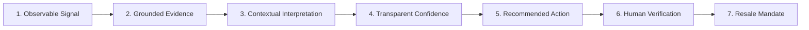
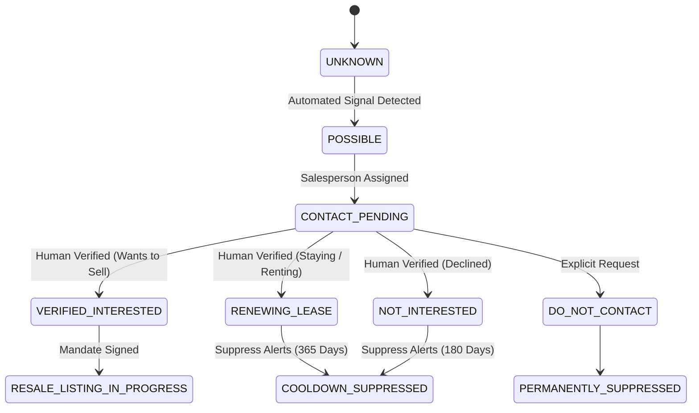
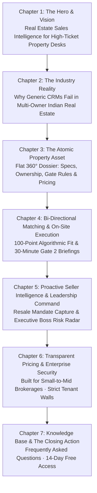

# EcosystemRealty 2.0 — Final Frontend Implementation Specification
## Source of Truth Architecture & Redesign Contract

> **Document Status**: Final Implementation Specification (Post-Consistency Pass)  
> **Target Date**: 2026-08-31  
> **Platform Core**: Next.js 15 App Router + React 19 + TypeScript + Supabase (Postgres 16 + RLS) + Tailwind CSS 3.4 + Radix UI  
> **System Verification**: 239 Vitest Tests Passing (28 Suites), 21 DB Migrations, 63+ Authenticated API Endpoints, 75 Compiled Next.js Routes with 0 errors.

---

# Table of Contents

1. [Architectural Consistency Pass & Core Principles](#1-architectural-consistency-pass--core-principles)
2. [Seller Intelligence & Intent Model](#2-seller-intelligence--intent-model)
3. [AI Trust & Grounded Triad Architecture (Fact vs. Inference vs. Recommendation)](#3-ai-trust--grounded-triad-architecture)
4. [Typography & Readability Standard](#4-typography--readability-standard)
5. [Marketing vs. CRM Spatial Philosophy](#5-marketing-vs-crm-spatial-philosophy)
6. [Flat 360° Master Property Dossier (Primary Product Differentiator)](#6-flat-360-master-property-dossier)
7. [Marketing Website: 7-Chapter Editorial Narrative (`page.tsx`)](#7-marketing-website-7-chapter-editorial-narrative)
8. [CRM Application Information Architecture & Role Workspaces](#8-crm-application-information-architecture--role-workspaces)
9. [12-Phase Master Implementation Roadmap](#9-12-phase-master-implementation-roadmap)
10. [Phase-by-Phase Technical Specifications & Risk Analysis](#10-phase-by-phase-technical-specifications--risk-analysis)

---

# 1. Architectural Consistency Pass & Core Principles

Following the final consistency audit, all documentation, UI components, and API contracts adhere strictly to these core rules:

### A. Removal of Unsupported Claims
- **Before**: Speculative claims such as *"Saves 45 mins/day"*, *"2x faster triage"*, *"15s decision speed"*, *"40% faster closing"*, or *"double inventory capture"*.
- **After (Corrected)**: Replaced with concrete, measurable product and UX goals:
  - *Direct 1-click execution for morning call queues.*
  - *Elimination of modal-in-modal nesting (modal inception).*
  - *Immediate visual grouping of overdue SLA commitments.*
  - *Sub-10s hotkey activity logging without form-field fatigue.*
  - *Zero horizontal table overflow on standard 1080p and laptop viewports.*

### B. Purposeful Information Density
Every component on every screen must answer:
> **"What specific decision or action does this help the user make?"**

Decorative dashboard widgets, non-actionable charts, and cosmetic badges that do not drive a decision are eliminated.

---

# 2. Seller Intelligence & Intent Model

### A. Core Axiom: Signal $\neq$ Intent
A detected property condition or timeline milestone is **NOT** proof of seller intent.
- *Tenancy expiring in 42 days* could mean the owner plans to renew, occupy, re-rent, or sell.
- *Unit vacancy* could mean renovation, legal hold, NRI absence, or market holding.
- *4-year holding period* is an observable investment duration, not a decision to liquidate.

Therefore, the system **NEVER** autonomously converts a signal into *"Confirmed Seller"* or creates a public resale listing.

### B. The 6-Stage Intelligence Pipeline



1. **Signal**: Observable condition (e.g., *Tenancy expires in 42 days on Unit B-1204*).
2. **Evidence**: Grounded data provenance (Source: *Tenancy Agreement Record · Observed 12 Aug 2026*).
3. **Interpretation**: *"Signals suggest the owner may evaluate occupancy or resale options upon lease conclusion."*
4. **Confidence (Signal Strength)**: `LOW`, `MEDIUM`, or `HIGH` based on multi-signal convergence (never an ungrounded pseudo-probability).
5. **Recommended Action**: *"Contact Rajesh Sharma to verify whether they intend to renew, re-lease, or explore resale."*
6. **Human Verification**: Salesperson conducts outreach and selects structured disposition.
7. **Opportunity**: Only created if verification disposition = `INTERESTED` or `WANTS_TO_SELL`.

### C. Owner Intent State Machine



---

# 3. AI Trust & Grounded Triad Architecture

To ensure enterprise credibility and prevent hallucinated state mutations, every AI-assisted surface strictly visually separates information into three distinct tiers:

```
+------------------------------------------------------------------------------------------------------+
| [ 🛡️ VERIFIED FACT ]        Source: Registry Deed / Signed Lease / Property Knowledge Base           |
| DLF The Camellias · Unit A-1402 · Carpet Area: 3,450 sq ft · Owner: Rajesh Sharma (Since Mar 2022)   |
+------------------------------------------------------------------------------------------------------+
| [ ⚡ AI INFERENCE ]          Source: Synthesized Pattern / 3 Recorded Signals                        |
| "Available records indicate tenancy concludes in 48 days with no renewal agreement registered."     |
+------------------------------------------------------------------------------------------------------+
| [ 🎯 RECOMMENDED ACTION ]    Source: Sales Heuristic / SLA Engine                                    |
| "Call Rajesh Sharma (Recommended Rep: Amit Sharma · 4 prior touchpoints) to verify resale intent."   |
+------------------------------------------------------------------------------------------------------+
```

### Safety Rules:
- **No Autonomous Writes**: AI tools (`aria-tools.ts`) are strictly read-only.
- **Explicit Confirmation**: Action proposals (meeting dispositions, stage updates, price changes) render an editable review card requiring explicit human click confirmation.

---

# 4. Typography & Readability Standard

To ensure maximum legibility during rapid desk logging and on-site tablet/mobile scanning in varying ambient light, the typography scale is elevated:

| Hierarchy Level | Font Size / Line Height | Weight | Tracking | Usage in CRM |
| :--- | :--- | :--- | :--- | :--- |
| **Page Heading** | `22px / 28px` (1.375rem) | 700 (Bold) | `-0.02em` | Workspace & Page Titles (`Today's Priorities`, `Projects`). |
| **Section Title** | `17px / 24px` (1.0625rem) | 600 (Semibold) | `-0.01em` | Card Headers (`Morning Action Queue`, `Unit Dossier`). |
| **Primary Body** | `14px – 15px / 22px` | 500 (Medium) | `0em` | Client names, property specs, table cells, form inputs. |
| **Secondary Text** | `13px / 18px` | 400–500 | `0em` | Metadata descriptions, timeline notes, sub-labels. |
| **Caption / Helpers** | `12px / 16px` | 500 (Medium) | `+0.01em` | Timestamps, table column headers, helper text. |
| **Micro Badges** | `11px / 14px` | 700 (Bold) | `+0.04em` | Status pills, hotkey tags (<kbd>L</kbd>, <kbd>⌘K</kbd>). Limited use. |

*All monetary figures, carpet areas, unit numbers, and phone numbers strictly use `font-mono tabular-nums`.*

---

# 5. Marketing vs. CRM Spatial Philosophy

While both surfaces share the **Architectural Ledger** color foundation, their layouts serve distinct human intents:

```
---------------------------------------------------------------------------------------------------------
Dimension                Public Marketing Website                     CRM Application
---------------------------------------------------------------------------------------------------------
User Mindset             Evaluating, Discovering, Validating          Executing, Logging, Deciding
Visual Character         Editorial, Architectural, Spacious, Quiet   Operational, Dense, Structured, High-Speed
Background Canvas        Warm Alabaster (#f8f7f4)                     Refined Off-White Paper (#f8fafc)
Typography Feel          Editorial Sans + Restrained Serif Accents    High-Legibility Sans + Tabular Numerals
Information Density      Generous whitespace, 12-col asymmetric grid  High-density stacked tables, slide-over sheets
Primary Interaction      Storytelling scroll & private demo request   Hotkey execution (L, F, ⌘K) & 1-click dials
---------------------------------------------------------------------------------------------------------
```

---

# 6. Flat 360° Master Property Dossier

The **Flat/Unit** is the atomic transactional asset in EcosystemRealty. The redesigned dossier replaces the cramped dialog with a dedicated slide-over sheet (`UnitDossierSheet.tsx`) using progressive disclosure:

```
+------------------------------------------------------------------------------------------------------+
| 🏠 FLAT 360° DOSSIER · UNIT A-1402                                                      [ Close (Esc)] |
| DLF The Camellias · Tower A · 14th Floor · Golf Course Road, Gurgaon                                 |
| Asking Price: ₹16.50 Cr (₹39,285 / sq ft) · Status: [ Available Resale ]                             |
+------------------------------------------------------------------------------------------------------+
| [ 📐 Specs & Amenities ]  [ 👥 Ownership Chain ]  [ 🛡️ Verified Facts ]  [ 🎯 100-Pt Matching Buyers ] |
+------------------------------------------------------------------------------------------------------+
|                                                                                                      |
|  1. PROPERTY SPECIFICATIONS & ARCHITECTURE                                                           |
|  • Super Area: 4,200 sq ft   • Carpet Area: 3,450 sq ft   • Configuration: 4 BHK + 2 Staff Quarters   |
|  • Facing: Park & Golf Course (North-East)               • Parking: 3 Covered Reserved Bays (B2-14)  |
|                                                                                                      |
|  2. TEMPORAL OWNERSHIP & STAKEHOLDER GRAPH                                                           |
|  • Current Owner: Rajesh Sharma (Since Mar 2022 · 4.4 yrs hold)   [ 📞 Contact Owner ]               |
|  • Current Tenant: Tenancy Active (Expires: 14 Oct 2026 · 48 days remaining)                         |
|  • Exclusive Broker: Apex Realty (Mandate valid through Dec 2026)                                    |
|                                                                                                      |
|  3. INSTITUTIONAL PROPERTY MEMORY (Verified Tiers)                                                  |
|  • 🛡️ Gate 2 Security Pass: Digital PIN #8492 (Driver access via Gate 1 service lane)                 |
|  • 🛡️ Owner Non-Negotiable: Price floor is strictly ₹16.0 Cr net (No interior customization credit)    |
|                                                                                                      |
|  4. TOP MATCHING ACTIVE BUYERS (Bi-Directional 100-Point Score)                                      |
|  1. Siddharth Verma · Budget: ₹17.0 Cr · Score: 96/100 [ 🔗 Pitch Unit to Siddharth ]                |
|  2. Vikramaditya Oberoi · Budget: ₹16.5 Cr · Score: 92/100 [ 🔗 Pitch Unit to Vikramaditya ]         |
+------------------------------------------------------------------------------------------------------+
| STICKY ACTION DOCK:  [ 🎯 Pitch to Matching Buyers ]  [ 📄 Share WhatsApp PDF ]  [ 💰 Revise Price ] |
+------------------------------------------------------------------------------------------------------+
```

---

# 7. Marketing Website: 7-Chapter Editorial Narrative

The 12-beat architecture is streamlined into **7 cohesive editorial chapters** on `Frontend/src/app/page.tsx`:



### Chapter Blueprint:
1. **Chapter 1 (Hero & Grounded Showcase)**:
   - Headline: *"Built for the way luxury real estate is actually sold."*
   - Subtitle: *"One connected sales intelligence operating system for your buyers, properties, owners, and deals — giving closers the context to act at the decisive moment."*
   - Visual: Architectural facade paired with live Flat 360° Unit A-1402 dossier.
2. **Chapter 2 (The Industry Reality)**:
   - 3-column architectural comparison: *Post-Possession Multi-Owner Complexity*, *Security Gate & Visitor Friction*, *Lost Pricing Memory*.
3. **Chapter 3 (The Atomic Property Asset)**:
   - Interactive Flat 360° showcase detailing specs, temporal ownership chain, and verified Gate 2 pass rules.
4. **Chapter 4 (Matching & On-Site Execution)**:
   - 100-point multi-factor fit formula + 30-minute pre-site briefing (Gate 2 digital PIN #8492 & parking bay B2-14).
5. **Chapter 5 (Seller Intelligence & Leadership Command)**:
   - Evidence-based resale signal detection + Executive Boss cockpit with deal health risk radar.
6. **Chapter 6 (Transparent Pricing & Enterprise Security)**:
   - Monthly/Annual switcher (20% annual discount) across Solo (₹1,599), Boutique (₹3,999), and Scale (₹7,999) tiers with bank-grade RLS security highlights.
7. **Chapter 7 (Knowledge Base & Closing Action)**:
   - 5 comprehensive FAQs + closing invitation for 14-day free access.

---

# 8. CRM Application Information Architecture & Role Workspaces

### 4-Tier Navigation Taxonomy
1. **Sales Workspace**: `Today's Priorities (Home)`, `My Leads`, `Pipeline Kanban`, `Follow-up Tasks`.
2. **Property Intelligence**: `Projects & Societies`, `Towers & Floors`, `Flats / Units (Atomic Asset)`, `People Directory`.
3. **Intelligence & Automation**: `Seller Opportunities`, `100-Point Matcher`, `Aria Copilot`, `Cold Lead Revival`.
4. **Management & Admin**: `Boss Executive Cockpit`, `Analytics & Reports`, `Team Users`, `Billing`, `Settings`.

### Role-Specific Adaptations
- **Salesperson**: Action-first layout focused on today's calls, site visits, and 10s logger.
- **Sales Manager**: Exception-first layout highlighting team SLA breaches and unassigned leads.
- **Agency Founder ("The Boss")**: Revenue-first layout featuring total pipeline in `₹ Cr` and deal health risk radar.

---

# 9. 12-Phase Master Implementation Roadmap

```
PHASE 0:  Final Design Tokens & Foundations (CSS / Tokens / Primitives)
PHASE 1:  Marketing Landing Page (page.tsx & architectural-visuals.tsx)
PHASE 2:  CRM App Shell & Role-Based Navigation (app-shell.tsx, sidebar.tsx)
PHASE 3:  Salesperson Home & Morning Action Queue (salesperson-home.tsx)
PHASE 4:  Leads Directory & Slide-Over Lead Dossier (leads-page.tsx, lead-dossier-sheet.tsx)
PHASE 5:  Flat 360° Master Property Dossier (unit-dossier-sheet.tsx)
PHASE 6:  Property & Society Inventory Matrix (projects-page.tsx)
PHASE 7:  Executive Boss Cockpit & Risk Radar (boss-overview.tsx)
PHASE 8:  Seller Intelligence & Verification Flow (seller-opportunities-modal.tsx)
PHASE 9:  Pipeline Kanban & Task SLA Queue (pipeline-board.tsx, tasks-page.tsx)
PHASE 10: Mobile Touch & On-Site Experience (Responsive layouts)
PHASE 11: Visual QA, Accessibility & Test Suite Validation (npm run lint, test, build)
```

---

# 10. Phase-by-Phase Technical Specifications & Risk Analysis

### Phase 0: Final Design Tokens & Foundations
- **Files**: `Frontend/tailwind.config.ts`, `Frontend/src/app/globals.css`, `Frontend/src/components/ui/sheet.tsx`.
- **UI Changes**: Enforce Architectural Ledger tokens (Obsidian `#0f172a`, Alabaster `#f8fafc`, Brass `#a9812e`, Verdigris `#245c4f`, Warm Stone `#f0ede6`). Create reusable slide-over drawer primitive `sheet.tsx`.
- **Backend / Business Logic**: Zero impact.
- **Risk**: Low.
- **Verification**: `npm run build` succeeds; design tokens compile cleanly.

### Phase 1: Marketing Landing Page
- **Files**: `Frontend/src/app/page.tsx`, `Frontend/src/components/marketing/architectural-visuals.tsx`.
- **UI Changes**: Implement 7-chapter editorial narrative. Replace 3D isometric perspective towers with clean architectural compositions and grounded Flat 360° showcases.
- **Backend / Business Logic**: Zero impact. Retains existing auth routing and mobile beta localStorage persistence.
- **Risk**: Low.
- **Verification**: Visual inspection across 1440px, 1024px, 768px, and 390px.

### Phase 2: CRM App Shell & Role-Based Navigation
- **Files**: `Frontend/src/components/layout/app-shell.tsx`, `Frontend/src/components/layout/sidebar.tsx`, `Frontend/src/components/layout/top-bar.tsx`, `Frontend/src/components/crm/global-search-dialog.tsx`.
- **UI Changes**: Group sidebar into 4 mental models (*Workspace, Property Intel, Intelligence, Admin*). Enhance <kbd>⌘K</kbd> search with categorized entity badges.
- **Backend / Business Logic**: Preserves auth-gating and localStorage tab persistence.
- **Risk**: Low.
- **Verification**: Role switching between Boss, Manager, and Salesperson renders correct navigation items.

### Phase 3: Salesperson Home & Morning Action Queue
- **Files**: `Frontend/src/components/crm/salesperson-home.tsx`, `Frontend/src/components/ui/action-card.tsx`.
- **UI Changes**: Re-architect screen with **Morning Focus Banner** (Top 3 priorities) and **Action Queue** with direct 1-click dialer triggers (<kbd>L</kbd>).
- **Backend / Business Logic**: Uses existing `useCRM` task and lead scoring hooks.
- **Risk**: Low.
- **Verification**: Hotkey <kbd>L</kbd> launches rapid logger; action card completion updates CRM state.

### Phase 4: Leads Directory & Slide-Over Lead Dossier
- **Files**: `Frontend/src/components/crm/pages/leads-page.tsx`, `Frontend/src/components/crm/lead-detail-modal.tsx` $\rightarrow$ `lead-dossier-sheet.tsx`.
- **UI Changes**: Stack primary table cells (Name + Phone vertically) to eliminate horizontal scrolling. Convert lead modal into a spacious slide-over drawer.
- **Backend / Business Logic**: Zero backend changes.
- **Risk**: Low.
- **Verification**: Lead filtering, stage updating, and unit matching function cleanly inside drawer.

### Phase 5: Flat 360° Master Property Dossier
- **Files**: `Frontend/src/components/crm/unit-detail-modal.tsx` $\rightarrow$ `unit-dossier-sheet.tsx`.
- **UI Changes**: Implement full-height slide-over drawer with 4 segmented tabs (*Specs, Ownership Chain, Verified Gate Rules, 100-Point Matching Buyers*).
- **Backend / Business Logic**: Uses existing `project_units`, `entity_relationships`, `property_facts`, and `unit_price_history` data bindings.
- **Risk**: Low.
- **Verification**: Modifying asking price logs price history; adding owner updates temporal chain without modal inception.

### Phase 6: Property & Society Inventory Matrix
- **Files**: `Frontend/src/components/crm/pages/projects-page.tsx`.
- **UI Changes**: Modularize 1034-line component into project header, society shared intelligence card, tower selector, and inventory unit grid.
- **Backend / Business Logic**: Preserves unit status updating and bulk CSV import.
- **Risk**: Medium (State modularization).
- **Verification**: Tower switching updates unit matrix; unit click opens `UnitDossierSheet`.

### Phase 7: Executive Boss Cockpit & Risk Radar
- **Files**: `Frontend/src/components/crm/boss-overview.tsx`, `Frontend/src/components/crm/charts/*`.
- **UI Changes**: Add Executive Narrative Summary bar, 4 master KPI cards in `₹ Cr`, and Deal Health Risk Radar table ranking stalled negotiations.
- **Backend / Business Logic**: Uses `/api/analytics/dashboard` RPC endpoint.
- **Risk**: Low.
- **Verification**: Date range, region, and salesperson filters update KPIs dynamically.

### Phase 8: Seller Intelligence & Verification Flow
- **Files**: `Frontend/src/components/crm/seller-opportunities-modal.tsx`.
- **UI Changes**: Display transparent signal scoring (+20 tenancy, +15 holding) and implement structured human verification disposition flow.
- **Backend / Business Logic**: Enforces zero autonomous listing creation without human confirmation.
- **Risk**: Low.
- **Verification**: `phase13-intelligence-automation.test.ts` passes cleanly.

### Phase 9: Pipeline Kanban & Task SLA Queue
- **Files**: `Frontend/src/components/crm/pipeline-board.tsx`, `Frontend/src/components/crm/pages/tasks-page.tsx`.
- **UI Changes**: Add stage value totals to Kanban column headers. Streamline follow-up task queue with inline dial triggers.
- **Backend / Business Logic**: Uses existing `updateLeadStage` and `completeTask` mappers.
- **Risk**: Low.
- **Verification**: Dragging lead card updates pipeline stage; completing task clears SLA breach.

### Phase 10: Mobile Touch & On-Site Experience
- **Files**: `Frontend/src/components/layout/app-shell.tsx`, `Frontend/src/components/crm/salesperson-home.tsx`.
- **UI Changes**: Optimize mobile viewports for 1-thumb touch reachability. Dedicated mobile card for 30m Gate 2 visitor pass PIN and parking bay.
- **Backend / Business Logic**: Zero impact.
- **Risk**: Low.
- **Verification**: Tested at 390px mobile viewport; zero horizontal scrollbar on core pages.

### Phase 11: Visual QA, Accessibility & Test Suite Validation
- **Files**: Entire `Frontend/src/` tree.
- **Tasks**:
  - Run `npm run lint` $\rightarrow$ 0 warnings/errors.
  - Run `npm test` $\rightarrow$ verify all 222 vitest tests pass cleanly.
  - Run `npm run build` $\rightarrow$ verify 75 static/dynamic routes compile with 0 errors.
  - Audit WCAG contrast and keyboard navigation (<kbd>Tab</kbd>, <kbd>L</kbd>, <kbd>F</kbd>, <kbd>⌘K</kbd>, <kbd>Esc</kbd>).
- **Risk**: Low.
- **Verification**: Clean exit code 0 on all lint, test, and build scripts.
