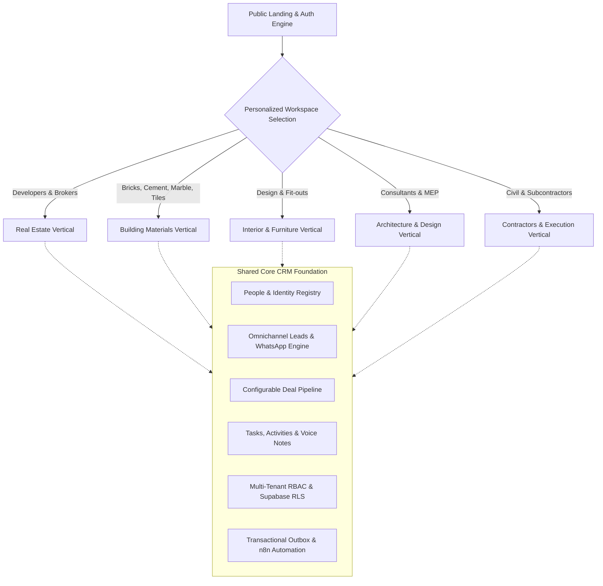

# Ecosystem Realty — Unified Operating System for Construction, Materials & Real Estate

**Ecosystem Realty** is an extensible, enterprise-grade Sales Operating System and AI platform engineered for the entire lifecycle of the built environment. 

Rather than isolating real estate transactions from the supply chain, Ecosystem Realty connects **Real Estate Developers, Building Material Suppliers (Bricks, Cement, Marble, Tiles, Sanitaryware, Hardware), Interior & Furniture Studios, Architecture Firms, and Civil Contractors** into a unified, collaborative commercial ecosystem.

Built with **Next.js 15 App Router**, **React 19**, **TypeScript**, **Tailwind CSS**, **Vercel AI SDK**, **Google Gemini**, **Supabase** (Postgres + Auth + RLS + Realtime), and an **n8n Event Bus**.

---

## 🌐 The Big Picture: One Platform, Five Interconnected Verticals

Every building project involves a linked chain of commerce. Ecosystem Realty provides a **common public website and shared core engine**, with **personalized post-login experiences** tailored to each industry's workflow, vocabulary, and operational depth.



---

## 🎯 Supported Industry Verticals

| Vertical | Primary Users | Tailored Capabilities | Core Asset Model |
| :--- | :--- | :--- | :--- |
| **Real Estate** | Developers, Brokers, Channel Partners, Mandate Desks | 6-tier unit dossiers, digital gate passes for site visits, bidding room ledger, statutory Indian brokerage (1% + 1% + GST/TDS), buyer matching | **Unit / Flat 360°** (Project $\rightarrow$ Tower $\rightarrow$ Floor $\rightarrow$ Flat) |
| **Building Materials** | Brick kilns, Cement distributors, Marble/Granite yards, Tiles & Sanitaryware suppliers | Wholesale vs. retail price tiers, MOQ, contractor credit ledger, sample dispatch tracking, quick WhatsApp quotes, delivery challans | **Material SKU / Lot Catalog** (Dimensions, Finishes, Grades, Stock) |
| **Interior & Furniture** | Interior designers, Modular kitchen studios, Turnkey fit-out firms | Room-by-room staging, moodboards, Bill of Quantities (BOQ), client material approvals, artisan/vendor milestone tracking | **Room & BOQ Specification** (Living, Kitchen, Finishes, Hardware) |
| **Architecture & Design** | Architects, Structural engineers, MEP consultants | Drawing revisions (GFC), specification sheets, client design sign-offs, site inspection memos, consultant coordination | **Design Project & Drawing Sheets** (Schematic, Working, As-Built) |
| **Contractors & Civil** | General contractors, Masonry & civil subcontractors, Site supervisors | Daily Site Reports (DSR), labor attendance, material consumption logs, milestone progress tracking, subcontractor measurement bills | **Site Milestone & Work Breakdown** (Excavation, RCC, Finishing) |

---

## ⚡ Adaptive Operating Modes: "Simple" vs. "Deep"

Different businesses operate at different speeds. The CRM adapts its complexity dynamically:

```
┌────────────────────────────────────────────────────────────────────────┐
│                        COMPLEXITY SELECTOR                             │
├───────────────────────────────────┬────────────────────────────────────┤
│ 🟢 SIMPLE / HIGH-VELOCITY MODE    │ 🔵 DEEP / ENTERPRISE MODE          │
│ • Fast 3-stage visual pipeline    │ • Multi-tier approval workflows    │
│ • 1-click WhatsApp quotes & bills │ • 6-tier real estate hierarchy     │
│ • Instant lead-to-order logging   │ • Chronological bid ledger         │
│ • Minimalist, low-friction forms  │ • Transactional outbox & n8n event │
│ • Best for: Material dealers,     │ • Role-gated pricing floors        │
│   trade contractors & boutiques   │ • Best for: Developers & large     │
│                                   │   distributor/dealership networks  │
└───────────────────────────────────┴────────────────────────────────────┘
```

---

## 🏛️ Shared Architecture & Technical Foundation

### 1. EcosystemRealty Core + n8n Separation-of-Responsibilities
- **Core Platform Owns the Truth**: All core business logic (*People, Leads, Accounts, Catalogs, Pipeline, Deals, and Audit Logs*) executes inside Next.js and Supabase. The system works 100% uninterrupted even if external automations are unreachable.
- **Transactional Outbox & Domain Event Bus (`crm_domain_events`)**: Dispatches HMAC-SHA256 signed events (`LeadCreated`, `QuoteGenerated`, `DispatchScheduled`, `DealWon`, `CommissionCreated`) with retries, exponential backoff, and circuit breakers.
- **Inbound Idempotency (`inbound_integration_events`)**: Protects against duplicate leads or orders from WhatsApp, IndiaMART, Justdial, or Meta webhook replays.
- **AI Human-in-the-Loop**: Gemini AI suggestions (audio note structuring, buyer matching, dormant lead resurrection) require explicit user sign-off before committing database mutations.

---

## 📂 Project Structure

```
building-ecosystem-crm/
├── supabase/migrations/            # Canonical database migrations (Multi-tenant schema, RLS, Outbox)
│   ├── 0001_init.sql → 0021_n8n_event_bus.sql # Multi-tenant core, RLS, Outbox
│   └── 0024_ecosystem_verticals.sql # Org industry vertical & complexity mode settings
├── DOCS/                           # Specifications & Developer Guides
│   ├── system-spec/                # Canonical System Specs
│   ├── domain-guides/              # Engineering, AI & Automation Guides
│   ├── ui-ux-spec/                 # UI/UX & Architectural Design System Specs
│   └── ecosystem-architecture.md   # Multi-vertical extensibility blueprint
└── Frontend/
    ├── src/
    │   ├── app/                    # Next.js 15 App Router
    │   │   ├── (auth)/             # Universal Auth (Login, Org Setup with Industry & Mode selector)
    │   │   ├── (marketing)/        # Unified Building Ecosystem landing page
    │   │   ├── dashboard/          # Adaptive dashboard (Developer vs Material Dealer vs Contractor)
    │   │   ├── leads/              # Universal Lead Inbound & qualification
    │   │   ├── pipeline/           # Configurable Stage Kanban
    │   │   ├── people/             # Universal Directory (Buyers, Suppliers, Architects, Contractors)
    │   │   ├── inventory/          # Dynamic inventory (Real Estate Units vs Material SKUs vs BOQ)
    │   │   └── api/                # 80+ API endpoints (Auth, Inbound, Outbox, Analytics)
    │   ├── components/
    │   │   ├── layout/             # Dynamic AppShell, Sidebar & Mobile Nav (Vertical-driven)
    │   │   ├── core/               # Shared CRM widgets (Leads table, Pipeline board, Audio recorder)
    │   │   └── verticals/          # Plug-and-play vertical modules:
    │   │       ├── real-estate/    # Stacking charts, Gate pass, Bidding room, Cost sheet
    │   │       ├── materials/      # SKU matrix, Wholesale pricing, Dispatch challan
    │   │       ├── interior/       # Room moodboards, Bill of Quantities (BOQ) estimator
    │   │       └── contracting/    # Daily Site Reports (DSR), Material consumption tracker
    │   ├── config/
    │   │   ├── ecosystem.ts        # Central Vertical profiles, labels & navigation registry
    │   │   └── stages.ts           # Industry-specific default pipeline stages
    │   ├── context/                # auth-context (Org Industry + Mode) · crm-context
    │   ├── lib/                    # Persistence, Server security, Gemini AI & formatters
    │   └── types/                  # Domain TypeScript definitions
```

---

## 🚀 Getting Started

### Prerequisites
- Node.js 20+
- npm 9+
- A Supabase project with Postgres

### 1. Database Setup
Apply migrations in numerical order:
```bash
supabase/migrations/0001_init.sql → supabase/migrations/*.sql
```

### 2. Environment Configuration
```bash
cd Frontend
cp .env.local.example .env.local
# Fill in NEXT_PUBLIC_SUPABASE_URL, NEXT_PUBLIC_SUPABASE_ANON_KEY
# Optional: GEMINI_API_KEY, N8N_SERVICE_SECRET
```

### 3. Run Locally
```bash
npm run dev        # Starts app on http://localhost:3000
npm test           # Runs all Vitest test suites
npm run build      # Verifies clean Next.js compilation
```
