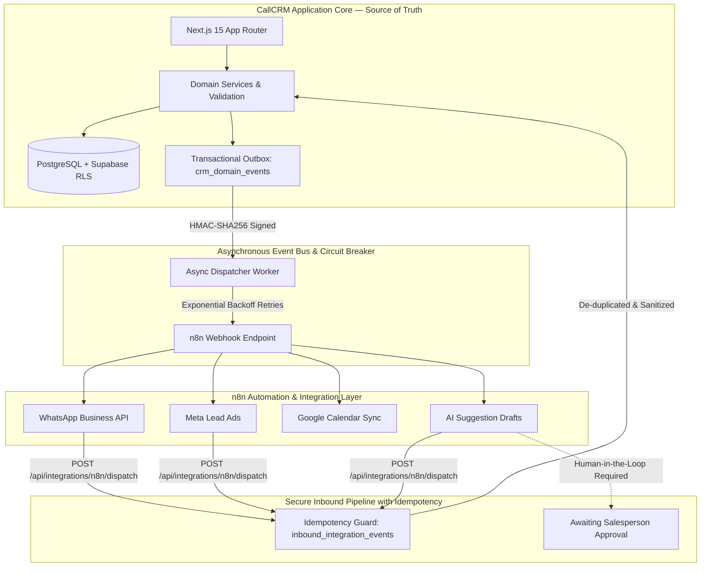

# CallCRM 2.0 — Architectural Real Estate Sales Operating System & n8n Automation Engine

CallCRM 2.0 is an enterprise-grade Real Estate Sales Operating System and AI Agent platform engineered specifically for high-ticket Indian luxury real estate developers, brokerage houses, channel partners, and advisory desks.

Built with **Next.js 15 App Router**, **React 19**, **TypeScript**, **Tailwind CSS**, **Vercel AI SDK**, **Google Gemini 2.5 Flash**, and **Supabase** (Postgres + Auth + RLS + Realtime), CallCRM connects **People + Property + Inventory + Relationships + Communication + Activities + Deals + Money + Documents + Operations**.

---

## 🏛️ CallCRM + n8n Separation-of-Responsibilities Architecture

CallCRM adheres strictly to a **Separation-of-Responsibilities Architecture**:



### Core Architecture Rules:
1. **CallCRM Owns the Truth**: All core operations (*People, Leads, Buyer Requirements, Listings, Mandates, Units, Negotiations, Deals, Brokerage, and Audit Logs*) run natively inside CallCRM. **CallCRM functions 100% uninterrupted even if n8n is offline**.
2. **Transactional Outbox & Domain Event Bus (`crm_domain_events`)**: Dispatches HMAC-SHA256 signed domain events (`LeadCreated`, `SiteVisitScheduled`, `NegotiationAgreed`, `MandateExpiring`, `CommissionCreated`) with 3-second timeouts, exponential backoff retries, and automatic **circuit breakers**.
3. **Inbound Idempotency & Duplicate Shield (`inbound_integration_events`)**: Prevents duplicate lead/contact creation across repeated Meta/WhatsApp webhook deliveries using external event IDs.
4. **AI Safety Guardrail Enforced**: AI extractions cannot mutate CRM deal stages, property prices, or financial records without explicit human approval.

---

## ⚡ Key Differentiators & Value Pillars

1. **People Registry Decoupled from Leads**: A single real-world identity (e.g. *Rahul Sharma*) can simultaneously hold multiple requirements (4BHK Gurgaon + Mumbai investment), own units (A-1402), and refer clients without duplicating contacts.
2. **Atomic Flat/Unit Asset Model & 360° Dossiers**: 6-tier real estate hierarchy (`Region` $\rightarrow$ `Area/Locality` $\rightarrow$ `Society/Project` $\rightarrow$ `Tower/Block` $\rightarrow$ `Floor` $\rightarrow$ `Flat/Unit`). The Flat/Unit is the core transactional asset holding pricing memory, cost sheets, and temporal ownership histories.
3. **Property Listings & Exclusive Mandate Engine**: Tracks mandate validity windows, key custodians, viewing notice SLAs, and **role-protected seller price floors** (masked from junior sales reps).
4. **Chronological Negotiation Room & Bid Ledger**: Multi-round buyer offer vs. seller counter tracking with price gap metrics, token deposit statuses, and special conditions.
5. **Site Visit Operational OS & Digital Gate Pass**: Synthesizes digital Gate 2 visitor PINs, visitor parking bays, caretaker contacts, 5-point pre-visit checklists, and post-visit survey debriefs.
6. **Statutory Indian Brokerage & Commission Engine**: Computes 1% buyer + 1% seller brokerage, 18% GST addition, 1% TDS deduction (u/s 194H), channel partner shares, and sales rep incentives.
7. **Proactive Seller Intelligence Engine**: Identifies expiring lease agreements ($<60$ days), vacant units incurring maintenance holding costs, and 3+ year investor exit windows with 1-click conversion to active resale listings.
8. **100-Point Bi-Directional Matching Engine**: Algorithmic scoring across Location (30%), Budget (30%), Configuration (20%), Floor/Facing (10%), Mandate Exclusivity (10%).
9. **Multi-Tenant Security by Construction**: Row-Level Security on all 39 tables, `org_id` always derived from the verified session, fail-closed HMAC webhooks, and DB-enforced plan quotas.

---

## 🧠 AI Agents & Automation Modules

| Agent / Engine | Purpose | Trust Model |
| :--- | :--- | :--- |
| **Seller Intelligence** | Tenancy expiry, vacant units & investor exit signals | Server scanner (`/api/seller-opportunities`) · 1-click mandate conversion |
| **100-Point Bi-Directional Matcher** | Multi-factor inventory ↔ buyer matching | Algorithmic scoring · reverse matching on new units |
| **Site Visit Pre-Briefing & Gate Pass** | 30-min pre-visit gate passes, PINs & checklists | Operational Dispatcher (`/api/site-visits/dispatch`) · WhatsApp share |
| **Negotiation Room Ledger** | Chronological bidding rounds & price gap analysis | Bidding Ledger (`/api/deals/[id]/negotiations`) · Protected price floors |
| **Brokerage & Commission Calculator** | Statutory GST (18%), TDS (1%), CP & rep splits | Financial Engine (`/api/finance/commissions`) · Manager role-gated |
| **Meeting Structurer** | Unstructured speech/notes → structured outcomes | Human-in-the-loop approval gate · zero autonomous DB writes |
| **Aria 2.0 Intelligence** | Property briefings, buyer matching & intake qualification | Gemini 2.5 Flash · read-only tools · human approval required |
| **Lost-Lead Resurrector** | Dormant-deal ↔ live-inventory matching | Server-side manager+ scan · client applies via audited writes |
| **WhatsApp Sales Engine** | 1-click templated outreach & instant logging | Outbound `wa.me/` · inbound webhook HMAC + replay guard |

---

## System Architecture

```
Real-estate/
├── supabase/migrations/            # Canonical DB — apply in order (0001 → 0021):
│   ├── 0001_init.sql               #   multi-tenant schema, RLS, org bootstrap trigger
│   ├── 0002_sample_seed.sql        #   first-run sample data RPC
│   ├── 0003_rate_limiting.sql      #   durable Postgres rate limiter
│   ├── ...                         #   phases 4-11 hardening, SLAs, analytics, billing
│   ├── 0018_phase12_property_intelligence_schema.sql # Areas, Towers, Units 360, Relationships, Facts
│   ├── 0019_phase13_intelligence_automation.sql # Seller opportunities, site visit briefings, stale facts
│   ├── 0020_enterprise_domain_model.sql # People, Requirements, Mandates, Bids, Dispatches, Commissions
│   └── 0021_n8n_event_bus_and_integration_outbox.sql # Outbox, Integration Endpoints, Idempotency Logs
├── .github/workflows/ci.yml        # CI: lint → vitest → next build
├── DOCS/                           # Complete Architecture & Documentation Hub
│   ├── system-spec/                # 12-Part Canonical System Specifications (01 → 12)
│   ├── domain-guides/              # Deep-Dive Engineering, AI & Automation Guides (01 → 11)
│   ├── ui-ux-spec/                 # CRM UI/UX Redesign & Architectural Ledger Specs (01 → 09)
│   ├── marketing-spec/             # Marketing Website Editorial Specifications (01 → 08)
│   ├── playbooks/                  # Executive Blueprints, Audits & Encyclopedias (01 → 04)
│   └── README.md                   # Master Documentation Catalog & Index
└── Frontend/
    ├── Dockerfile                  # Multi-stage standalone production image (non-root)
    ├── .env.local.example          # Complete environment template
    └── src/
        ├── middleware.ts           # Edge route protection (JWT revalidation)
        ├── app/                    # App Router: marketing page, auth flow,
        │   │                       # CRM routes (thin AppShell wrappers), /api/* (83 endpoints)
        │   └── api/                # people · listings/mandates · deals/[id]/negotiations · site-visits/dispatch · finance/commissions · integrations/*
        ├── components/crm/         # Negotiation modal · Site visit dispatch · Commission modal · n8n drawer
        ├── context/                # auth-context (Supabase sessions) · crm-context
        ├── lib/
        │   ├── persistence/        # crm-sync (row↔domain mappers) · retry-queue
        │   ├── server/             # domain-event-bus · seller-intelligence · site-visit-briefing · aria-tools · api-security
        │   ├── mock-data.ts        # Demo dataset (unauthenticated mode only)
        │   └── utils.ts            # ₹ Lakh/Cr currency, phone formatters
        ├── types/crm.ts            # Domain TypeScript definitions
        └── __tests__/              # 239 tests across 28 suites: unit · security · state-machine · n8n architecture
```

---

## 🚀 Getting Started

### Prerequisites
- Node.js 20+
- npm 9+
- A Supabase project (free tier works)

### 1. Database setup
Apply migrations in numeric order (SQL Editor or Supabase CLI):
```
supabase/migrations/0001_init.sql → 0021_n8n_event_bus_and_integration_outbox.sql
```

### 2. Environment
```bash
cd Frontend
cp .env.local.example .env.local
# Fill in: NEXT_PUBLIC_SUPABASE_URL, NEXT_PUBLIC_SUPABASE_ANON_KEY
# Optional: GEMINI_API_KEY, webhook secrets, N8N_SERVICE_SECRET
```

### 3. Run & Test
```bash
npm run dev        # http://localhost:3000
npm test           # Runs all 239 Vitest suites
npm run build      # Verifies clean Next.js compilation across all 83 routes
```
