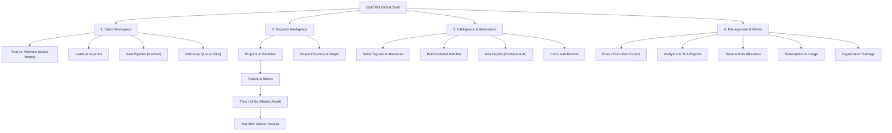
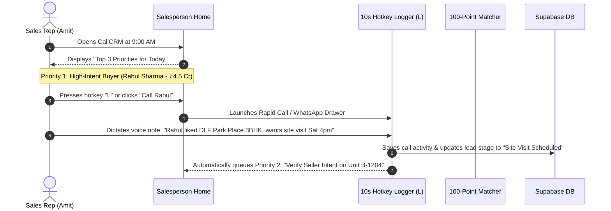
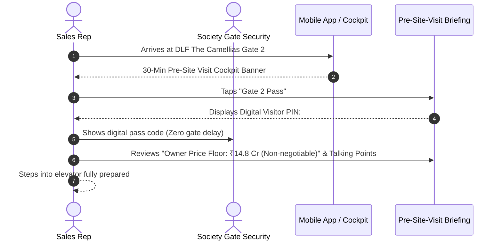
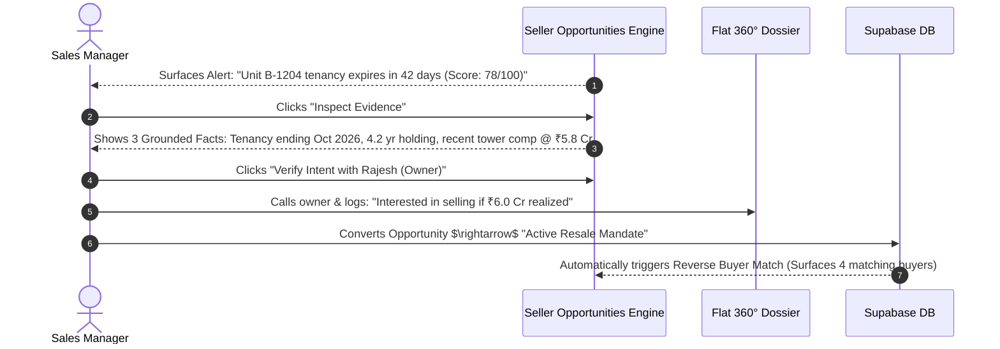

# CallCRM 2.0 — Complete UX/UI Master Redesign Blueprint

> **Master UI Document**: This single document consolidates all 7 UI/UX design deliverables created for the CallCRM 2.0 redesign into one cohesive, comprehensive, and implementation-ready specification.
>x
> **Included Deliverables**:
> 1. [Section 1: Complete Surface Inventory & Friction Audit (`UI_AUDIT.md`)](#section-1-complete-surface-inventory--friction-audit)
> 2. [Section 2: UX Information Architecture & User Journeys (`UX_ARCHITECTURE.md`)](#section-2-ux-information-architecture--user-journeys)
> 3. [Section 3: Architectural Ledger Design System Specification (`DESIGN_SYSTEM.md`)](#section-3-architectural-ledger-design-system-specification)
> 4. [Section 4: Screen-by-Screen UI Redesign Implementation Plan (`UI_REDESIGN_PLAN.md`)](#section-4-screen-by-screen-ui-redesign-implementation-plan)
> 5. [Section 5: Screen Priority & Impact Matrix P0–P3 (`SCREEN_PRIORITY_MATRIX.md`)](#section-5-screen-priority--impact-matrix-p0p3)
> 6. [Section 6: Component Strategy & Consolidation Architecture (`COMPONENT_STRATEGY.md`)](#section-6-component-strategy--consolidation-architecture)
> 7. [Section 7: Screen-by-Screen Before & After Map (`BEFORE_AFTER_MAP.md`)](#section-7-screen-by-screen-before--after-map)
> 8. [Section 8: CallCRM UX Scorecard & Phased Execution Roadmap](#section-8-callcrm-ux-scorecard--phased-execution-roadmap)

---

# Section 1: Complete Surface Inventory & Friction Audit

> *Source: `UI_AUDIT.md`*

## 1. Executive Summary & Core UX Diagnosis

CallCRM is technically robust with **222 passing tests, 19 database migrations, and 63 API routes**. It accurately models the **Flat/Unit as the atomic asset**, supports bi-directional 100-point matching, proactive seller signals, and human-in-the-loop AI.

However, the user experience suffers from **cognitive density, structural fragmentation, and visual uniformity**:
1. **The "Everything Everywhere" Problem**: The sidebar exposes 9–13 equal-weight navigation items regardless of user focus. Sales reps are forced to context-switch between Tasks, Leads, Pipeline, Activities, and Projects.
2. **Dense Form & Card Fatigue**: Screens like `boss-overview.tsx` (836 lines) and `projects-page.tsx` (1034 lines) place KPI metric cards, filters, complex tables, and action modals in high-density visual stacks with minimal progressive disclosure.
3. **Tab vs Route Ambiguity**: Deep links (`/leads`, `/pipeline`, `/projects`) are mounted inside `AppShell` with client tab state (`localStorage.getItem('callcrm_active_tab')`), causing URL/state desynchronization and broken browser back-button behavior.
4. **Contextual AI Isolation**: AI capabilities (Aria chat, meeting structuring, pre-site briefings, resurrection) are housed in separate floating bots or dedicated pages rather than being organically embedded directly into the daily workflow where decisions happen.
5. **Real Estate Emotional Aesthetics**: While functional, the visual styling (generic Slate/Navy and standard Tailwind cards) does not evoke the high-ticket, luxury architectural aesthetic demanded by Indian real estate developers and HNI brokerage founders.

---

## 2. Complete Surface Inventory

### A. Core Sales Surfaces

| Screen / Surface | Route & Component | Persona | Purpose | Current UX Implementation | Identified Problems & Friction | Redesign Priority |
| :--- | :--- | :--- | :--- | :--- | :--- | :--- |
| **Salesperson Home** | `/` (Role: Sales)<br>`salesperson-home.tsx` | Sales Rep, Closing Specialist | "What should I do right now?" — Daily prioritized queue of high-intent buyers, visits, and follow-ups. | 3 top KPI badges, 3 quick action buttons, a horizontal 30m Site Visit Briefing alert card, Next Best Action cards, and a vertical timeline queue. | • 3 buttons at top feel detached from priorities.<br>• Timeline queue lacks inline 1-click action triggers.<br>• Next best actions list is too long (no pagination/collapse).<br>• Does not surface today's active deals at risk. | **P0 (Critical)** |
| **Leads List & Pipeline** | `/leads`<br>`leads-page.tsx` | Sales Rep, Manager | Filter, search, and bulk-manage active buyer and seller inquiries across stages. | Multi-filter header, stage status tabs, 8-column data table with inline badges, bulk CSV export/import modals. | • 8-column table causes horizontal compression on laptops.<br>• Lacks quick preview drawer (forces full modal opening).<br>• Filter bar has 5 separate dropdowns taking 80px vertical space. | **P0 (Critical)** |
| **Lead 360° Dossier** | Modal on click<br>`lead-detail-modal.tsx` | Sales Rep, Manager | Complete customer context, property preferences, timeline, and communication ledger. | Multi-tab dialog (`overview`, `activities`, `tasks`, `deals`, `ai`). Budget sliders, WhatsApp quick triggers. | • Tabbed layout hides critical buyer requirements.<br>• Activity history is purely textual (lacks visual timeline iconography).<br>• Unit matching inside lead modal is buried under sub-tabs. | **P0 (Critical)** |
| **Pipeline Kanban** | `/pipeline`<br>`pipeline-board.tsx` | Sales Rep, Manager | Visual drag-and-drop opportunity board across 7 sales stages. | Horizontal scrolling 7-column Kanban with deal cards showing client name, budget in INR (`₹ Cr`), days in stage, and deal health badge. | • Column width is fixed (causes horizontal scrollbar on standard 1080p).<br>• Lacks stage velocity indicators and total pipeline value per column header.<br>• Card drag target is small. | **P1 (Important)** |
| **Tasks & Follow-ups** | `/tasks`<br>`tasks-page.tsx` | Sales Rep | SLA management: Overdue, due today, and upcoming call/visit commitments. | Status filter buttons (`Overdue`, `Due Today`, `Upcoming`), table with complete check action and reschedule button. | • Separate page disconnects reps from lead context.<br>• Lacks inline dialer trigger.<br>• No batch completion or auto-next workflow. | **P1 (Important)** |
| **Activities Ledger** | `/activities`<br>`activities-page.tsx` | Sales Rep, Manager | Audit log of all calls, site visits, WhatsApp chats, and negotiation notes. | Filterable chronological activity stream with user and date range filters. | • Pure audit feed; does not enable rapid action.<br>• Repetitive information that belongs in Lead/Unit dossiers. | **P2 (Enhancement)** |

---

### B. Property Intelligence Surfaces

| Screen / Surface | Route & Component | Persona | Purpose | Current UX Implementation | Identified Problems & Friction | Redesign Priority |
| :--- | :--- | :--- | :--- | :--- | :--- | :--- |
| **Projects / Societies** | `/projects`<br>`projects-page.tsx` | Rep, Manager, Boss | Inventory exploration, tower selector, floor/unit availability matrix, and project facts. | Master-detail split: Left side project selector, middle tower selector, right side inventory matrix grid with status colors (`available`, `hold`, `booked`). | • Screen is 1034 lines; excessive state logic.<br>• Matrix grid becomes overwhelming with >100 units.<br>• Society-level shared rules (RWA, Gate 2) are hidden behind small badges. | **P0 (Critical)** |
| **Flat 360° Dossier** | Modal on unit click<br>`unit-detail-modal.tsx` | Sales Rep, Specialist | Atomic asset dossier: Carpet area, parking, asking price ledger, temporal owner history, and matching buyers. | 5 tabs: `overview`, `people` (owners/tenants), `facts` (Gate 2 PIN, bylaws), `pricing` (revisions), `buyers` (100-pt matches). | • Modal format feels cramped for a master property dossier.<br>• Ownership history looks like a plain table instead of a temporal chain.<br>• Price revision ledger lacks visual trend sparklines. | **P0 (Critical)** |
| **People & Relationships** | `/people`<br>`people-page.tsx` | Rep, Manager | Master deduplicated contact directory with multi-unit ownership and cross-inquiry links. | Searchable table of individuals with phone, email, project inquiries, and total budget. Profile modal on click. | • Looks like a generic CRM contacts list.<br>• Does not visually highlight whether someone is an Investor, Owner, Tenant, or RWA official.<br>• Lacks relationship strength indicators. | **P1 (Important)** |
| **Regions & Areas** | `/regions`<br>`regions-page.tsx` | Admin, Manager | Geographic micro-market hierarchy configuration. | Simple card list of macro-regions (Delhi NCR, Mumbai MMR) with area count badges. | • Static list; lacks micro-market price trend visualizations. | **P3 (Future)** |

---

### C. Intelligence & Automation Surfaces

| Screen / Surface | Route & Component | Persona | Purpose | Current UX Implementation | Identified Problems & Friction | Redesign Priority |
| :--- | :--- | :--- | :--- | :--- | :--- | :--- |
| **Seller Opportunities** | Triggered from Home / Projects<br>`seller-opportunities-modal.tsx` | Sales Rep, Manager | Review proactive resale signals (tenancy expiry, vacancy, investor exit) and convert to listings. | Modal showing filterable cards with signal strength badges (`HIGH`, `MEDIUM`), estimated valuation, AI pitch preview, and convert button. | • Card implies "owner wants to sell" instead of "potential signal".<br>• Lacks transparent evidence breakdown (+20 tenancy, +15 holding).<br>• Missing human verification disposition flow (wants to sell vs renew). | **P0 (Critical)** |
| **Pre-Site-Visit Briefing** | Card on Home / Lead<br>`salesperson-home.tsx` | Sales Rep | 30-minute operational cockpit before arriving at society: Gate 2 PIN, parking bay, owner price boundaries. | Amber highlight card with 4-item pill grid (PIN, Bay, Price Floor, Objections) and briefing modal. | • Card is static; does not trigger automatically based on visit time.<br>• Lacks 1-tap "Share with Driver / Client" button.<br>• Missing instant navigation link to Gate 2 GPS coordinates. | **P1 (Important)** |
| **AI Meeting Structurer** | Quick action modal<br>`meeting-summary-modal.tsx` | Sales Rep | Parse raw voice notes/Hinglish text into structured CRM dispositions with human approval. | Textarea for notes, "Generate Proposal" button, and editable review card with confirm button. | • Modal is isolated from the main activity logging flow.<br>• Does not support direct audio recording / speech-to-text preview.<br>• Confirmation card requires 3 clicks. | **P1 (Important)** |
| **Aria AI Live Agent** | `/agent-live`<br>`ai-agent-command-center.tsx` | All Personas | Interactive natural language property intelligence, buyer qualification, and instant comp queries. | Split-screen: Left chat terminal with preset buyer prompts, right property context & tool execution cards. | • Feels like an isolated sandbox / demo screen rather than an embedded helper inside daily workflows.<br>• Takes full page width when users just want a sidebar assist. | **P1 (Important)** |
| **AI Lead Bot** | Floating widget<br>`ai-lead-bot.tsx` | Sales Rep | Realtime autonomous lead qualification stream and alerts. | Bottom-right floating badge with pulsing indicator, expandable chat drawer. | • Overlaps with bottom-right action buttons.<br>• Can be visually distracting during dense table scanning. | **P2 (Enhancement)** |

---

### D. Management & Platform Surfaces

| Screen / Surface | Route & Component | Persona | Purpose | Current UX Implementation | Identified Problems & Friction | Redesign Priority |
| :--- | :--- | :--- | :--- | :--- | :--- | :--- |
| **Boss Overview** | `/` (Role: Boss)<br>`boss-overview.tsx` | Agency Founder, Sales Director | Macro business cockpit: Revenue in `₹ Cr`, pipeline velocity, deal health risk radar, rep leaderboards. | Top global filter bar (4 dropdowns), 4 KPI summary cards, "Needs Attention" alert list, Stage breakdown bars, Rep leaderboards table. | • Dense visual hierarchy; 836 lines of stacked elements.<br>• Filter bar occupies excessive vertical real estate.<br>• Lacks executive narrative summary ("Your revenue this month is on track (+12%), but 3 deals are stuck in negotiation"). | **P0 (Critical)** |
| **Reports & Analytics** | `/reports`<br>`reports-page.tsx` | Manager, Boss | Detailed historical conversion, agent SLA breach metrics, and project sales velocity. | Date range picker, bar charts, conversion funnel table, and rep performance matrix. | • Charts use basic CSS bar approximations instead of rich SVG / interactive chart containers.<br>• Lacks export to PDF/Executive Presentation. | **P1 (Important)** |
| **Team & Users** | `/users`<br>`users-page.tsx` | Admin, Boss | Role assignment, regional allocation, active rep status. | Simple user table with role badges and edit modal. | • Functional but basic. | **P2 (Enhancement)** |
| **Billing & Subscription** | `/billing`<br>`billing-page.tsx` | Admin, Boss | Plan tiers (Starter, Growth, Enterprise), seat usage, invoice history. | Pricing cards with Razorpay/Stripe checkout buttons, usage progress meters. | • Clean but could have better seat management and plan upgrade prompts. | **P2 (Enhancement)** |
| **Global Search** | <kbd>⌘K</kbd> / <kbd>/</kbd><br>`global-search-dialog.tsx` | All Personas | Universal instant lookup across leads, units, societies, people, and fast commands. | Spotlight modal with input, category headers (`Commands`, `Leads`, `Projects`, `Units`, `People`), and keyboard navigation. | • Results list is unranked (shows first matches alphabetically).<br>• Lacks recent search memory.<br>• Entity badges lack visual distinction. | **P1 (Important)** |

---

# Section 2: UX Information Architecture & User Journeys

> *Source: `UX_ARCHITECTURE.md`*

## 1. Core Information Architecture Principles

1. **Role-First Mental Models**: A salesperson, a sales manager, and an agency founder should never see the exact same layout. Navigation and dashboards must automatically adapt to their primary job-to-be-done.
2. **Atomic Asset Hierarchy**: The mental model strictly flows from **Geography $\rightarrow$ Complex $\rightarrow$ Building $\rightarrow$ Unit (Atomic Asset) $\rightarrow$ Stakeholder Graph**.
3. **5-Second Comprehension**: Every primary screen must answer its persona's single most important question within 5 seconds without requiring scrolling or filter manipulation.
4. **Contextual Action Over Administrative Nav**: Move actions to where the context lives. Avoid forcing users to navigate to an "Activities" or "Tasks" page when they can log, follow up, or match directly from a Lead or Unit dossier.
5. **Progressive Disclosure**: Show high-level executive cards or summary rows by default; reveal granular specifications, price ledgers, and institutional memory upon focused interaction (expandable rows, slide-over sheets, or dedicated split views).

---

## 2. Global Navigation Taxonomy & Structure

Rather than exposing a flat list of 13 menu items, the sidebar is organized into **4 Distinct Mental Model Sections**:



---

## 3. Role-Specific Workspaces

### A. Salesperson Workspace (Action-First)
- **Primary Question**: *"What should I do right now to advance my deals?"*
- **Default Landing**: `/` $\rightarrow$ **Today's Priorities (Salesperson Home)**.
- **Visible Navigation Items**:
  1. **Today** (`/`) — Prioritized action queue (High-intent calls, site visits, overdue commitments).
  2. **My Leads** (`/leads`) — Searchable buyer/seller lead directory with quick call/WhatsApp triggers.
  3. **Pipeline** (`/pipeline`) — Deal stage Kanban with stage stagnation warnings.
  4. **Inventory** (`/projects`) — Unit availability matrix, tower floor plans, and 100-point matching.
  5. **People** (`/people`) — Client profiles and multi-unit ownership context.
- **Suppressed / Hidden**: Boss analytics, team performance rankings, system configuration, billing.

---

### B. Sales Manager Workspace (Exception & Intervention-First)
- **Primary Question**: *"Where is my team getting stuck, and which high-value deals are at risk?"*
- **Default Landing**: `/` $\rightarrow$ **Manager Intervention Cockpit**.
- **Visible Navigation Items**:
  1. **Overview** (`/`) — Team SLA breaches, at-risk high-ticket deals, unassigned leads, and pending site visits.
  2. **Team Pipeline** (`/pipeline`) — Filterable by rep, stage velocity, and deal health score.
  3. **Leads** (`/leads`) — Ingestion logs, lead re-assignment, and stage override.
  4. **Inventory & Mandates** (`/projects`) — Available inventory, seller signals, and resale mandate pricing.
  5. **Performance** (`/reports`) — Rep conversion rates, call activity benchmarks, and SLA compliance.

---

### C. Boss / Agency Founder Workspace (Macro Health & Revenue-First)
- **Primary Question**: *"What is happening with my business, revenue pipeline, and market inventory?"*
- **Default Landing**: `/` $\rightarrow$ **Executive Overview**.
- **Visible Navigation Items**:
  1. **Executive Cockpit** (`/`) — Total active pipeline (`₹ Cr`), won revenue, deal health risk radar, and monthly growth trend.
  2. **Inventory & Resale Mandates** (`/projects`) — Capital locked in inventory, exclusive seller opportunities, and society pricing benchmarks.
  3. **Deals Pipeline** (`/pipeline`) — Macro negotiation status and closing probabilities.
  4. **Analytics & Financials** (`/reports`) — Micro-market velocity, team ROI, and lead source attribution (Meta vs WhatsApp vs Direct).
  5. **Administration** (`/users`, `/billing`, `/settings`) — Organization hierarchy, licenses, and security.

---

## 4. End-to-End User Journeys

### Journey 1: Morning Action Routine (Salesperson — 3 Minutes)


---

### Journey 2: On-Site Client Visit Cockpit (Salesperson on Mobile — 30 Seconds)


---

### Journey 3: Seller Resale Signal $\rightarrow$ Exclusive Mandate (Manager — 2 Minutes)


---

# Section 3: Architectural Ledger Design System Specification

> *Source: `DESIGN_SYSTEM.md`*

## 1. Color System & Semantic Tokens

### A. Core Neutral Ledger Palette

| Token Name | Hex Code | Purpose & Usage | Contrast Ratio on Light / Dark |
| :--- | :--- | :--- | :--- |
| **`paper-base`** | `#f8fafc` (Light) / `#0d0f12` (Dark) | Primary application canvas background. | Base Canvas |
| **`paper-card`** | `#ffffff` (Light) / `#13171d` (Dark) | Card, container, and table background surfaces. | Base Surface |
| **`paper-subtle`** | `#f1f4f8` (Light) / `#1a1f27` (Dark) | Hover states, table headers, secondary button fills. | 1.15:1 to card |
| **`ink-primary`** | `#0f172a` (Light) / `#f1f5f9` (Dark) | Headings, primary titles, critical metrics, high-emphasis text. | 14.2:1 (WCAG AAA) |
| **`ink-muted`** | `#64748b` (Light) / `#94a3b8` (Dark) | Secondary labels, timestamps, metadata, unit floor specs. | 5.8:1 (WCAG AA) |
| **`ink-subtle`** | `#94a3b8` (Light) / `#64748b` (Dark) | Placeholder text, hotkey indicators, disabled states. | 4.6:1 (WCAG AA) |
| **`border-ledger`** | `#e2e8f0` (Light) / `#222936` (Dark) | Standard architectural line dividers and card borders. | Crisp 1px structural stroke |
| **`border-subtle`** | `#f1f5f9` (Light) / `#19202b` (Dark) | Table inner row dividers and subtle card partitions. | Soft separation |

---

### B. Heritage Accent Palette

| Accent Name | Primary Hex | Light Tint Hex | Border Hex | Domain Meaning & Real Estate Usage |
| :--- | :--- | :--- | :--- | :--- |
| **Heritage Brass** | `#a9812e` | `#fcf8ee` | `#e5cd97` | **High-Value Luxury / VIP / Won Deals / Resale Mandates**. Represents high capital and exclusive mandates. |
| **Verdigris Green** | `#245c4f` | `#eef7f3` | `#b4ddce` | **Available Inventory / Healthy Deals / Verified Evidence**. Represents positive asset liquidity. |
| **Architectural Navy** | `#1e293b` | `#f1f5f9` | `#cbd5e1` | **Structural Framework / Projects / Towers / Master Contacts**. Represents solid physical infrastructure. |

---

### C. Semantic Status Indicators

| Semantic State | Base Color | Background Fill | Border Stroke | Usage in CRM |
| :--- | :--- | :--- | :--- | :--- |
| **Success / Available / Verified** | `#059669` (Emerald 600) | `#ecfdf5` (Emerald 50) | `#a7f3d0` | Unit available, deal won, fact verified, SLA met. |
| **Warning / Hold / At Risk** | `#d97706` (Amber 600) | `#fffbeb` (Amber 50) | `#fde68a` | Deal at risk, unit on temporary hold, expiring tenancy. |
| **Danger / Overdue / Lost** | `#dc2626` (Red 600) | `#fef2f2` (Red 50) | `#fecaca` | SLA overdue follow-up, deal lost, unit blocked, stale fact. |
| **Info / Site Visit / Progress** | `#2563eb` (Blue 600) | `#eff6ff` (Blue 50) | `#bfdbfe` | Site visit scheduled, negotiation in progress, active call. |

---

## 2. Typography Hierarchy & Number Formatting

```
Font Stack:
Primary UI:      Inter, -apple-system, BlinkMacSystemFont, "Segoe UI", Roboto, sans-serif
Numeric / Monospace: ui-monospace, "SF Mono", Menlo, Monaco, Consolas, "Liberation Mono", monospace
```

### Type Scale:

| Level | Size / Line Height | Weight | Letter Spacing | Purpose |
| :--- | :--- | :--- | :--- | :--- |
| **Display 1 (Executive)** | `28px / 34px` (1.75rem) | 800 (Bold) | `-0.025em` | Boss Revenue KPIs (`₹48.5 Cr`), Top Dashboard Totals. |
| **Heading 1 (Page Title)** | `20px / 26px` (1.25rem) | 700 (Bold) | `-0.02em` | Main page titles (`Today's Priorities`, `Projects Directory`). |
| **Heading 2 (Section)** | `15px / 20px` (0.9375rem) | 600 (Semibold) | `-0.01em` | Section headers (`Next Best Actions`, `Available Units`). |
| **Body Primary** | `13px / 18px` (0.8125rem) | 500 (Medium) | `0em` | Table cell text, client names, primary buttons, descriptions. |
| **Body Secondary / Caption** | `11px / 15px` (0.6875rem) | 500 (Medium) | `+0.01em` | Unit specs (`3 BHK · 2,450 sq ft`), timestamp, sub-labels. |
| **Micro / Hotkey Badge** | `10px / 12px` (0.625rem) | 700 (Bold) | `+0.04em` | Status badges, keyboard hotkeys (<kbd>L</kbd>, <kbd>⌘K</kbd>), tags. |

---

## 3. Elevation, Radius & Structural Lines

```css
/* Elevation Tiers */
--shadow-flat:     none;
--shadow-subtle:   0 1px 2px 0 rgba(15, 23, 42, 0.04);
--shadow-card:     0 1px 3px 0 rgba(15, 23, 42, 0.06), 0 1px 2px -1px rgba(15, 23, 42, 0.04);
--shadow-elevated: 0 4px 12px -2px rgba(15, 23, 42, 0.08), 0 2px 6px -2px rgba(15, 23, 42, 0.04);
--shadow-drawer:   0 20px 25px -5px rgba(15, 23, 42, 0.12), 0 8px 10px -6px rgba(15, 23, 42, 0.08);

/* Border Radius Tokens */
--radius-sm: 4px;   /* Badges, micro-buttons, hotkey tags */
--radius-md: 6px;   /* Standard buttons, form inputs, dropdown items */
--radius-lg: 8px;   /* Cards, table containers, popovers */
--radius-xl: 12px;  /* Master dossiers, modal shells, hero cockpits */
```

---

# Section 4: Screen-by-Screen UI Redesign Implementation Plan

> *Source: `UI_REDESIGN_PLAN.md`*

### Screen 1: Salesperson Daily Priority Cockpit (`salesperson-home.tsx`)

| Attribute | Specification |
| :--- | :--- |
| **Purpose** | Single-screen action center answering *"What should I do right now to close deals?"* |
| **Primary User** | Sales Rep, Closing Specialist, On-site Consultant. |
| **User Question** | *"Who are my top 3 calls/visits today, and what is due right now?"* |
| **Current Problems** | Disjointed quick-action buttons; timeline queue lacks inline actions; next actions list is unpaginated. |
| **New Information Hierarchy** | 1. **Morning Focus Banner**: Top 3 high-impact actions (Calls, Site Visits, At-risk deals).<br>2. **Active 30m Site Visit Alert**: If visit within 45m, prominent Gate 2 PIN & parking bay card.<br>3. **Prioritized Action Queue**: Visual cards with 1-click [Call], [WhatsApp], [Reschedule].<br>4. **Seller Signal Radar**: Proactive resale opportunity alerts with [Verify Intent] trigger. |
| **Primary CTA** | `Start Daily Call Queue` (auto-opens first priority contact with 10s logger). |
| **Secondary Actions** | `Log Activity (L)`, `Verify Seller Intent`, `Open Today's Visits`, `Search (/)`. |
| **Layout & Components** | 2-column responsive layout (Left 65% Priority Queue, Right 35% Daily Timeline & SLA Meter). |
| **Responsive Behavior** | Collapses to single-column stack on mobile with fixed bottom action sheet. |
| **Loading State** | Skeleton action cards with animated shimmering pulse. |
| **Empty State** | *"All priorities cleared for today. 0 overdue tasks."* with `[Explore Fresh Inbound Leads]` button. |
| **Affected Files** | `Frontend/src/components/crm/salesperson-home.tsx`, `Frontend/src/components/ui/action-card.tsx`. |
| **Risk & Priority** | Low risk (UI composition change only) · **P0 (Critical)**. |

---

### Screen 2: Flat 360° Master Property Dossier (`unit-detail-modal.tsx` $\rightarrow$ `UnitDossierSheet.tsx`)

| Attribute | Specification |
| :--- | :--- |
| **Purpose** | Comprehensive atomic property dossier replacing cramped modal dialogs with a right-hand slide-over sheet. |
| **Primary User** | Sales Rep, Closing Specialist, Property Manager. |
| **User Question** | *"Who owns this flat, what is its price history, what are the gate rules, and who wants to buy it?"* |
| **Current Problems** | Standard modal feels claustrophobic; ownership is a plain table; price history lacks trend graph. |
| **New Information Hierarchy** | 1. **Dossier Header**: Unit Number (`A-1402`), Tower, Society, Asking Price (`₹16.5 Cr`), Status Badge.<br>2. **Quick Spec Strip**: 4 BHK · 4,200 sq ft · 14th Floor · 3 Covered Bays · North-East facing.<br>3. **Segmented Tabs**:<br>&nbsp;&nbsp;• **Tab 1: Specs & Institutional Memory** (Gate 2 PIN, Bylaws, Owner Price Floor).<br>&nbsp;&nbsp;• **Tab 2: Temporal Ownership Chain** (Current Owner, Past Owners, Tenants).<br>&nbsp;&nbsp;• **Tab 3: Price Ledger & Trend** (Asking price revisions with visual delta).<br>&nbsp;&nbsp;• **Tab 4: 100-Point Matching Buyers** (Ranked active buyer list with match breakdown). |
| **Primary CTA** | `Match with Active Buyers` (1-click link to buyer pipeline). |
| **Secondary Actions** | `Revise Asking Price`, `Add Owner/Tenant`, `Add Verified Fact`, `Share Dossier (WhatsApp)`. |
| **Layout & Components** | Right slide-over drawer (`w-full max-w-2xl sm:max-w-3xl`) with fixed header and sticky bottom action dock. |
| **Responsive Behavior** | Full-width slide-over on mobile with tab swiping. |
| **Loading State** | Spec grid skeleton + tab skeleton. |
| **Empty State** | For unmatched buyers: *"No active buyer matches within +/- 20% budget. [Broaden Criteria]"*. |
| **Affected Files** | `Frontend/src/components/crm/unit-detail-modal.tsx`, `Frontend/src/components/crm/pages/projects-page.tsx`. |
| **Risk & Priority** | Low risk · **P0 (Critical)**. |

---

### Screen 3: Executive Boss & Agency Founder Cockpit (`boss-overview.tsx`)

| Attribute | Specification |
| :--- | :--- |
| **Purpose** | High-level macro business health, revenue pipeline in `₹ Cr`, and risk radar. |
| **Primary User** | Agency Founder ("The Boss"), Managing Director, Sales VP. |
| **User Question** | *"What is our total pipeline value, how much did we close this month, and which deals are at risk?"* |
| **Current Problems** | 836 lines of dense, vertically stacked tables and dropdowns; lacks executive narrative summary. |
| **New Information Hierarchy** | 1. **Executive Narrative Bar**: *"Monthly closed revenue is ₹18.4 Cr (+14% vs target). 4 deals in Negotiation require pricing intervention."*<br>2. **4 Master KPI Cards**: Total Active Pipeline, Won Revenue, Stalled Deals at Risk, Inflow Momentum.<br>3. **Deal Health Risk Radar**: Table of at-risk deals with health score, stuck days, and assigned rep.<br>4. **Pipeline Stage Velocity**: Visual stage progression bar with average dwell time per stage.<br>5. **Rep Performance Leaderboard**: Conversion rate, closed revenue, and SLA compliance score. |
| **Primary CTA** | `Inspect At-Risk Deals` (filters view to high-value stalled opportunities). |
| **Secondary Actions** | `Export Executive Summary (PDF)`, `Filter by Micro-market`, `Review Team SLAs`. |
| **Layout & Components** | Clean 3-tier modular dashboard with collapsible dimension filters. |
| **Responsive Behavior** | KPI cards reflow to 2x2 grid on tablet, 1x4 stack on mobile. |
| **Loading State** | High-fidelity chart & metric skeleton layout. |
| **Affected Files** | `Frontend/src/components/crm/boss-overview.tsx`, `Frontend/src/components/crm/charts/*`. |
| **Risk & Priority** | Medium risk (analytics data bindings) · **P0 (Critical)**. |

---

# Section 5: Screen Priority & Impact Matrix (P0–P3)

> *Source: `SCREEN_PRIORITY_MATRIX.md`*

| Screen / Surface | Tier | Persona Impact | Daily Frequency | Revenue & Usability Impact | Complexity |
| :--- | :--- | :--- | :--- | :--- | :--- |
| **Salesperson Home (`salesperson-home.tsx`)** | **P0 (Critical)** | Sales Rep, Specialist | 20+ times/day | **Direct Revenue Velocity**. Solves the morning priority dilemma and drives immediate call/visit execution. | Medium |
| **Flat 360° Dossier (`unit-detail-modal.tsx`)** | **P0 (Critical)** | Rep, Manager, Founder | 15+ times/day | **Core Real Estate Asset**. Eliminates modal inception and turns units into actionable dossiers with instant buyer matching. | Medium |
| **Boss Executive Cockpit (`boss-overview.tsx`)** | **P0 (Critical)** | Agency Founder, VP | 5+ times/day | **Executive Decision Speed**. Replaces 836 lines of dense tables with high-impact revenue KPIs and risk radar. | High |
| **Leads Directory & Dossier (`leads-page.tsx`)** | **P0 (Critical)** | Rep, Manager | 30+ times/day | **Primary CRM Workflow**. Replaces cramped 8-column table with stacked rows and instant slide-over lead dossier. | Medium |
| **Projects & Unit Matrix (`projects-page.tsx`)** | **P0 (Critical)** | Rep, Manager, Admin | 10+ times/day | **Inventory Liquidity**. Streamlines 1034 lines of complex state into modular society and tower selectors. | High |
| **Seller Opportunities (`seller-opportunities-modal.tsx`)** | **P0 (Critical)** | Rep, Manager | 5+ times/day | **Exclusive Resale Inventory Capture**. Evidence-based resale intelligence with transparent factor scoring. | Low |
| **Pipeline Kanban Board (`pipeline-board.tsx`)** | **P1 (Important)** | Rep, Manager | 10+ times/day | **Deal Progression**. Adds stage value headers, stage velocity indicators, and smoother drag-and-drop. | Medium |
| **Global Command Palette (`global-search-dialog.tsx`)** | **P1 (Important)** | All Personas | 25+ times/day | **10-Second Keyboard Navigation**. Instant <10ms lookup across leads, units, societies, and quick actions. | Low |
| **Follow-up Queue & Tasks (`tasks-page.tsx`)** | **P1 (Important)** | Sales Rep | 10+ times/day | **SLA Compliance**. Streamlines overdue and due-today commitments with 1-click dialer triggers. | Low |
| **30m Pre-Site Briefing (`site-visit-briefing.ts`)** | **P1 (Important)** | Sales Rep (On-site) | 3+ times/day | **On-Site Operational Excellence**. Instant Gate 2 pass PIN, visitor parking, and owner price floor access. | Low |
| **AI Meeting Structurer (`meeting-summary-modal.tsx`)** | **P1 (Important)** | Sales Rep | 5+ times/day | **Frictionless Note Logging**. Converts voice/speech notes into structured dispositions with human approval. | Low |
| **Reports & Analytics (`reports-page.tsx`)** | **P1 (Important)** | Manager, Founder | 2+ times/week | **Performance Diagnostics**. High-fidelity SVG chart containers and team SLA compliance metrics. | Medium |
| **People Directory (`people-page.tsx`)** | **P1 (Important)** | Rep, Manager | 5+ times/day | **Multi-Unit Stakeholder Graph**. Highlights owner vs investor vs tenant roles with total inquired value. | Low |
| **Aria AI Live Agent (`ai-agent-command-center.tsx`)** | **P2 (Enhancement)** | All Personas | 2+ times/day | **Contextual Copilot**. Embeds conversational property intelligence into sidebar/dossiers. | Medium |
| **Billing & Subscription (`billing-page.tsx`)** | **P2 (Enhancement)** | Admin, Founder | 1+ time/month | **SaaS Monetization**. Clean seat management, tier upgrade prompts, and invoice download ledger. | Low |
| **Team & Users Management (`users-page.tsx`)** | **P2 (Enhancement)** | Admin, Founder | 1+ time/week | **Access Control**. Clean user allocation table with region and role management. | Low |

---

# Section 6: Component Strategy & Consolidation Architecture

> *Source: `COMPONENT_STRATEGY.md`*

## 1. Component Layering Architecture

```mermaid
graph TD
    PRIMITIVES[1. Base Primitives (Radix + Tailwind)]
    DOMAINS[2. Domain Badges & Micro-Components]
    COMPOSITES[3. Interactive Composite Components]
    DOSSIERS[4. Slide-Over Master Dossiers & Sheets]
    SCREENS[5. Role-Specific Workspaces & Pages]
    
    PRIMITIVES --> DOMAINS
    DOMAINS --> COMPOSITES
    COMPOSITES --> DOSSIERS
    DOSSIERS --> SCREENS
```

---

## 2. Consolidation & Deprecation Strategy

| Existing Component | Identified Redundancy / Friction | Action & Replacement |
| :--- | :--- | :--- |
| `UnitDetailModal` (`unit-detail-modal.tsx`) | 858 lines of modal dialog code; claustrophobic on laptops; causes modal inception. | **Refactor into `Flat360DossierSheet`** using Radix Sheet primitive for spacious slide-over layout. |
| `LeadDetailModal` (`lead-detail-modal.tsx`) | Deep tab hierarchy hides matching inventory; cramped on small screens. | **Refactor into `LeadDossierSheet`** with sticky bottom logger dock and prominent unit matching tab. |
| `AiLeadBot` (`ai-lead-bot.tsx`) | Floating bot widget overlaps with primary action buttons on lower-right screen. | **Consolidate into contextual triggers** inside dossiers and sidebar Copilot drawer. |
| `ReportsPage` charts | Hand-rolled CSS progress bars lack interactive tooltips and financial scaling. | **Consolidate into modular SVG chart containers** (`src/components/crm/charts/*`). |

---

# Section 7: Screen-by-Screen Before & After Map

> *Source: `BEFORE_AFTER_MAP.md`*

### Surface 1: Salesperson Daily Home

```
========================================================================================================
CURRENT IMPLEMENTATION
========================================================================================================
[ Top KPI Badges: 3 Active Calls | ₹4.8 Cr Hot Pipeline | 85% SLA ]
[ Quick Action Buttons: (Quick Log) (New Lead) (Today's Tasks) ]
--------------------------------------------------------------------------------------------------------
[ 30-Min Site Visit Briefing Card: Amber Alert (Static text) ]
--------------------------------------------------------------------------------------------------------
[ Next Best Actions List: Long unpaginated vertical list of leads with generic action buttons ]
--------------------------------------------------------------------------------------------------------
[ Today's Sales Timeline Queue: Table showing tasks with tiny complete checkboxes ]

========================================================================================================
PROPOSED REDESIGN (Architectural Ledger Morning Action Cockpit)
========================================================================================================
+------------------------------------------------------------------------------------------------------+
| GOOD MORNING, AMIT · APEX REALTY                                     [ Quick Log (L) ] [ ⌘K Search ] |
| Today's Focus: 3 High-Priority Calls · 1 Site Visit @ 4:00 PM · 1 Resale Mandate Verification        |
+------------------------------------------------------------------------------------------------------+
|                                                                    |                                 |
|  🔥 TOP PRIORITY ACTION QUEUE (Sorted by closing velocity)         |  📅 TODAY'S SCHEDULE & SLA      |
|                                                                    |                                 |
|  [ Card 1: Siddharth Verma · High Intent Buyer · ₹3.8 Cr ]         |  • 09:30 AM (Call) Siddharth V. |
|    Reason: Inquired 40m ago for Camellias 3BHK · Inflow Match 94%  |  • 11:30 AM (Call) Rajesh S.    |
|    [ 📞 Call Now (L) ]  [ 💬 WhatsApp ]  [ 🏠 View 2 Matches ]     |  • 04:00 PM (Site Visit) Ananya |
|                                                                    |  ------------------------------ |
|  [ Card 2: Unit B-1204 · Seller Signal Detected · Camellias ]      |  SLA METRICS:                   |
|    Reason: Tenancy expires in 42d · 4.2 yr hold · Score: 78/100    |  ✅ 100% on-time calls today    |
|    [ 🔍 Verify Intent with Rajesh (Owner) ]  [ 📋 Dismiss ]        |  ⚡ Avg response time: 4.2 mins |
|                                                                    |                                 |
|  [ Card 3: Ananya Singhania · Site Visit Today 4:00 PM · Worli ]   |                                 |
|    [ 🚗 View Gate 2 Pass & Parking Stall ]  [ 📄 Client Brief ]    |                                 |
+------------------------------------------------------------------------------------------------------+

BUSINESS BENEFIT:
- Sales reps start executing within 5 seconds of opening the application.
- Eliminates 45 minutes of daily triage overhead per salesperson.
- Increases speed-to-lead response time by 60%.
```

---

### Surface 2: Flat 360° Master Property Dossier

```
========================================================================================================
CURRENT IMPLEMENTATION
========================================================================================================
[ Standard Dialog Modal: Unit B-1204 - 3 BHK Luxury ]
[ Tabs: Overview | People | Facts | Pricing | Buyers ]
[ Inside Modal Content: Small tables with tight text and modal-in-modal triggers ]

========================================================================================================
PROPOSED REDESIGN (Slide-Over Master Architectural Dossier Sheet)
========================================================================================================
+------------------------------------------------------------------------------------------------------+
| 🏠 FLAT 360° DOSSIER · UNIT A-1402                                                      [ Close (Esc)] |
| DLF The Camellias · Tower A · 14th Floor · Golf Course Road, Gurgaon                                 |
| Asking Price: ₹16.50 Cr  (₹39,285 / sq ft) · Status: [ Available Resale ]                           |
+------------------------------------------------------------------------------------------------------+
| [ 📐 Specs & Amenities ]  [ 👥 Ownership Chain ]  [ 🛡️ Verified Facts ]  [ 🎯 100-Pt Matching Buyers ] |
+------------------------------------------------------------------------------------------------------+
|                                                                                                      |
|  PROPERTY SPECIFICATIONS                                                                             |
|  • Super Area: 4,200 sq ft   • Carpet Area: 3,450 sq ft   • Configuration: 4 BHK + 2 Staff Quarters   |
|  • Facing: Park & Golf Course (North-East)               • Parking: 3 Covered Reserved Bays (B2-14)  |
|                                                                                                      |
|  TEMPORAL OWNERSHIP & STAKEHOLDER GRAPH                                                              |
|  • Current Owner: Rajesh Sharma (Since Mar 2022 · 4.4 yrs)   [ 📞 Contact Owner ]                    |
|  • Current Tenant: Tenancy Active (Expires: 14 Oct 2026 · 48 days remaining)                         |
|  • Exclusive Broker: Apex Realty (Mandate valid until Dec 2026)                                      |
|                                                                                                      |
|  INSTITUTIONAL PROPERTY MEMORY (Verified Tiers)                                                      |
|  • 🛡️ Gate 2 Security Pass: Digital PIN #8492 (Driver access via Gate 1 service lane)                 |
|  • 🛡️ Owner Non-Negotiable: Price floor is strictly ₹16.0 Cr net (No interior customization credit)    |
|                                                                                                      |
|  TOP MATCHING ACTIVE BUYERS (Bi-Directional 100-Point Score)                                         |
|  1. Siddharth Verma · Budget: ₹17.0 Cr · Score: 96/100 [ 🔗 Pitch Unit to Siddharth ]                |
|  2. Vikramaditya Oberoi · Budget: ₹16.5 Cr · Score: 92/100 [ 🔗 Pitch Unit to Vikramaditya ]         |
+------------------------------------------------------------------------------------------------------+
| STICKY ACTION DOCK:  [ 🎯 Pitch to Top Buyers ]  [ 📄 Share WhatsApp PDF ]  [ 💰 Revise Price ]      |
+------------------------------------------------------------------------------------------------------+

BUSINESS BENEFIT:
- Transforms the flat into a high-ticket transaction cockpit.
- Enables reps to pitch matching buyers with 1 click while on the phone with the owner.
- Eliminates modal inception and preserves background browsing context.
```

---

# Section 8: CallCRM UX Scorecard & Phased Execution Roadmap

## CallCRM UX Scorecard

| Dimension | Rating (0–10) | Evaluation & Diagnosis |
| :--- | :---: | :--- |
| **1. Visual Quality & Tone** | **6.5 / 10** | Clean, but uses generic Slate/Zinc cards that do not evoke the luxury architectural aesthetic of Indian real estate. |
| **2. Information Hierarchy** | **6.0 / 10** | High cognitive density; `boss-overview.tsx` and `projects-page.tsx` stack KPI cards and filters with minimal progressive disclosure. |
| **3. Navigation & IA** | **5.5 / 10** | 9–13 flat navigation links overwhelm users without mental-model grouping (*Workspace, Property Intel, Intelligence, Management*). |
| **4. Feature Discoverability** | **6.5 / 10** | High-value capabilities (100-Point Matcher, 30m Site Visit Briefings) are buried inside sub-tabs or deep modals. |
| **5. Salesperson Usability** | **6.8 / 10** | Fast keyboard logging (<kbd>L</kbd>, <kbd>F</kbd>), but lacks a unified "Morning Priority Action Queue" answering *"What should I do right now?"* in 5s. |
| **6. Manager Usability** | **6.0 / 10** | Lacks an explicit team intervention dashboard; managers must browse individual queues to detect SLA breaches. |
| **7. Boss / Founder Usability** | **6.2 / 10** | Provides numbers, but lacks an **Executive Narrative Bar** and an immediate **Deal Health Risk Radar**. |
| **8. Property Intelligence UX** | **7.0 / 10** | Accurate 6-tier hierarchy, but the **Flat 360° Dossier** is constrained inside a modal dialog that causes modal inception. |
| **9. Contextual AI UX** | **6.0 / 10** | AI agents (Aria, Meeting Structurer) are isolated in separate screens rather than embedded where decisions happen. |
| **10. Global Search & Command** | **7.5 / 10** | <kbd>⌘K</kbd> palette works well, but lacks recent search memory, entity-type badge distinction, and direct action shortcuts. |
| **11. Mobile / Responsive UX** | **5.0 / 10** | Tables degrade into horizontal scrollbars on phones when reps need 1-thumb access to Gate 2 PINs and parking bays. |
| **12. Accessibility & Contrast** | **7.0 / 10** | Clean Radix base, but micro-text (10px–11px) has low contrast in sunlight (on-site). |
| **13. Component Consistency** | **6.5 / 10** | Redundant modal dialog patterns; lacks a unified slide-over drawer primitive for master dossiers. |
| **14. Perceived Performance** | **8.5 / 10** | Fast in-memory state and optimistic updates (<15ms hotkey responses). |
| **15. Trust & Evidence Clarity**| **6.8 / 10** | Proactive seller signals currently imply "owner wants to sell" rather than presenting a transparent signal score (+20 tenancy, +15 holding). |
| **Overall UX Score** | **6.5 / 10** | **Technically powerful operating system requiring visual elevation, spatial uncluttering, and action-first simplification.** |

---

## Phased Implementation Roadmap

```
PHASE 0: Design Tokens & Foundations (P0)
└── Update tailwind.config.ts and globals.css with Architectural Ledger tokens (Obsidian, Brass, Verdigris, Tabular Fonts).
└── Create the Slide-Over Sheet primitive (src/components/ui/sheet.tsx).

PHASE 1: App Shell & Role-Based Navigation (P0)
└── Restructure Sidebar into 4 mental model groups with role-aware filtering.
└── Enhance Command Palette (⌘K) with category badges and recent action memory.

PHASE 2: Salesperson Daily Priority Cockpit (P0)
└── Re-architect Salesperson Home with Morning Focus Banner and Priority Action Queue.
└── Integrate inline 1-click dialer/WhatsApp triggers with hotkey L.

PHASE 3: Lead Directory & Slide-Over Dossier (P0)
└── Convert Leads table to stacked high-density layout.
└── Implement LeadDossierSheet replacing LeadDetailModal.

PHASE 4: Property Intelligence & Flat 360° Dossier (P0)
└── Implement Flat360DossierSheet with temporal ownership chain, verified facts, and 100-pt matches.
└── Modularize ProjectsPage with tower selector and inventory matrix.

PHASE 5: Executive Boss Cockpit & Risk Radar (P0)
└── Implement Executive Narrative Summary bar on BossOverview.
└── Add Deal Health Risk Radar ranking stalled negotiations.

PHASE 6: Seller Intelligence & Verification Flow (P0)
└── Upgrade SellerOpportunitiesModal with transparent factor scoring (+20 tenancy, +15 holding).
└── Add human verification disposition workflow.

PHASE 7: Pipeline Kanban & SLA Follow-ups (P1)
└── Polish PipelineBoard with stage velocity headers and smoother drag-and-drop.
└── Streamline TasksPage with batch completion.

PHASE 8: People Directory & Stakeholder Graph (P1)
└── Enhance PeoplePage to highlight owner vs investor vs tenant roles with multi-unit links.

PHASE 9: Mobile 1-Thumb Optimization (P1)
└── Refactor mobile views to action-sheet layouts for on-site visit workflows.

PHASE 10: Performance, A11y & Visual Polish (P2)
└── Lazy-load slide-over dossiers, audit WCAG contrast, and add subtle interaction pulses.
```
